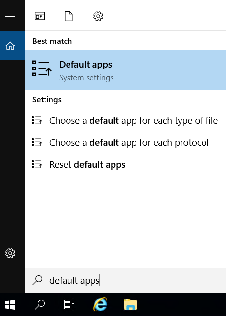
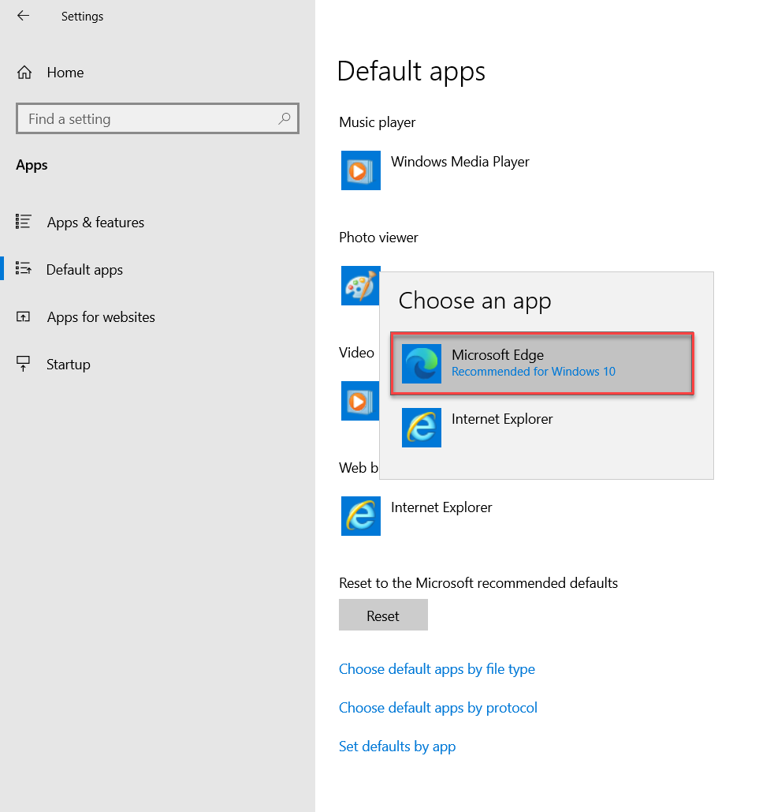
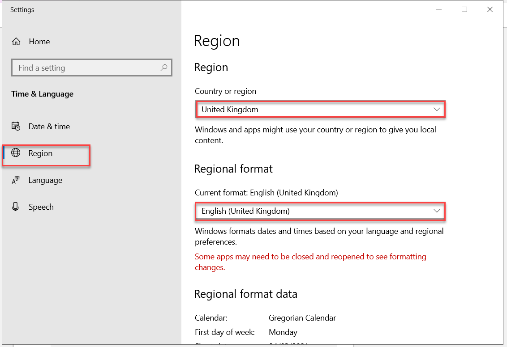
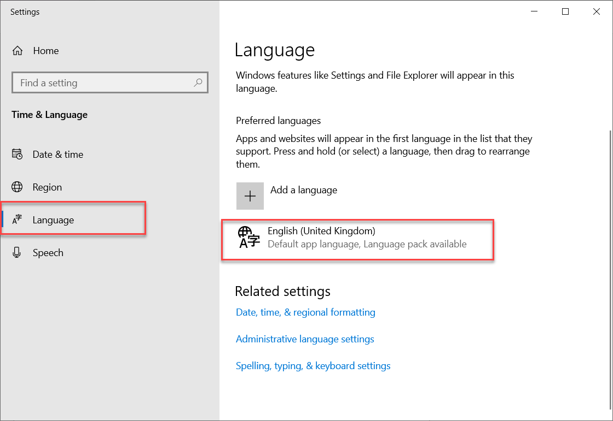
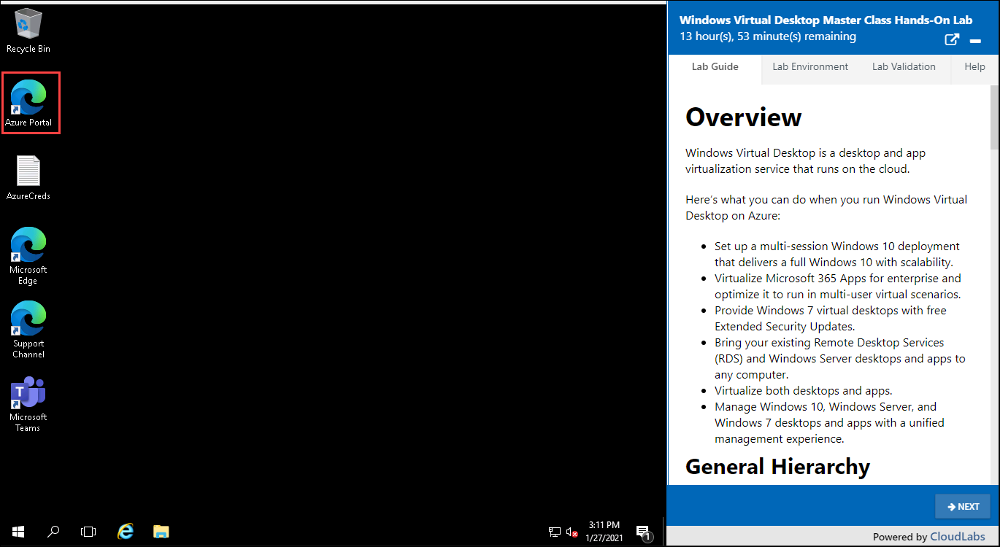
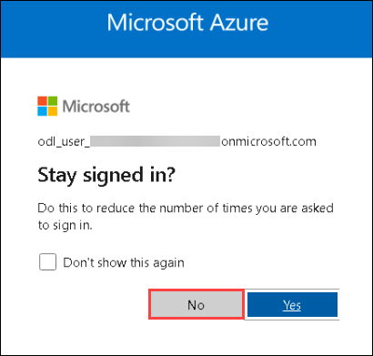
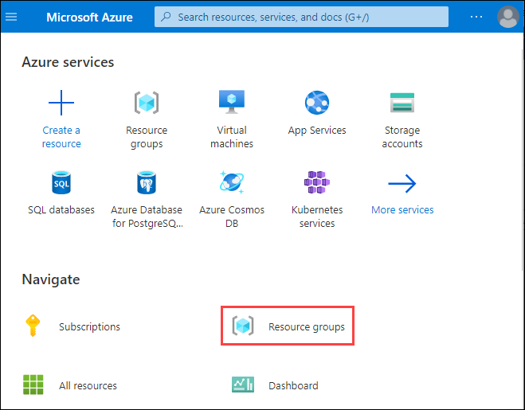
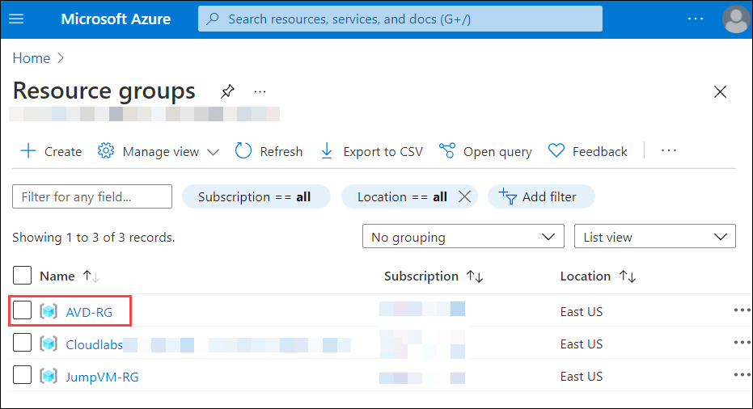

# **Pre-requisites for this Azure Virtual Desktop workshop**

## **Task 1: Configure Lab environment (VM)**

In this task, you will setup the Lab VM environment respective to your region. Note: Only if you are using the LAB VM. if not, skip this task and move to the next.

1. Default Browser - Make sure Edge is the default browser by navigating to Start>Settings>Default Apps as shown below

   

   

1. Within settings, set the Region and Language to the required setting as shown below

   

   

## **Task 2: Log in to Azure Portal**

1. In the JumpVM, double click on the **Azure portal shortcut** on the desktop. Note: if you are using your own workstation then please use modern browser and new **private mode or incognito** session.

     

2. Login to Azure with the username **<inject key="AzureAdUserEmail" />** and click on **Next**.

   

3. Enter password **<inject key="AzureAdUserPassword" />** and click on **Sign in**.

   

    > **Note:** If there's a popup entitled **Stay signed in?** with buttons for **No** and **Yes** - Choose **No**.
    >
    >    
    >   
    > **Note:** If there's another popup entitled **Welcome to Microsoft Azure** with buttons for **Start Tour** and **Maybe Later** - Choose **Maybe Later**.
    >
    >     

4. Now in the Azure portal, click on **Resource Groups** present under *Navigate*.

   

5. You will see a list of resource groups as show in the image below. Click on **AVD-RG** to open it.

   

> **Note:** You will be using ***AVD-RG*** throughout the lab. Other two resource groups listed in the portal are not to be used in the lab.

## **Task 3: Azure Active Directory Domain Services (AADDS)**

- To deploy Azure Virtual Desktop environment, we need a Windows Active Directory (for example: contoso.com). This can be achieved using one of the following ways:

    1. Azure Active Directory Domain Services(AADDS)
    2. Windows Active Directory

- In this lab, we have used AADDS and it is pre-provisioned. 

  

- The domain name will be the suffix of your lab user account (for example: If your lab user account is ***odl_user_189588@azurehol1057.onmicrosoft.com***, the domain will be ***azurehol1057.onmicrosoft.com***.)

- When you provision Azure ADDS, it creates a group named "AAD DC Administrators" in Azure Active Directory. Members of this group are allowed to be able to join AVD Sessions Hosts to Azure ADDS.  Your lab account is already a member of this group. 

Click on the **Next** button present in the bottom-right corner of this lab guide.  