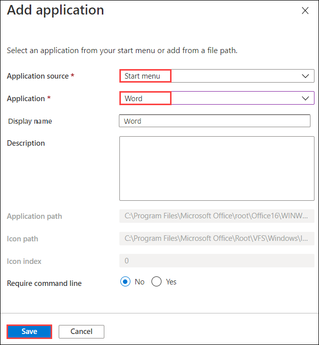
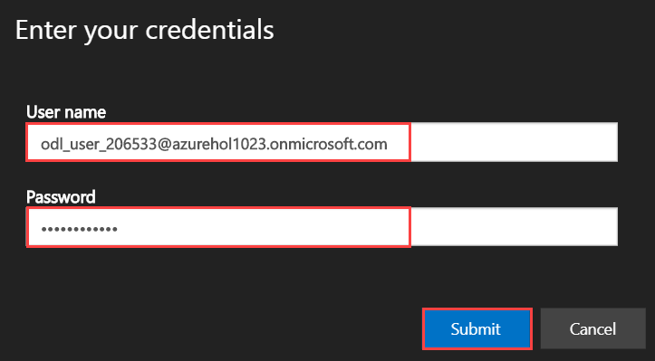
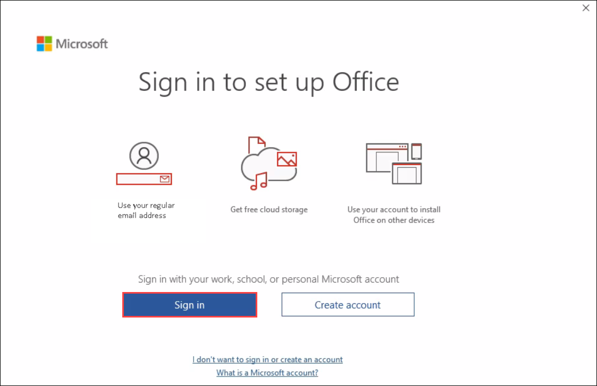
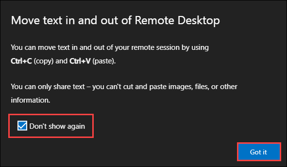
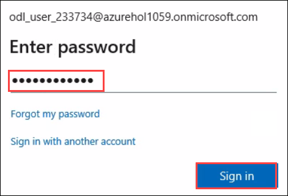
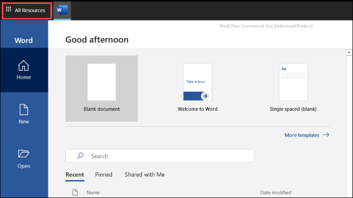
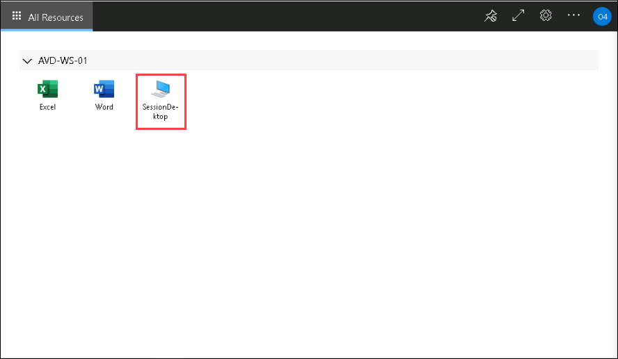
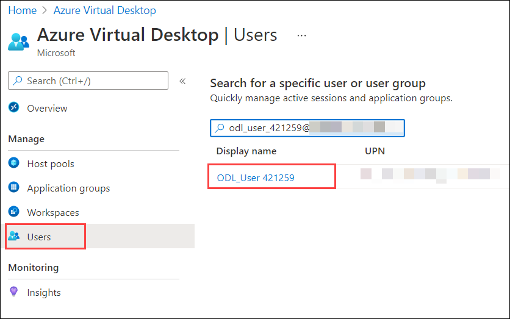
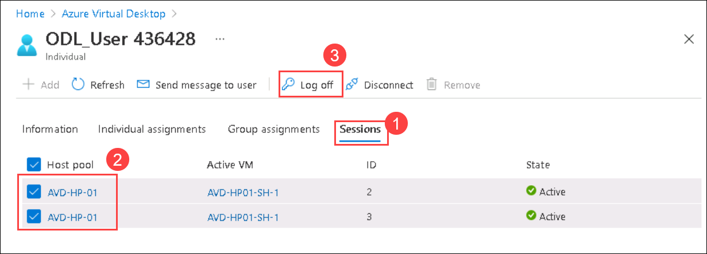
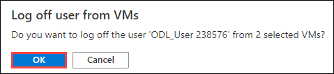

# Exercise 3: Access the Published Applications and Desktop using Browser


## **Task 1: Access the Published Application**

In this exercise, we will access the Desktop and RemoteApps assigned to us in the previous exercise using browser.

1. Open the following URL in a new browser tab in the JumpVM. This URL will lead us to the Remote Desktop Web Client.

   ```aka.ms/wvdarmweb``` 

   >**Note:** If you are already logged in through your user, then jump to step 3 else continue with the next step i.e., Step 2.

2. Now to login, enter the lab credentials as mentioned below:

   - Username: *Paste your username* **<inject key="AzureAdUserEmail" />** *and then click on **Next**.*
   
   

   - Password: *Paste the password* **<inject key="AzureAdUserPassword" />** *and click on **Sign in**.*

   

   >**Note:** If there's a dialog box saying ***Help us protect your account***, then select **Skip for now** option.

   

3. The AVD dashboard will launch, then click on **Word** application to access it. 

   

4. Select **Allow** on the prompt asking permission to *Access local resources*.

   

5. Enter the lab credentials to access the application and click on **Submit**.

   - Username: **<inject key="AzureAdUserEmail" />** 
  
   - Password: **<inject key="AzureAdUserPassword" />**

   
      
6. The Word application will launch and look similar to the screenshot below. Click on **Sign in**.

   

7. Enter username **<inject key="AzureAdUserEmail" />** on *Activate Office* window and click on **Next**.

   

   >**Note:** If you get a popup saying *Move Text in and out of Remote Desktop*, click on the ***Don't show again*** checkbox and then click on ***Got it*** button.
   
   

8. Enter password **<inject key="AzureAdUserPassword" />** and click on **Sign in**.

   

   >**Note:** If there's a dialog box saying ***Help us protect your account***, then select **Skip for now** option.
 
   

9. Click on **Close** button on the window asking *Your privacy option*.

   

10. Once signed in, the application will look similar to the screenshot below 

    

## **Task 2: Access the published Desktop**

1. On the top-left side of Remote Desktop Web Client, click on **All Resources**.
   
   
      
2. We will land on the AVD dashboard again. Click on the tile named *Session Desktop* to launch the desktop.

   

3. Select **Allow** on the prompt asking permission to *Access local resources*.

   

4. Enter the lab credentials to access the application and click on **Submit**.

   - Username: **<inject key="AzureAdUserEmail" />** 
  
   - Password: **<inject key="AzureAdUserPassword" />**

   

5. The virtual desktop will launch and look similar to the screenshot below. 

   
   
6. Return back to the Azure Portal, search for *Azure virtual desktop* in the search bar and select **Azure Virtual Desktop** from the suggestions.

   

7. Click on **User** under *Manage* blade, then paste **<inject key="AzureAdUserEmail" />** in the search bar and click on your user to open it.

   

8. Click on **Sessions** tab, select both Host pools by clicking on the checkbox and then click on **Log off** button.

   

9. Click on **OK** to *Log off user from VMs*.

   

10. Click on **Refresh** button and make sure *No results* is displayed under Host pool.

    

11. Click on the **Next** button present in the bottom-right corner of this lab guide. 
