# Exercise 5: Setup FSLogix

The Azure Virtual Desktop service recommends FSLogix profile containers as a user profile solution. FSLogix is designed to roam profiles in remote computing environments, such as Azure Virtual Desktop. It stores a complete user profile in a single container. At sign-in, this container is dynamically attached to the computing environment using natively supported Virtual Hard Disk (VHD) and Hyper-V Virtual Hard disk (VHDX). The user profile is immediately available and appears in the system exactly like a native user profile. This article describes how FSLogix profile containers used with Azure Files function in Azure Virtual Desktop.

### **Task 1: Create Storage account and file share**

In the following task, we will be creating a storage account with a file share which will be used to store user profiles for FSlogix.

1. Navigate to the Azure portal, search for *storage accounts* in the search bar, and select **Storage accounts** from the suggestions.

   
   
2. Click on **+ Create** to create a new storage account.

   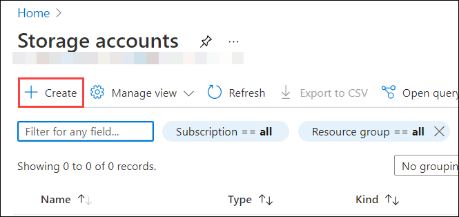

3. Use the following configuration for the storage account.
   
   - Subscription: *Select the default subscription*. 
   
   - Resource Group: *Select **AVD-RG** from the drop-down*. 
   
   - Storage account name: **<inject key="Storage Account Name" />**   
      
   - Region: **East US**, *this should be same as the location of your resource group*.  
   
   - Performance: **Standard**   
   
   - Account kind: **StorageV2(general purpose v2)**
   
   - Replication: **Geo-redundant storage (GRS)**
   
   - Make read access to the data available in the event of regional unavailability.
   
   - At last, click on **Next: Advanced**
   
   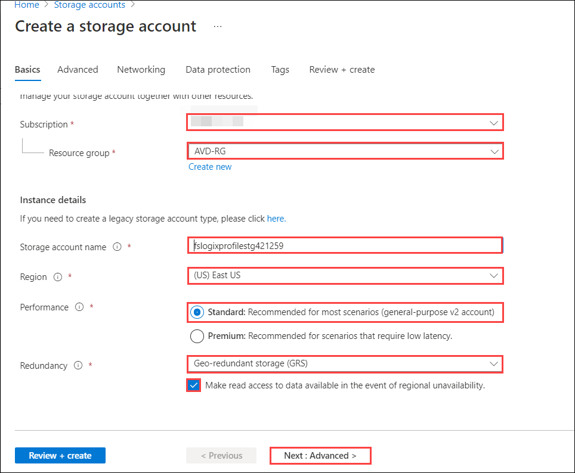
   
4. On the _Advanced_ tab, leave it to default and click on the **Next: Networking** tab use the following configuration.

   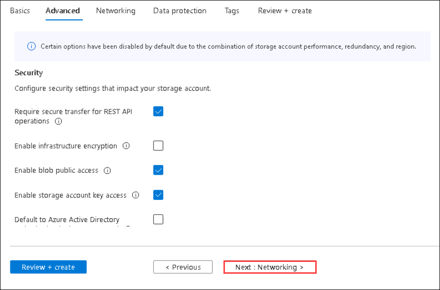

5. In the _Networking_ tab, use the following configurations:

   - Connectivity method: **Public endpoint(selected networks)**
     
   >**Note:** This will make sure that your storage account is not accessible from the public network making it more secure.
   - Virtual network subscription: *Select the default subscription*.
   - Virtual Network: **aadds-vnet**
   - Subnets: **sessionhost-subnet (10.0.1.0/24)**
   - Leave the rest to default settings.
   - Click on **Review + Create**.
     
   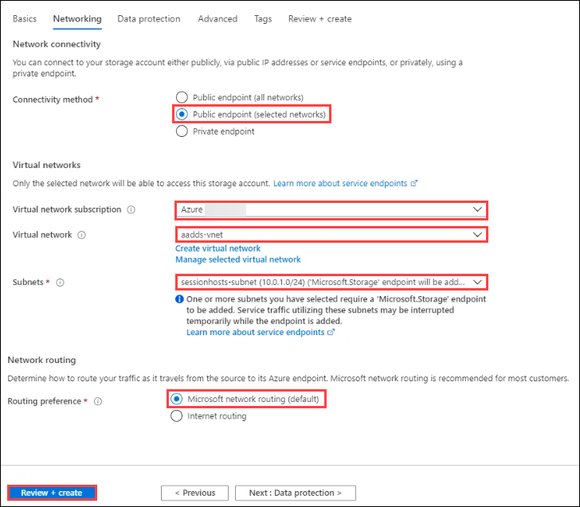
     
6. Click on **Create**.

   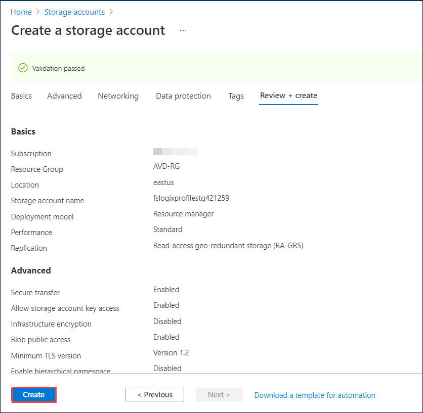

7. After deployment completes click on the notification icon on your azure portal, then click on **Go to resource**.

   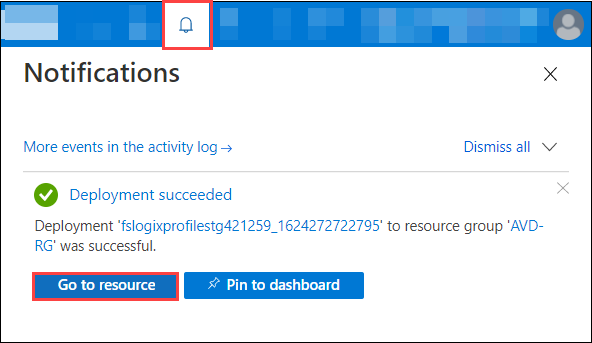
   
8. In the storage account, click on **File shares** present under **Data storage** blade. Then click on **Not configured** under **File share settings** page.

   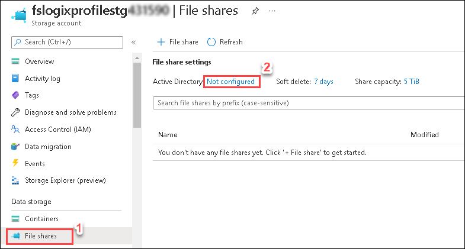

9. Click on **Set up** under **Azure Active Directory Domain Services** for enabling Identity-based access to users.

   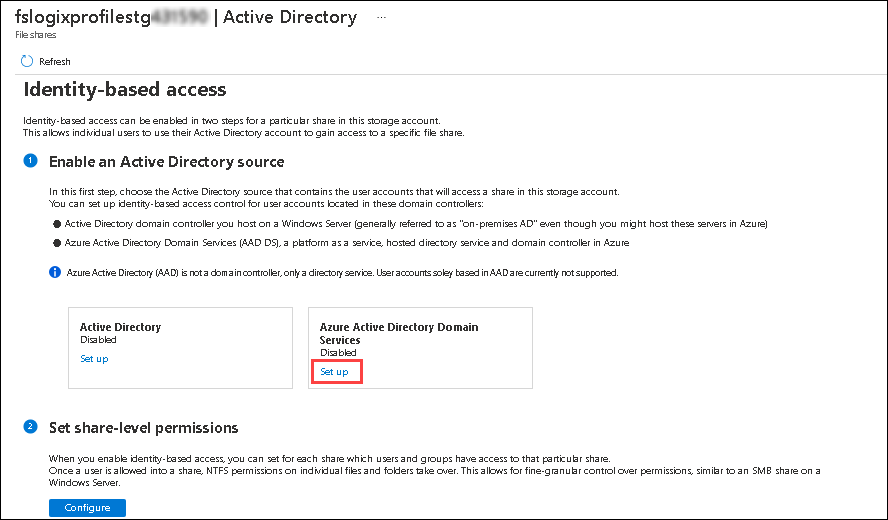

10. Select **Enable** for the Azure Active Directory Domain Services and then click on **Save**.
     
    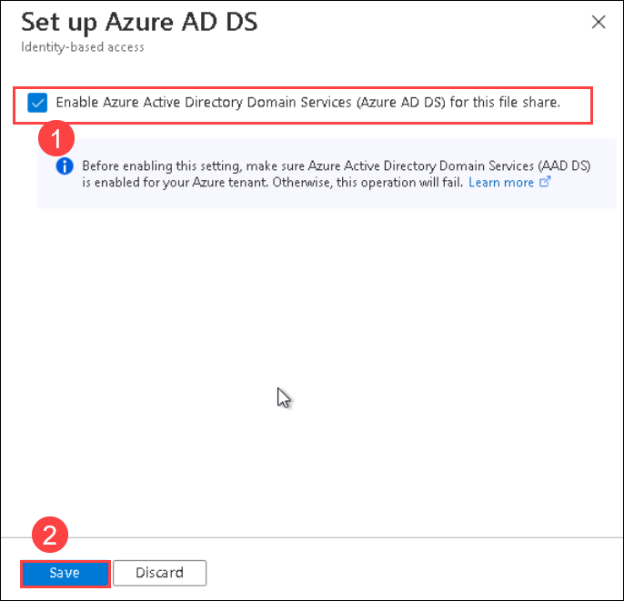
    
    >**Note:** Setting this property implicitly ***domain joins*** the storage account with the associated Azure AD DS deployment. Azure AD DS authentication over SMB is then enabled for all new and existing file shares in the storage account.
 
11. In the right pane, click on **File shares** present under *Data Storage* blade.

    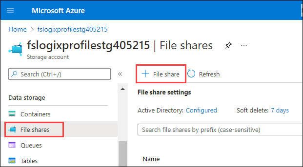
 
12. Enter the following name for your file share.
    
    - Name: **userprofile**   
    - Tier: **Transaction Optimized**
    - Click on **Create**, this will create the file share.
    
    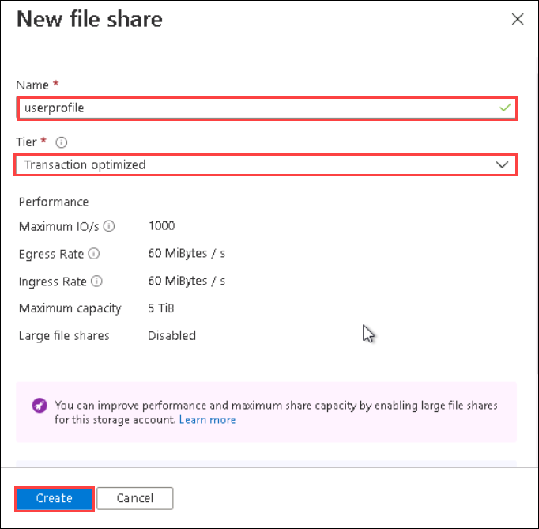
    
### **Task 2: Configure File share**

In this task, we will give *Storage File Data SMB Share Contributor* permissions to **<inject key="AzureAdUserEmail" />** so that their profiles can be stored in the fileshare.
   
1. Open on the file share we created earlier.

   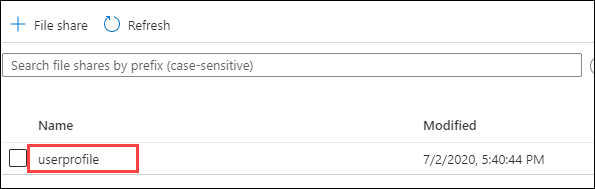
     
   >**Note:** Overview page of the file share will look as shown below. The user won't have access to it until we perform the next steps of this task. 

   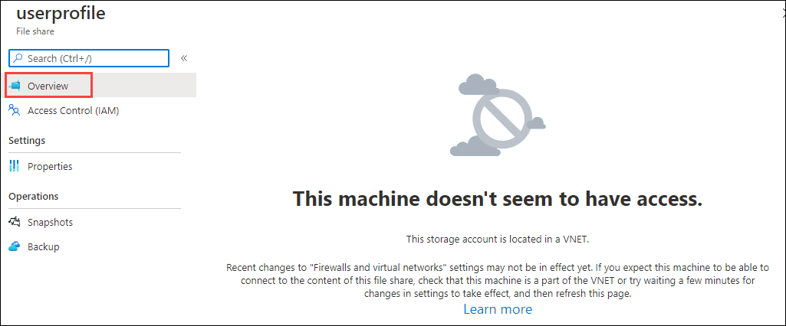

2. Click on **Access Control (IAM)**, then click on **Add** and select **Add role assignment**.

   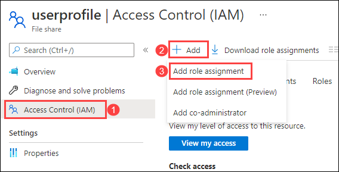
   
3. Select following configuration for role assignment:  
   
   - Role: **Storage File Data SMB Share Contributor**
   
   >**Note:** There are three Azure built-in roles for granting share-level permissions to users:
   > - *Storage File Data SMB Share Reader* allows read access in Azure Storage file shares over SMB.
   > - *Storage File Data SMB Share Contributor* allows read, write, and delete access in Azure Storage file shares over SMB.
   > - *Storage File Data SMB Share Elevated Contributor* allows read, write, delete, and modify Windows ACLs in Azure Storage file shares over SMB.
   
   - Under **Select** search paste your username **<inject key="AzureAdUserEmail" />** and select it.
   
   - Then click on **Save**.
   
   
 
### **Task 3: Configure Session Hosts**

In this task, we will install and configure FSLogix in the **AVD-HP01-SH-0** session host using a Powershell script.

1. In your Azure portal search for *Virtual machines* in the search bar and click on **Virtual Machines** from the suggestions.

   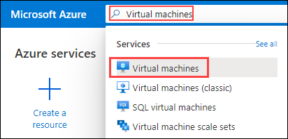
      
2. Click on **AVD-HP01-SH-0**.

   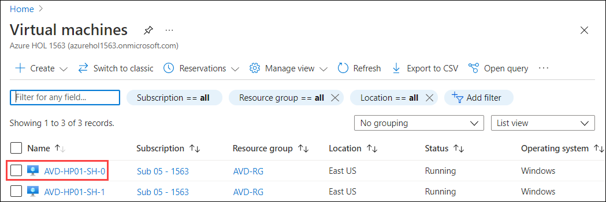
      
3. Then click on **Run command** under **Operations** tab .

   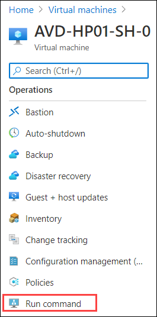
  
4. Now select **RunPowerShellScript**.

   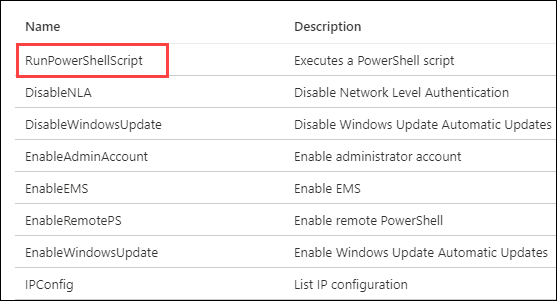
   
5. A similar window as that of the below image will appear.

   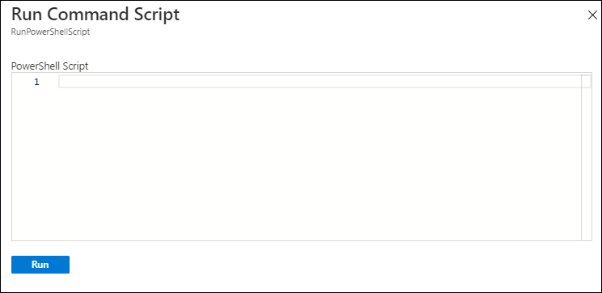
   
6. **Copy** the script is given below and paste it by pressing **Ctrl + V** in the Powershell window. **Do not** run the script right away.


```
 #Variables
$storageAccountName = "NameofStorageAccount" 

#Create Directories
$LabFilesDirectory = "C:\LabFiles"

if(!(Test-path -Path "$LabFilesDirectory")){
New-Item -Path $LabFilesDirectory -ItemType Directory |Out-Null
}
if(!(Test-path -Path "$LabFilesDirectory\FSLogix")){
New-Item -Path "$LabFilesDirectory\FSLogix" -ItemType Directory |Out-Null
}

 #Download FSLogix Installation bundle

 if(!(Test-path -Path "$LabFilesDirectory\FSLogix_Apps_Installation.zip")){
       Invoke-WebRequest -Uri "https://experienceazure.blob.core.windows.net/templates/wvd/FSLogix_Apps_Installation.zip" -OutFile     "$LabFilesDirectory\FSLogix_Apps_Installation.zip"

 #Extract the downloaded FSLogix bundle
 function Expand-ZIPFile($file, $destination){
     $shell = new-object -com shell.application
     $zip = $shell.NameSpace($file)
     foreach($item in $zip.items()){
     $shell.Namespace($destination).copyhere($item)
     }
 }

 Expand-ZIPFile -File "$LabFilesDirectory\FSLogix_Apps_Installation.zip" -Destination "$LabFilesDirectory\FSLogix"

}
   #Install FSLogix
   if(!(Get-WmiObject -Class Win32_Product | where vendor -eq "FSLogix, Inc." | select Name, Version)){
       $pathvargs = {C:\LabFiles\FSLogix\x64\Release\FSLogixAppsSetup.exe /quiet /install }
       Invoke-Command -ScriptBlock $pathvargs
   }
   #Create registry key 'Profiles' under 'HKLM:\SOFTWARE\FSLogix'
   $registryPath = "HKLM:\SOFTWARE\FSLogix\Profiles"
   if(!(Test-path $registryPath)){
       New-Item -Path $registryPath -Force | Out-Null
   }

   #Add registry values to enable FSLogix profiles, add VHD Locations, Delete local profile and FlipFlop Directory name
   New-ItemProperty -Path $registryPath -Name "VHDLocations" -Value "\\$storageAccountName.file.core.windows.net\userprofile" -PropertyType String -Force | Out-Null
   New-ItemProperty -Path $registryPath -Name "Enabled" -Value 1 -PropertyType DWord -Force | Out-Null
   New-ItemProperty -Path $registryPath -Name "DeleteLocalProfileWhenVHDShouldApply" -Value 1 -PropertyType DWord -Force | Out-Null
   New-ItemProperty -Path $registryPath -Name "FlipFlopProfileDirectoryName" -Value 1 -PropertyType DWord -Force | Out-Null

   #Display script completion in console
   Write-Host "Script Executed successfully"
```
 
 
 
   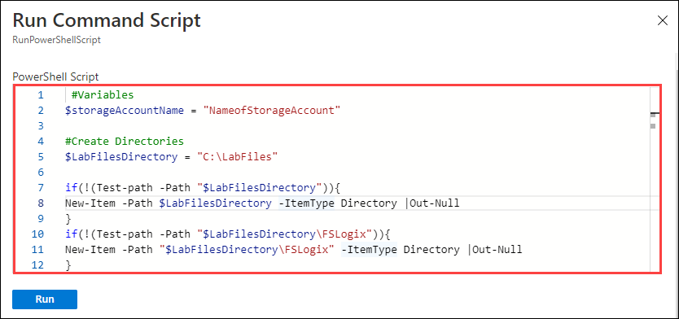
   
   >**Note:** The above script will :
   >
   >i) Install FSLogix Profile Container application
   >
   >ii) Configure the required registries
   > 
   >iii) Set the profile container location to the Azure file share location we created.
 
7. In line 2, we have to replace the name of the storage account with the **"NameofStorageAccount"** block.

   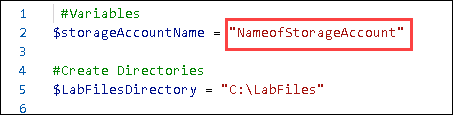

8. In the script, replace **NameofStorageAccount** with **<inject key="Storage Account Name" />** and then click on **Run** to execute the script.

   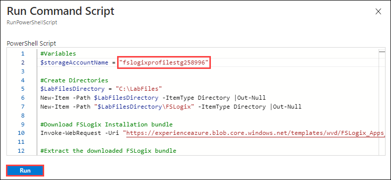

9. Wait for some time for the script to execute. Once done, it will show an output saying **Script Executed successfully**.

   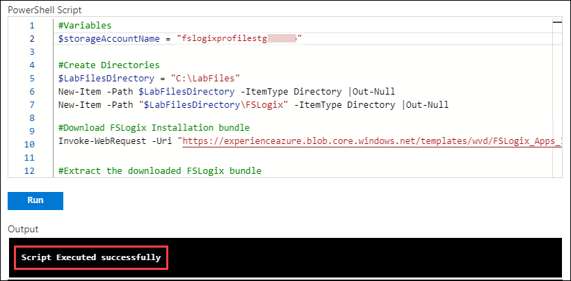
   
   >**Note:** It will take around five minutes for the script to execute.
   
10. Navigate to virtual machines and click on **AVD-HP01-SH-1**.

    

11. Select **RunPowerShellScript**.

    
        
12. **Copy** the script given below and paste it by pressing **Ctrl + V** in the Powershell window. **Do Not** run the script right away.

```
 #Variables
$storageAccountName = "NameofStorageAccount" 

#Create Directories
$LabFilesDirectory = "C:\LabFiles"

if(!(Test-path -Path "$LabFilesDirectory")){
New-Item -Path $LabFilesDirectory -ItemType Directory |Out-Null
}
if(!(Test-path -Path "$LabFilesDirectory\FSLogix")){
New-Item -Path "$LabFilesDirectory\FSLogix" -ItemType Directory |Out-Null
}

 #Download FSLogix Installation bundle

 if(!(Test-path -Path "$LabFilesDirectory\FSLogix_Apps_Installation.zip")){
       Invoke-WebRequest -Uri "https://experienceazure.blob.core.windows.net/templates/wvd/FSLogix_Apps_Installation.zip" -OutFile     "$LabFilesDirectory\FSLogix_Apps_Installation.zip"

 #Extract the downloaded FSLogix bundle
 function Expand-ZIPFile($file, $destination){
     $shell = new-object -com shell.application
     $zip = $shell.NameSpace($file)
     foreach($item in $zip.items()){
     $shell.Namespace($destination).copyhere($item)
     }
 }

 Expand-ZIPFile -File "$LabFilesDirectory\FSLogix_Apps_Installation.zip" -Destination "$LabFilesDirectory\FSLogix"

}
   #Install FSLogix
   if(!(Get-WmiObject -Class Win32_Product | where vendor -eq "FSLogix, Inc." | select Name, Version)){
       $pathvargs = {C:\LabFiles\FSLogix\x64\Release\FSLogixAppsSetup.exe /quiet /install }
       Invoke-Command -ScriptBlock $pathvargs
   }
   #Create registry key 'Profiles' under 'HKLM:\SOFTWARE\FSLogix'
   $registryPath = "HKLM:\SOFTWARE\FSLogix\Profiles"
   if(!(Test-path $registryPath)){
       New-Item -Path $registryPath -Force | Out-Null
   }

   #Add registry values to enable FSLogix profiles, add VHD Locations, Delete local profile and FlipFlop Directory name
   New-ItemProperty -Path $registryPath -Name "VHDLocations" -Value "\\$storageAccountName.file.core.windows.net\userprofile" -PropertyType String -Force | Out-Null
   New-ItemProperty -Path $registryPath -Name "Enabled" -Value 1 -PropertyType DWord -Force | Out-Null
   New-ItemProperty -Path $registryPath -Name "DeleteLocalProfileWhenVHDShouldApply" -Value 1 -PropertyType DWord -Force | Out-Null
   New-ItemProperty -Path $registryPath -Name "FlipFlopProfileDirectoryName" -Value 1 -PropertyType DWord -Force | Out-Null

   #Display script completion in the console
   Write-Host "Script Executed successfully"
```


   
   
    
   > **Note:** The above script will :
   >
   > i) Install FSLogix Profile Container application
   > 
   > ii) Configure the required registries
   > 
   >iii) Set the profile container location to the Azure file share location we created.
 

13. In line 2, we have to replace the name of the storage account with the **"NameofStorageAccount"** block.

    

14. In the script, replace **NameofStorageAccount** with **<inject key="Storage Account Name" />** and then click on **Run** to execute the script.

    
       
15. Wait for some time for the script to execute.  Once done, it will show an output saying **Script Executed successfully**.

    
   
    >**Note:** It will take around five minutes for the script to execute.
  
16. Now search for *Azure virtual desktop* in the search bar and select **Azure Virtual Desktop** from the suggestions.

    
     
17. Click on **Users**, then in the search bar paste your username **<inject key="AzureAdUserEmail" />** and then click on your user.

    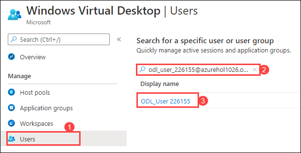
    
18. Switch to **Sessions** tab, then select both *Host Pools* and click on **Log off**.

    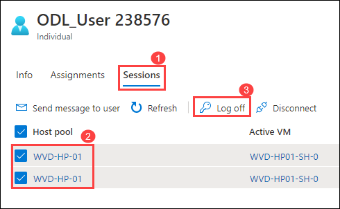
    
19. Click on **OK** to *Log off the user from VMs*.

    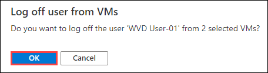

    >**Note:** This will log off the user **<inject key="AzureAdUserEmail" />** from both the session hosts, so that when the user sign in again to the session hosts, FSLogix will start functioning.
        
20. Now paste this link ```aka.ms/wvdarmweb``` in your browser in the JumpVM, and enter your **credentials** to login. 

    - Username: Paste username **<inject key="AzureAdUserEmail" />**, then click on **Next**.
   
    

    - Password: Paste password **<inject key="AzureAdUserPassword" />** and click on **Sign in**.

    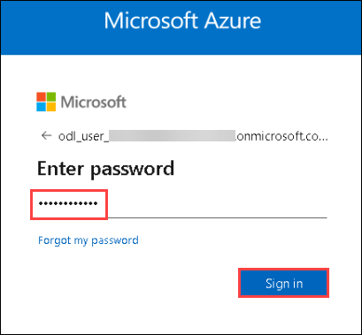

    >**Note:** If there's a dialog box saying ***Help us protect your account***, then select the **Skip for now** option.
    
     

21. Click on the **Session Desktop** Desktop to launch it.

    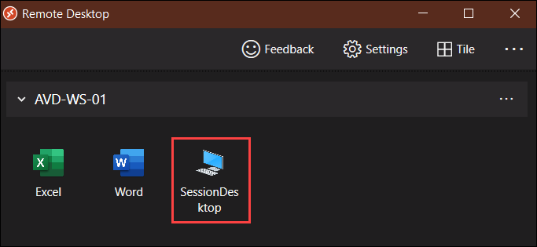

22. Select Allow on the prompt asking permission to access local resources.

    

23. Enter your **Credentials** to access the desktop.

    - Username: **<inject key="AzureAdUserEmail" />**
    - Password: **<inject key="AzureAdUserPassword" />**

    
        
24. The desktop will display looking similar to the screenshot below, showing ***Please wait for the FSLogix Apps Services***.

    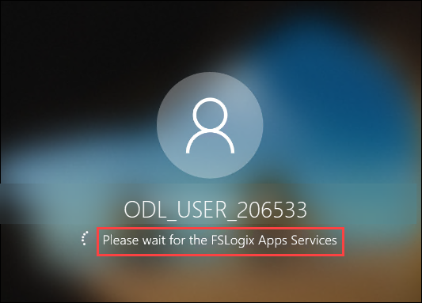
    
    >**Note:** This means that the user profile is being managed by FSLogix.

25. The virtual desktop will launch and look similar to the screenshot below.

    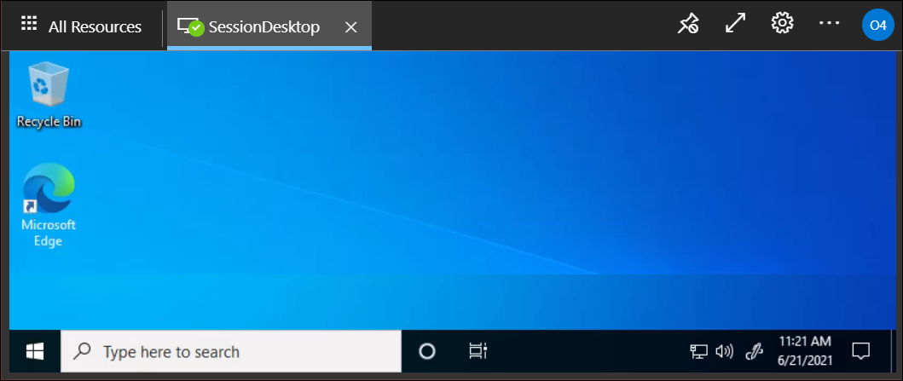

26. At last, click on **User Account** and click on **Sign Out**.

    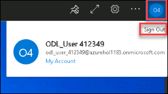
   
### **Task 4: Verifying the User profiles stored in File share**

In this task, we will be accessing the file share to verify the user profiles stored in the *.vhd* format.

1. Return to the Azure Portal, search for *storage accounts* in the search bar and click on **Storage Accounts** from the suggestions.

   
    
2. Click on the storage account we created in **Task 1 step 3**, then under settings blade click on  **Networking**.

   
   
3. Under **Allow access from** select **All networks** and click on **save icon**.

   
    
   >**Note:** This will enable access to your storage account on the public network so that you can see the user profiles stored in the fileshare.
    
4. Open the storage account we created earlier, then select **Fileshare** from the left side menu.

   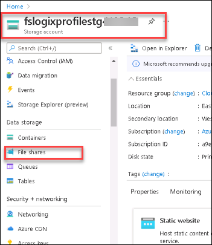
      
5. Click on the **userprofile** fileshare.

   

6. You will see the user folder created in the file share, click on the folder.

   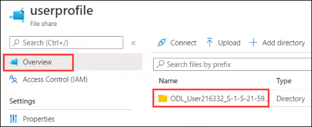 

7. Now you will be able to see the user profiles data stored in the filesharers in a ***.vhd*** format.

   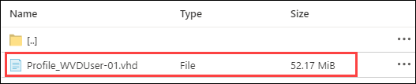

   >**Note:** It might take some time for the User Profile folder to appear in the fileshare. If you do not see the folder now, please continue with the next task and check back later.

8. Click on the **Next** button present in the bottom-right corner of this lab guide.
