# Lab 1: Create Host Pool using Getting Started Wizard

## **Scenario**

 Contoso is planning to set up its infrastructure on Azure. As a first step, Contoso needs you to provision a host pool which is the main component of AVD. The creation of a host pool also includes session hosts, a default application group, and a workspace.

## **Overview**

A Host Pool is a collection of Azure virtual machines that register to Azure Virtual Desktop as session hosts when you run the Azure Virtual Desktop agent. All session host virtual machines in a host pool should be sourced from the same image for a consistent user experience. To start host pool creation, we will login to the Azure portal.
 
## Exercise 1: Create Host Pool using Getting Started Wizard

In this exercise, we will be creating the Host pool using **Quickstart** using minimum effort and information.

1. On the **Azure portal** search for **Azure Virtual Desktop** **(1)** in the search bar and select **Azure Virtual Desktop** **(2)** from the suggestions.

   
   
1. On the Azure Virtual Desktop Page, **Click** on the **Quickstart** **(1)** from the side blade and click on **Start** **(2)**.

   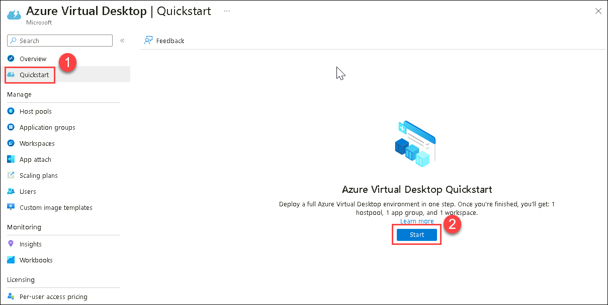
   
1. On **Quickstart Wizard** page, provide the information as mentioned below,

   **A. Project Details:**

   - Subscription: **Leave it as default**
   - Identity provider: Select ***Existing active directory***
   - Identity service type: Select ***Microsoft Entra Domain Services*** from the drop-down
   - Resource Group prefix: Enter ***AVD-HostPool-RG***
   - Region: Select **<inject key="Region" enableCopy="false"/>** from the drop-down list.

      >**Note**: The region you selected in the lab might be different from the region mentioned in the screenshot.
      
   - Virtual Network: **aadds-vnet** *(choose from dropdown)*
   - Subnet: **sessionhosts-subnet(10.0.1.0/24)** *(choose from dropdown)*
   
   **B. Azure user credentials:**
   
   - Azure admin user name: *Paste your username* **<inject key="AzureAdUserEmail" />**
   - Password: *Paste the password* **<inject key="AzureAdUserPassword" />**

   **C. Domain administrator credentials:**
   
   - Domain admin user name: *Paste your username* **<inject key="AzureAdUserEmail" />**
   - Password: *Paste the password* **<inject key="AzureAdUserPassword" />**
   - **Click** on **Next : Virtual Machines >**.

   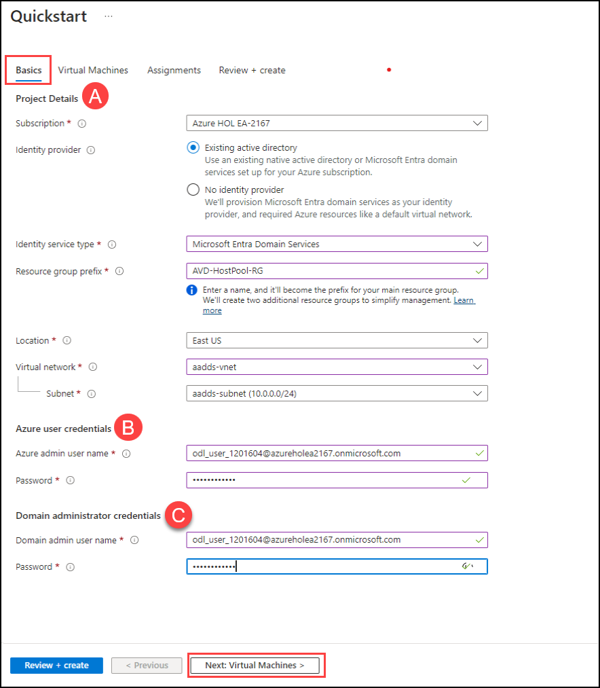
   
1. On the **Virtual Machines** tab, provide the information as mentioned below:
   
   - Users per virtual machine: Select ***Multiple users***
   - Image: Select **See all images** then under **Windows multi-session + Microsoft 365 Apps** choose **Select** and then select **Windows 11 Enterprise multi-session + Microsoft 365 Apps, Version 22H2** *(choose from dropdown)*

    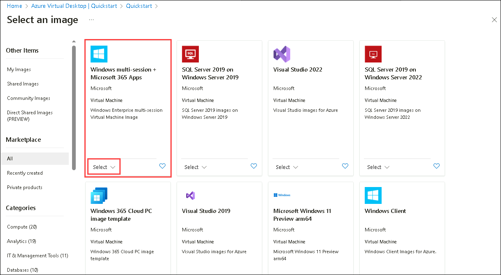

    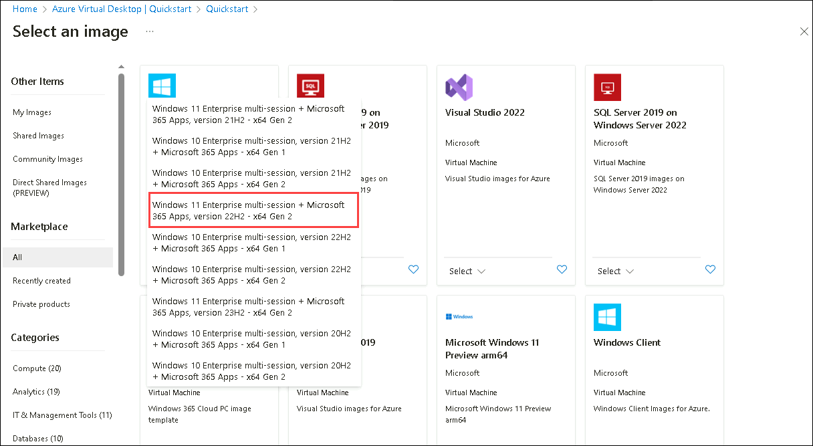

    - Virtual machine size: **Standard D4s v4**. *Click on **Change Size**, then select **D4s_v4** and click on **Select** as shown below*

     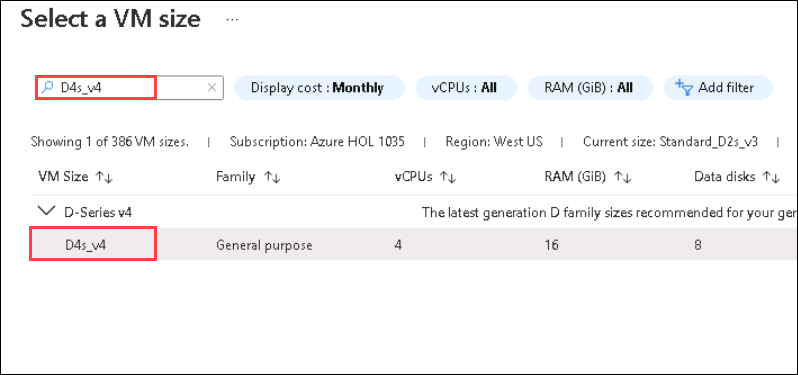
   
   - Name Prefix: **AVD-HP01-SH**
   - Number of virtual machines: **2**
   - Use custom configuration script: **Unselect** the option
   - **Click** on **Next : Assignments >**.

   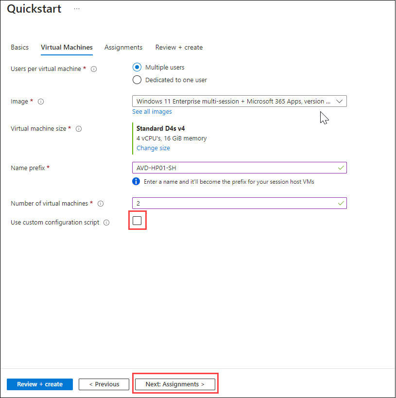
   
1. On the **Assignments** page, provide the information as mentioned below, 
   
   - Create test user account: **Unselect** the option
   - Assign existing users or groups: **Select** the option
   - click on **Next : Review + create >**.

   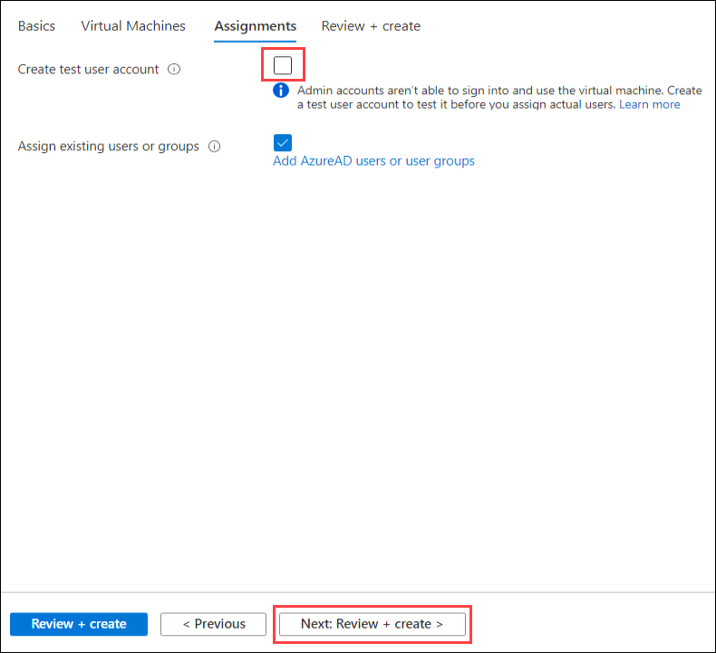
   
1. Verify the options and **click** on **Create**.

   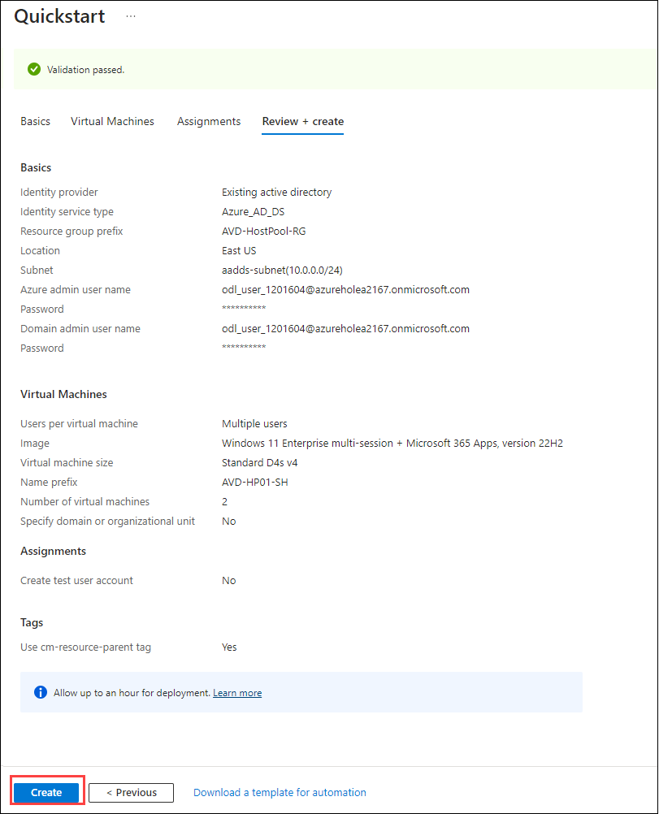

   >**NOTE**: Usually it takes 20 minutes to get deployed successfully. Sometimes it might take up to 90 minutes.
   
1. Once the deployment succeeds, it will look similar to the image shown below:

   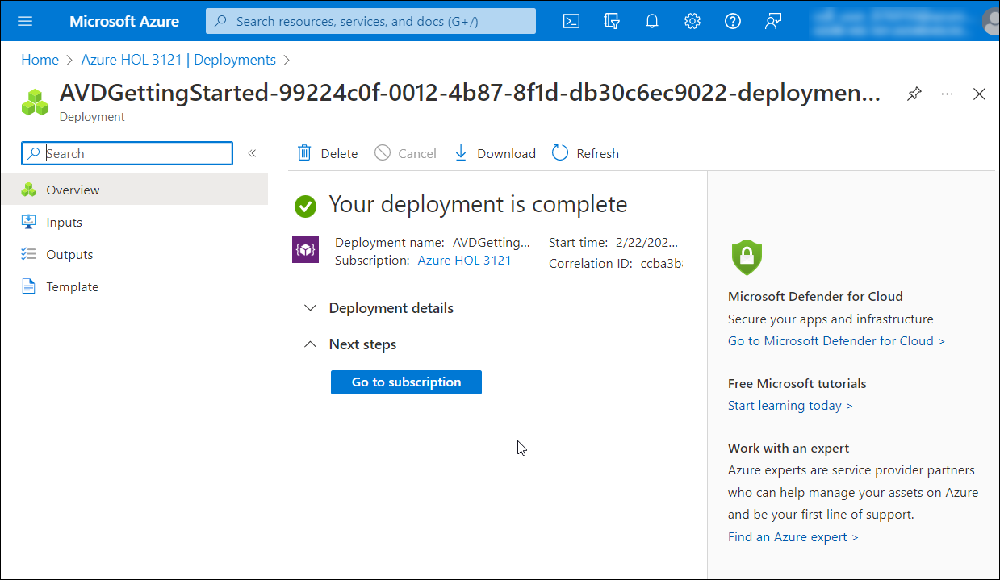
   
   >**Note**: If the host pool **deployment fails**, please **follow the steps below:**
   >If the host deployment is successful, we can move to step 8.
   
   >**i.** In the Azure portal, navigate to **Resource groups** and click on **AVD-HostPool-RG-deployment** **(1)** then click on **Delete resource group** **(2)**.
   
   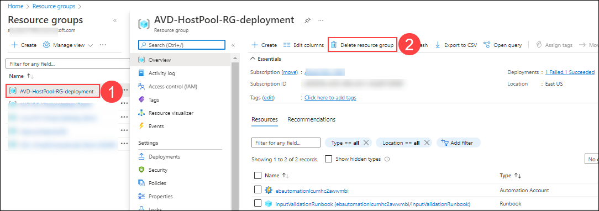
   
   >**ii.** On the popup on the right-hand side, enter the name of the resource group **AVD-HostPool-RG-deployment** **(1)** and then click on **Delete** **(2)**.
   
   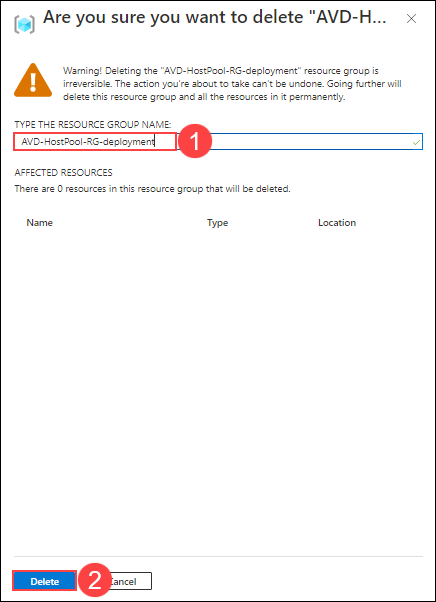
   
   >**iii.** After deleting the Resource group, navigate back to the initial step and re-perform the lab from Step 1 to Step 7.

1. Navigate to **AVD-HostPool-RG-avd** resource group and select **GS-AVD-HP** host pool.

   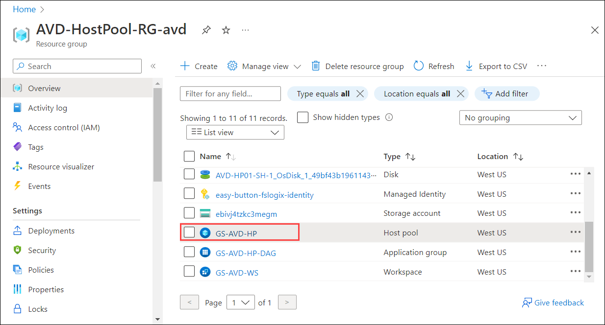
   
1. It will take you to the **Host pool**. The resources created are as follows,

   - **Host Pool**: 1 (GS-AVD-HP)
   - **Session Host**: 2 (AVD-HP01-SH-0, AVD-HP01-SH-1)
   - **Application Group**: 1 (GS-AVD-HP-DAG)
   - **Application**: 1 (SessionDesktop)
   - **Workspace**: 1 (GS-AVD-WS)

   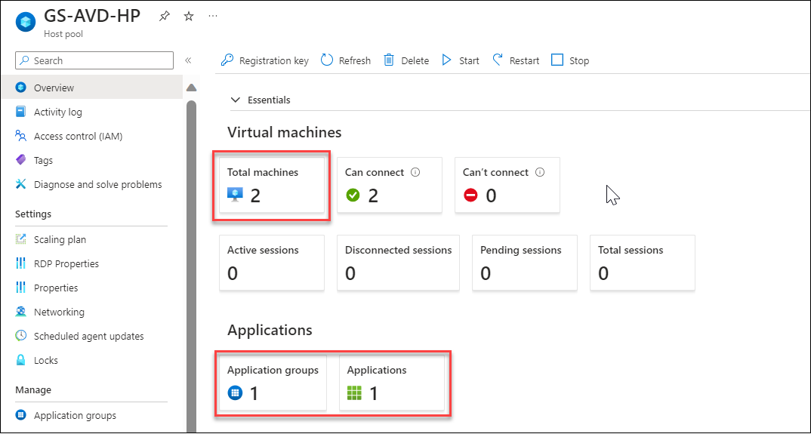
   
1. Click on the **Next** button present in the bottom-right corner of this lab guide.  
   
