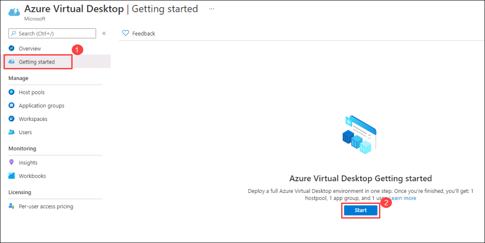
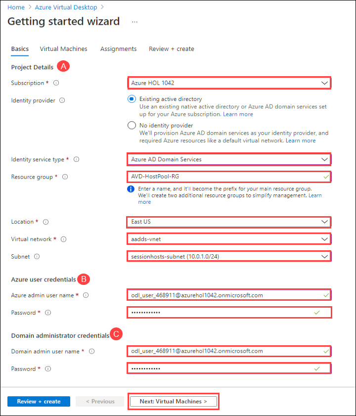
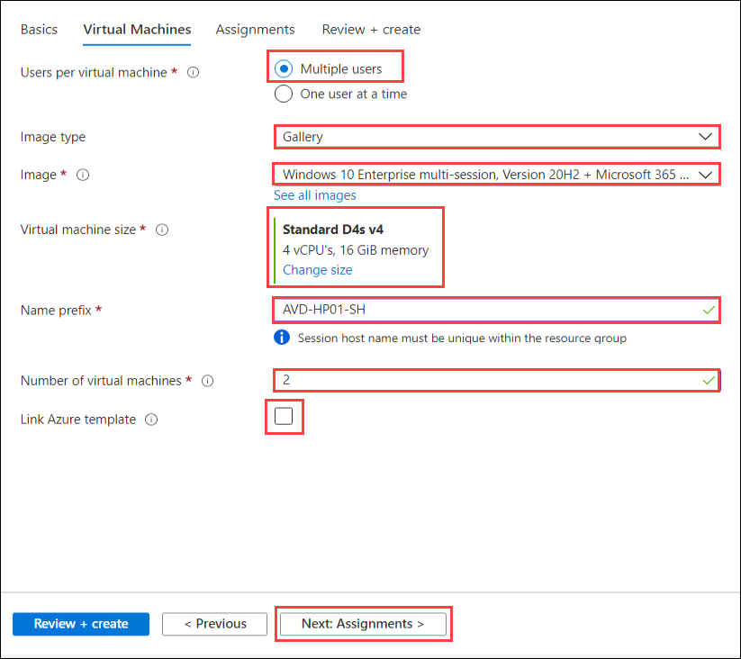
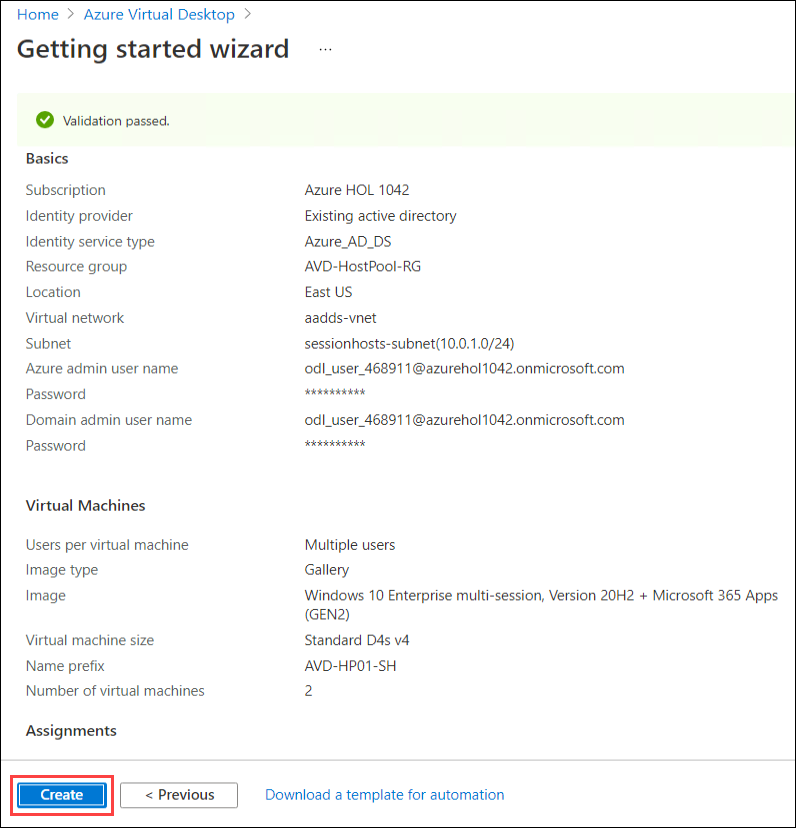
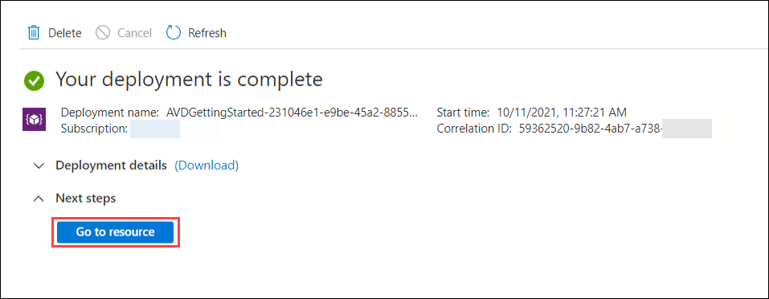
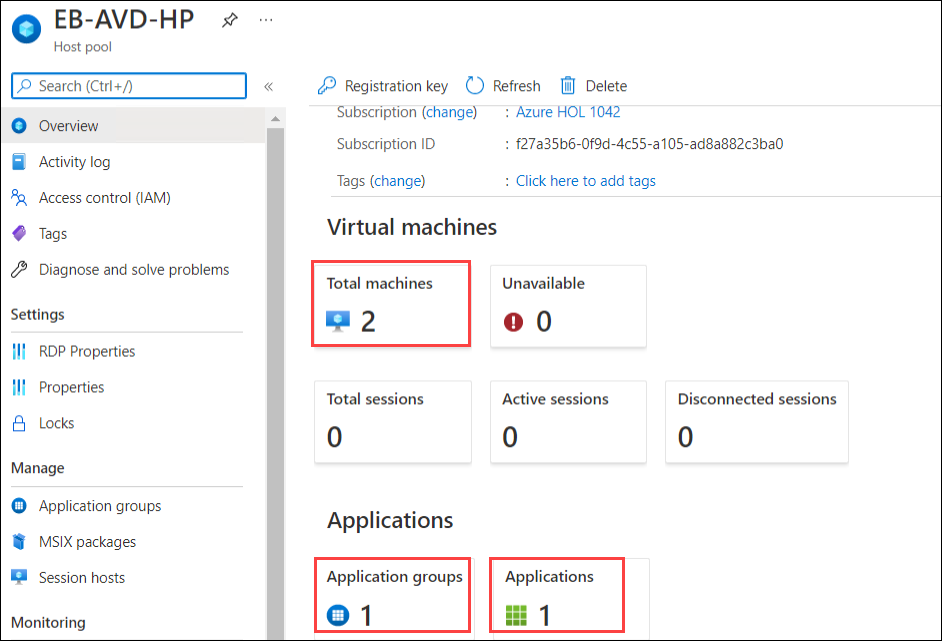

# Lab 1: Create Host Pool using Getting Started Wizard

## **Scenario**

 Contoso is planning to set up its infrastructure on Azure. As a first step, Contoso needs you to provision a host pool which is the main component of AVD. Creation of host pool also includes session hosts, default application group, and a workspace.

## **Overview**

 A Host Pool is a collection of Azure virtual machines that register to Azure Virtual Desktop as session hosts when you run the Azure Virtual Desktop agent. All session host virtual machines in a host pool should be sourced from the same image for a consistent user experience. To start with, we will login to the Azure portal.
 
## Exercise 1: Create Host Pool using Getting Started Wizard

In this exercise, We'll be creating the Host pool using **Getting Started Wizard** using minimum efforts and information.

1. On the **Azure portal** search for **Azure Virtual Desktop** in the **search bar** (1) and select **Azure Virtual Desktop** (2) from the suggestions.

   
   
1. On the AVD page, **Click** on the **Getting Started** (1) from the side blade and click on **Start** (2).

   
   
1. On **Getting Started Wizard** page, **Provide** the information as mentioned below,

   **A**.Project Details:

   - Subscription: Leave it to ***default***
   - Identity provider: Select ***Existing active directory***
   - Identity Service Provider: Select ***Azure AD Domain Services*** from the drop-down
   - Resource Group: Enter ***AVD-HostPool-RG***
   - Region: Select **<inject key="Region" />** from the drop-down list
   - Virtual Network: **aadds-vnet** *(choose from dropdown)*
   - Subnet: **sessionhosts-subnet(10.0.1.0/24)** *(choose from dropdown)*
   
   **B**. Domain administrator credentials:
   
   - Azure admin user name: *Paste your username* **<inject key="AzureAdUserEmail" />**
   - Password: *Paste the password* **<inject key="AzureAdUserPassword" />**

   **C**. Domain administrator credentials:
   
   - Domain admin user name: *Paste your username* **<inject key="AzureAdUserEmail" />**
   - Password: *Paste the password* **<inject key="AzureAdUserPassword" />**
   - **Click** on **Next : Virtual Machines >**.

   
   
1. In **Virtual Machines** tab, **Provide** the information as mentioned below,
   
   - Users per virtual machine: Select ***Multiple users***
   - Image type: ***Gallery***
   - Image: **Windows 10 Enterprise multi-session, version 20H2 + Microsoft 365 Apps - Gen 2** *(choose from dropdown)*
   - Virtual machine size: **Standard D4s v4**. *Click on **Change Size**, then select **D4s_v4** and click on **Select** as shown below*

     
   
   - Name prefix: **AVD-HP01-SH**
   - Number of VIrtual Machines: **2**
   - Link Azure template: **Unselect** the option
   - **Click** on **Next : Assignments >**.

   
   
1. In **Assignments** page, **Provide** the information as mentioned below, 
   
   - Create test user account: **Unselect** the option
   - Assign existing users or groups: **Select** the option
   - click on **Review and Create**.

   
   
1. Verify the options and **click** on **Create**.

   
   
   >**NOTE**: Usually it takes 20 mins to get deployed successfully. Sometimes it might take upto 90 minutes.
   
1. Once the deployment is successful, **Click** on **Go to resource**.

   
   
   >**Note**: If the host pool deployment fails, please follow the steps below else we can move to step 8.
   >
   >**i.** In Azure portal, navigate to **Resource groups** and click on **AVD-HostPool-RG-deployment** *(1)* then click on **Delete resource group** *(2)*.
   >
   >
   >
   >**ii.** On the popup on the right hand side, enter the name of the resource group **AVD-HostPool-RG-deployment** *(1)* and then click on **Delete** *(2)*.
   >
   > 
   >**iii.** After deleting the Resource group, navigate back to the initial step and re-perform the lab from Step-1 to Step-7.

   
1. It will take you to the **Host pool**. Reources created are as follows,

   - **Host Pool**: 1 (EB-AVD-HP)
   - **Session Host**: 2 (AVD-HP01-SH-0, AVD-HP01-SH-1)
   - **Aplication Group**: 1 (EB-AVD-HP-DAG)
   - **Application**: 1 (SessionDesktop)
   - **Workspace**: 1 (EB-AVD-WS)

   
   
1. Click on the **Next** button present in the bottom-right corner of this lab guide.  
   
