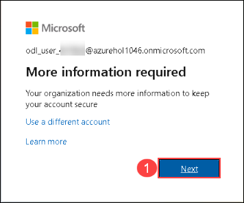
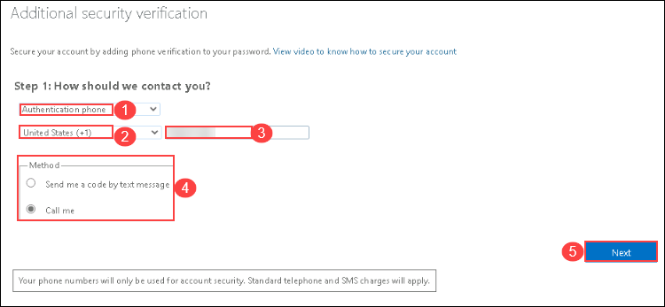
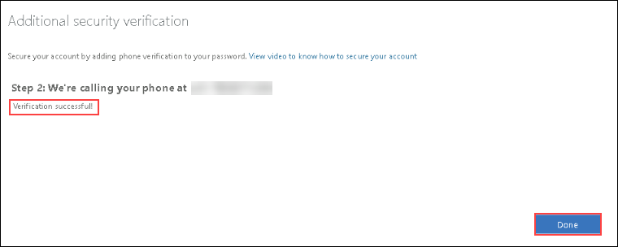
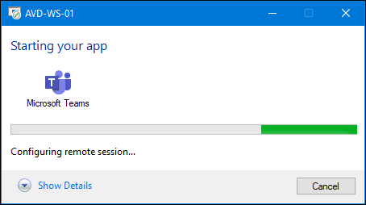
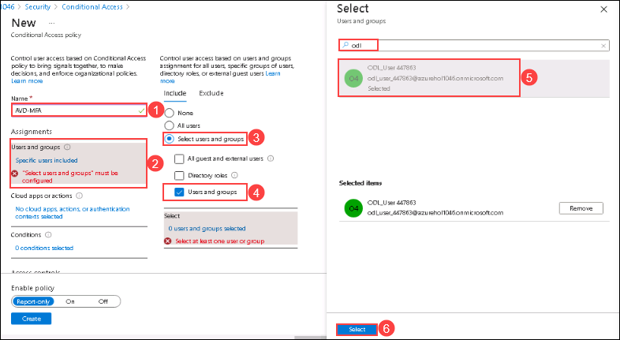

# **Lab 10: Use MEM to enforce MFA while using AVD**

### **Exercise 1: Setup Multi-Factor Authentication (MFA)**

1. In your JumpVM launch browser and visit `https://AKA.ms/proofup` and if asked to login then login using the following credentials:

   - Username: **<inject key="AzureAdUserEmail" />**
   - Password: **<inject key="AzureAdUserPassword" />**
  
2. On a prompt saying "More Information Required" click on **Next**.

   
  
3. Enter the details required to setup MFA.

   

   - Select the method as: **Authentication phone** *(1)*.
   - Country Code: Select the country code of your mobile number *(2)*.
   - Mobile Number: Enter the number which you want to use for the MFA *(3)*.
   - Method: Select the preferred method of authentication as **Call me** *(4)*.

4. Click on **Next**.

5. Now you will get a verification call on the provided contact details.

   
  
6. After answering the call, you will be asked to press the "**#**" key to complete the verification.

   

7. Now after few seconds the status will change to **Verification Successful**, click on **Done** to finish the MFA registration.

   
  
### **Exercise 2: Creating Conditional Access Policy**

1. In Azure POrtal search for *Azure Active Directory* and click on the search result.

   
  
2. From the left-hand side blade, click on **Security** under Manage.

   
  
3. In **Security** page select **Conditional Access** under Protect.

   
  
4. Under the Policies page click on **+ New Policy**.

   

5. Configure the Conditional Access Policy with the following details:

   - Name: **AVD-MFA** *(1)*
   - **Assignments**:
   - Click on **Users and Groups** *(2)*.
   - A new window will slide in, there click on **Select users and Groups** *(3)* and then select the check box saying **Users and groups** *(4)*.
   - Now a *Select* window will open, here search for ODL user and Select it *(5)*.
   - Click on **Select** *(6)* button.
   
   
   
   - Click on **Cloud apps or actions** *(1)*
   - Click on **Select apps** *(2)*
   - Search for **Windows Virtual Desktop** and click on the **check box** *(3)* next to the search reuslt
   - Now Click on **Select** *(4)* button.

   
  
   - Click on **Conditions** *(1)*
   - Then select **Client apps** *(2)*.
   - Now in the Client Apps blade toggle the *Configure* switch to **Yes** *(3)* and make sure that all the checkboxes below are selected.
   - Then click on **Done** *(4)*

   
  
   - **Access Control**
   - Click on **Grant** *(1)*.
   - Select the Check Box saying **Require multi-factor authentication** *(2)*.
   - Then click on **Select** *(3)*

   
   
6. Toggle the **Enable Policy** switch to **Yes** and click on **Create**.

   
  
7. Login to AVD Client to see the MFA getting triggered.
