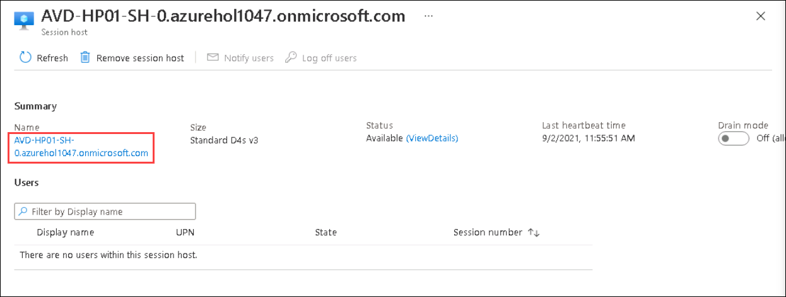
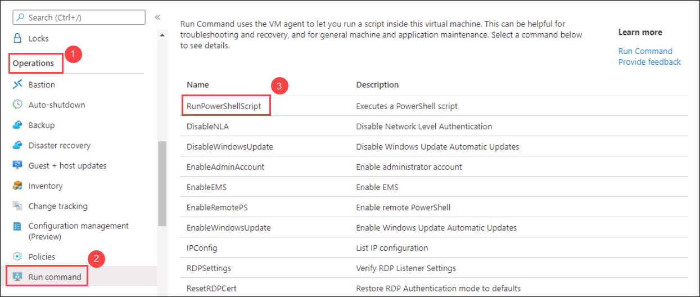
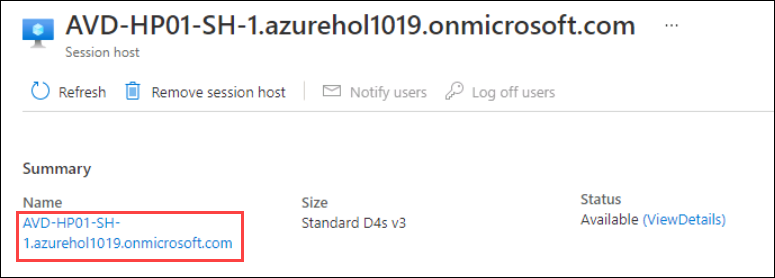
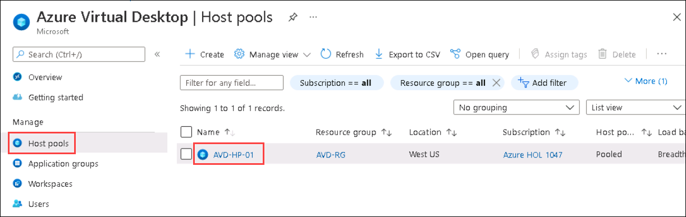
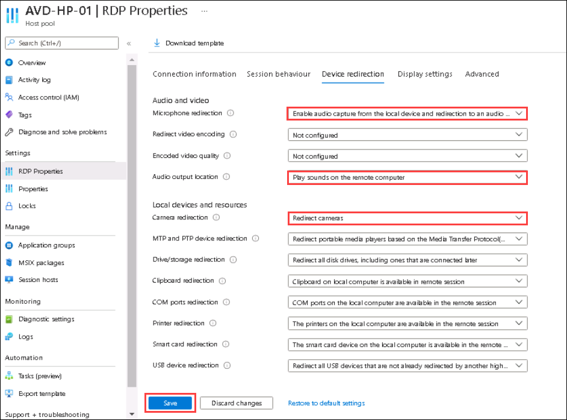

# Lab 9: MS Teams Optimized Experience

In this lab, We'll be implementing MS Teams for AVD. Microsoft Teams on Azure Virtual Desktop supports chat and collaboration. With media optimizations, it also supports calling and meeting functionality. With media optimization for Microsoft Teams, the Windows Desktop client handles audio and video locally for Teams calls and meetings.

## Exercise 1: Configuring Session host for implementing MS Teams

   >**NOTE**: Make sure both the session hosts are running.
   
1. Navigate to the Azure portal, then search for Azure Virtual Desktop in the search bar and select Azure Virtual Desktop from the suggestions.

   

1. You will be directed towards the Azure Virtual Desktop management window.  

   
   
1. Click on the Session host tab and you will see two session hosts. Select **AVD-HP01-SH-0.azure...** session host.

   
   
1. Click on **AVD-HP01-SH-0.azure...**.

   
 
1. Under **Operations** blade, Select **Run Command**. Select **RunPowerShellScript**.

   
   
1. Paste the following commands into the Powershell script window and select **Run**. Once the execution is completed, **The operation completed successfully** message will be displayed in the output window

   >**NOTE**: The below mentioned script downloads WebRTC and MS Teams which are specially meant for AVD.

   ```
   reg add "HKLM\SOFTWARE\Microsoft\Teams" /v IsWVDEnvironment /t REG_DWORD /d 1 /f

   $WebClient = New-Object System.Net.WebClient
   $WebClient.DownloadFile("https://experienceazure.blob.core.windows.net/templates/aiw-avd-v2/lab-files/RTC.msi","C:\RTC.msi")

   msiexec /i C:\RTC.msi /qn

   $WebClient = New-Object System.Net.WebClient
   $WebClient.DownloadFile("https://experienceazure.blob.core.windows.net/templates/aiw-avd-v2/lab-files/AVDTeams.msi","C:\AVDTeams.msi")

   msiexec /i C:\AVDTeams.msi ALLUSER=1

   Write-Output "The script is executed successfully"
   
   ```

   

   >**NOTE**: Wait for 3 minutes as the Session VM will take time to restart.

1. Similarily for the 2nd session host, Click on the Session host tab and you will see two session hosts. Select **AVD-HP01-SH-1.azure...** session host.

   
   
1. Under **Operations** blade, Select **Run Command**. Select **RunPowerShellScript**.

   
   
1. Paste the following commands into the Powershell script window and select **Run**. Once the execution is completed, **The operation completed successfully** message will be displayed in the output window.

   >**NOTE**: The below mentioned script downloads WebRTC and MS Teams which are specially meant for AVD.
   
   ```
   reg add "HKLM\SOFTWARE\Microsoft\Teams" /v IsWVDEnvironment /t REG_DWORD /d 1 /f

   $WebClient = New-Object System.Net.WebClient
   $WebClient.DownloadFile("https://experienceazure.blob.core.windows.net/templates/aiw-avd-v2/lab-files/RTC.msi","C:\RTC.msi")

   msiexec /i C:\RTC.msi /qn

   $WebClient = New-Object System.Net.WebClient
   $WebClient.DownloadFile("https://experienceazure.blob.core.windows.net/templates/aiw-avd-v2/lab-files/AVDTeams.msi","C:\AVDTeams.msi")

   msiexec /i C:\AVDTeams.msi ALLUSER=1

   Write-Output "The script is executed successfully"
   
   ```

   

   >**NOTE**: Wait for 3 minutes as the Session VM will take time to restart.

1. Navigate to the Azure portal, then search for Azure Virtual Desktop in the search bar and select Azure Virtual Desktop from the suggestions.

   
   
1. Select **Host pools** from the side blade and select **AVD-HP-01**.

   
   
1. Under Settings, Select **RDP Properties** and select **Device redirection**. Select the following options and click on **Save**
   
   - Microphone redirection: Select **Enable audio capture from the local devices and redirection to an audio application in the remote session** from the dropdown.
   - Audio output location: Select **Play sounds on the remote computer** from the dropdown
   - Camera redirection: Select **Redirect cameras** from the dropdown.
   - Leave the rest properties as **defaults**.

   
   
1. Select **Application groups** from the side blade. You will see two application groups, Select the **AVD-AG-01** application group.

   
   
1. Under Manage, select **Applications** and select **Add**.

   
   
1. In **Add Application** tab, select the following options and click on **Save**.
   
   - **Application Source**: Start menu.
   - **Application**: Search for **Microsoft Teams** and select the same from dropdown.
   - **Display name**: Microsoft Teams.
   - **Leave** the other options as **defaults**.
   
   

1. After installation, in your PC go to **Start** and search for **Remote desktop** and open the remote desktop application with the exact icon as shown below.

   
   
1. Once the application opens, click on **Subscribe**.

   
  
1. Enter your **credentials** to access the workspace.

   - Username: *Paste your username* **<inject key="AzureAdUserEmail" />** *and then click on **Next**.*
   
   

   - Password: *Paste the password* **<inject key="AzureAdUserPassword" />** *and click on **Sign in**.*

   
   
   >**Note:** If there's a popup entitled **Help us protect your account** click **Skip for now (14 days until this is required)**

   

1. Make sure to **uncheck** *Allow my organization to manage my device* and click on **No, sign in to this app only**.

   
  
1. The WVD dashboard will launch, then double click on the Teams application to access it.

   
   
1. A window saying *Starting your app*, will appear. Wait for few seconds, then enter your password to access the Application.

    - Password: **<inject key="AzureAdUserPassword" />**
   
    
    
1. Teams application will start loading.

   
   
1. After the Teams application is launched, click on the **three dots** *(1)* then **About** *(2)* and click on **Version** *(3)*.

   

1. Now we will get a message on top of the teams application saying **The Teams Version 1.x.x.. is WVD Media Optimised**.

   
   
1. Again click on the **three dots** *(1)* on the top and select **Settings** *(2)*.

   
   
1. Now under Settings, click on **Devices** and explore the media devices connected to your local desktop.

   
   
1. Now, Close the settings tab and go to **calendar** which is located in the side blade. Select **Meet now**.

   
   
1. Leave the **Meeting name** as default and click on **Start meeting**.

   
   
1. Make sure both Video(1), and audio(2) are enabled. Click on **Join now(3)**.

   
   
1. Click on **Allow access** on the Windows Security alert prompt.

   
   
   >**NOTE**: If **Invite others** prompt appears, Close the tab and continue.
  
1. Now, You should be able to see yourself as the video is On.
