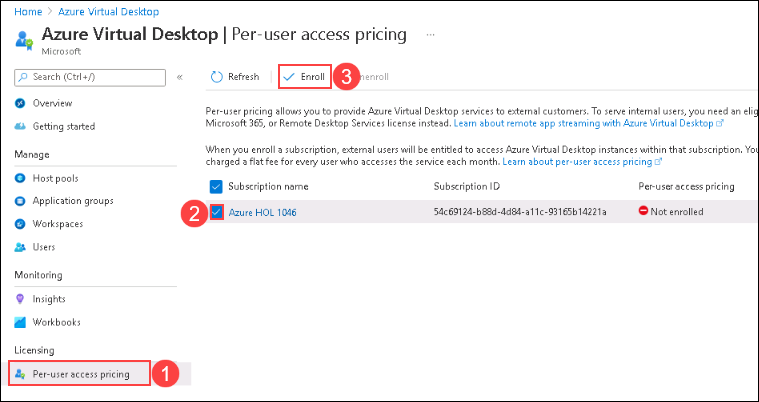
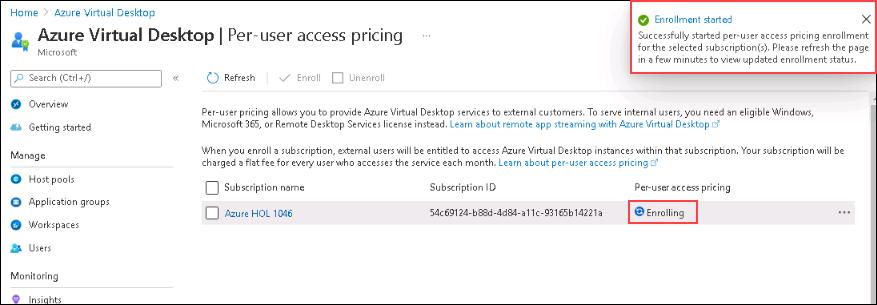

# Lab 12: Licensing Azure Virtual Desktop for external users

## Exercise 1: Enroll your subscription in per-user access pricing

### Task 1: Enroll your subscription in per-user access pricing

1. Sign in to the Azure portal at https://portal.azure.com.

2. Enter Azure Virtual Desktop into the search bar, then find and select Azure Virtual Desktop under Services.

   

3. In the Azure Virtual Desktop overview page, select **Per-user access pricing** (1) from the left-hand blade under Licensing.

   - In the list of subscriptions, select your **subscription** (2).
   - Select **Enroll** (3).

   

5. Review the Product Terms, then select **Enroll** to begin enrollment. It may take up to an hour for the enrollment process to finish.

   

6. After enrollment is done, check the value in the Per-user access pricing column of the subscriptions list to make sure it's changed from “Enrolling” to “**Enrolled**.”

### Task 2: Accessing application as an external user

1. Return to AVD client application. On the AVD dashboard, click on the application you want to launch.

   
   
2. A window saying *Connecting to: Session Desktop* will appear. Wait for few seconds, then enter your personal Corporate ID and password to access the Desktop.
   
   
   
   >**Note:** If there's a dialog box saying ***Help us protect your account***, then select **Skip for now** option.
   
   

3. Wait for the application to connect.

   

4. Your application will launch as an external user and look similar to the screenshot below. You can exit from the window by clicking on **X *i.e., the close button***. 
          
5. Click on the **Next** button present in the bottom-right corner of this lab guide. 
