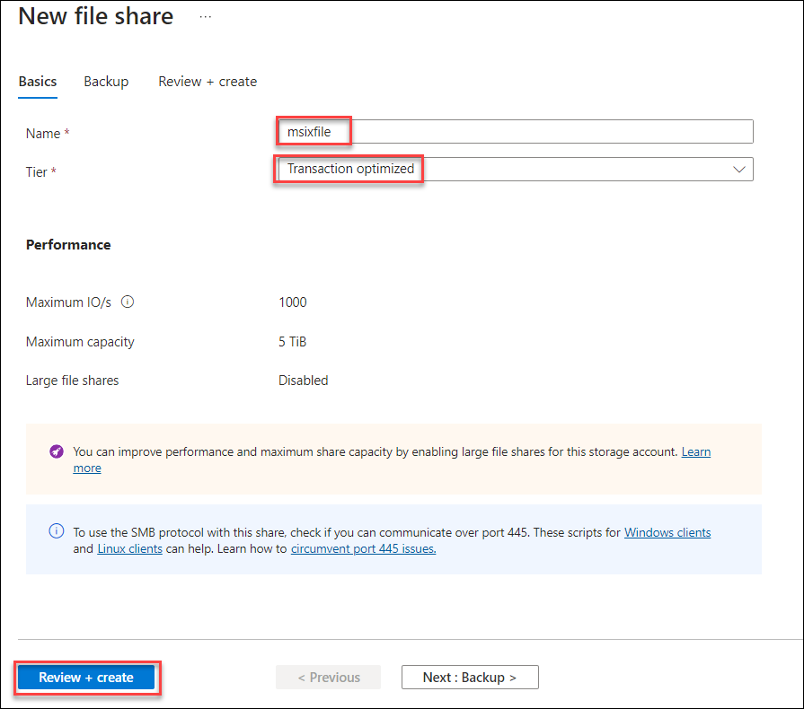
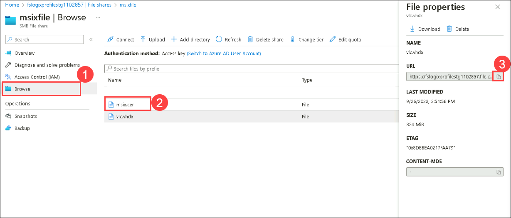

# Lab 12: MSIX App Attach (Optional - Read-Only)

## **Scenario**

Contoso wants a few applications to be installed in all the session's hosts. So, Contoso decided to implement the MSIX app attachment in order to install the application across the session hosts and users should be able to access them. You will help Contoso to install one of the applications that is, the VLC, using the MSIX app attach feature.

## **Overview**

In this exercise, we will be implementing MSIX App Attach for AVD. MSIX app attachment is a way to deliver MSIX applications to both physical and virtual machines. However, the MSIX app attached is different from regular MSIX because it's made especially for Azure Virtual Desktop. MSIX removes the need for repackaging when delivering applications dynamically.
Refer to this link ``https://docs.microsoft.com/en-us/azure/virtual-desktop/what-is-app-attach`` for more information.

## Exercise 1: Configuring AVD for MSIX App Attach

1. Search for **Storage accounts** in the search bar and select the **<inject key="Storage Account Name" />** account which was created in **Exercise 5: Setup FSLogix**.

1. In the right pane, click on **File shares (1)** present under *Data Storage* blade and click on **+File Share (2)**.

    
 
1. Enter the following name for your file share.
    
    - Name: **msixfile**   
    - Tier: **Transaction Optimized**
    - Click on **Review + create**, then click on **Create**.This will create the file share.
    
    
    
1. Go to the **msixfile** file share which you just created and select **upload**.
   
   
   
1. Browse the files and go to ``C:\LabFiles``. Select **vlc**, and **msix.cer** files and Click on **Open** then select **Upload**.

   
   
1. Select **Access Control(IAM) (1)** from the side blade. Click on **Add (2)** and select **Add Role Assignment (3)**.

   
   
1. Select the following options and click **Save**

   - Role: Search and select **Storage File Data SMB share Contributor (1)** role, then click on **Next (2)**

     
     
   - Under **Members**, enter the below details:
  
      - Assign access to **User, group, or service principal (1)**

      - Click on **+ Select members (2)**
      
      - Select: Search and select **<inject key="AzureAdUserEmail" />** user **(3)**.

      - Click on **Select (4)**
   
   
   
   - Select **Review + assign**
   
1. Search for **Storage accounts** in the search bar and select the **<inject key="Storage Account Name" />** account.

   
   
1. Under **Data storage**, select **File Shares (1)** and click on **msixfile (2)**.

    
   
1. In **msixfile** file share and click on **Connect**.

   
   
1. Under the **Windows** tab, select **Storage account key**, click on **Show Script** and **copy** the code from the window.

   
   
1. Go to the home page and search for **virtual machine** in the search bar. Select **AVD-HP01-SH-0**.

   
   
1. Under the **Operations** blade, Select Run Command. Select **RunPowerShellScript**.
    
   
  
1. **Paste** the **code** which you copied earlier into the window and select **Run**. Once the execution is completed, Output will be displayed as mentioned in the screenshot below.

   
   
   >**NOTE**: **This step is required for this lab only**. In the production environment, this is not required. You will use Microsoft Entra ID and Access Control (IAM) to control access to the MSIX VHD file. For more information refer to `` https://docs.microsoft.com/en-us/azure/virtual-desktop/app-attach-azure-portal ``.
   
1. Go to the home page and search for **virtual machine** in the search bar. Select **AVD-HP01-SH-1** VM.

   
   
1. Under the **Operations** blade, Select Run Command. Select **RunPowerShellScript**.
    
   
  
1. **Paste** the **code** which you copied earlier into the window and select **Run**. Once the execution is completed, Output will be displayed as mentioned in the screenshot below.

   
   
1. Search for **Stoarage accounts** in the search bar and select the **<inject key="Storage Account Name" />** account.

   
 
1. Under **Data storage**, select **File Shares** and click on **msixfile**.

    
   
3. In **msixfile** file share, Select **Browse (1)**, click on **msix.cer (2)** file and copy the **URL (3)** and save it in **notepad**.
   
   
   
1. Go to the home page, and search for **virtual machine** in the search bar. Select **AVD-HP01-SH-0**.

   
   
1. Under the **Operations** blade, select Run Command. Select **RunPowerShellScript**.
    
   
   
1. **Copy** the code mentioned below and paste the same into the window. **DO NOT** run the command as the **CERTIFICATE PATH** should be updated.   

   ```
   
   Import-Certificate -FilePath <CERTIFICATE PATH> -CertStoreLocation Cert:\LocalMachine\TrustedPeople
   
   ```
   
   
   
   >**NOTE**: This script will install the certificate in the AVD-HP01-SH-0 session host.

1. **Replace** the **CERTIFICATE PATH** with the **msix.cer** file URL which you had copied earlier and follow the next step.

1. For the **CERTIFICATE PATH** to be in the correct format, follow the below-mentioned steps to create the path.

   - **Remove** ``https://`` from the URL. Add ``\\`` to the start of the link.
   - **Replace** all the ``/`` (front slash) with ``\`` (back slash0. 
   - The final UNC path should look like this ``\\fslogixprofilestgxxxxxx.file.core.windows.net\msixfile\msix.cer``.

   

1. Click on **Run**   
   
1. Once the execution is completed, you'll be able to see similar output as mentioned below.

   

1. Go to the home page and search for **virtual machine** in the search bar. Select **AVD-HP01-SH-1** VM.

   
   
1. Under the **Operations** blade, Select Run Command. Select **RunPowerShellScript**.
    
   

1. **Copy** the code mentioned below and paste the same into the window. **DO NOT** run the command as the **CERTIFICATE PATH** should be updated.   

   ```
   
   Import-Certificate -FilePath <CERTIFICATE PATH> -CertStoreLocation Cert:\LocalMachine\TrustedPeople
   
   ```
   
   
   
   >**NOTE**: This script will install the certificate in the AVD-HP01-SH-1 session host.

1. **Replace** the **CERTIFICATE PATH** with **msix.cer** file URL which you had copied earlier and follow the next step.

1. For **CERTIFICATE PATH** to be in the correct format, Follow the below-mentioned steps to create the path.

   - **Remove** ``https://`` from the URL. Add ``\\`` to the start of the link.
   - **Replace** all the ``/`` (front slash) with ``\`` (back slash0. 
   - The final UNC path should look like this ``\\fslogixprofilestgxxxxxx.file.core.windows.net\msixfile\msix.cer``.

   

1. Click on **Run**   
   
1. Once the execution is completed, you'll be able to see similar output as mentioned below.

   
   
## Exercise 2: Creating MSIX Package in AVD environment
   
1. Go to **msixfile** file share, select the **Browse (1)** and then select the **VLC (2)** file. **Copy (3)** the **URL**.

   >**NOTE**: We'll be using this URL in further steps. Make sure you **Save** it in Notepad.

   

1. Navigate to the Azure portal, then search for *Azure Virtual Desktop* in the search bar and select **Azure Virtual Desktop** from the suggestions.

   

1. You will be directed towards the Azure Virtual Desktop management window.  

   
   
1. Select **Host pools** from the side blade and **select** the **GS-AVD-HP** host pool.

   

1. Under **Manage** blade, Select the **MSIX packages (1)** tab and click on **Add (2)**.

   
   
1. Paste the **URL** and follow the below-mentioned steps to create **UNC** path.

   - **Remove** ``https://`` from the URL. Add ``\\`` to the start of the link.
   - **Replace** all the ``/`` (front slash) with ``\`` (back slash0. 
   - The final UNC path should look like this ``\\fslogixprofilestg448267.file.core.windows.net\msixfile\VLC.vhd``.

   

   Click on **Add**.
   
1. For **Display name**, provide **VLC** as the value and enable state as **Active**. Click on **Add**.

   
   
1. Under **Manage** blade, Select the **Application groups** tab and click on **AVD-AG-01**.

   

1. Under **Manage** blade, Select the **Applications (1)** tab and click on **Add (2)**.

   
   
1. In **Add Application** tab, 

   - For **Application Source**, select **App Attach** from the drop-down. 
   - For **Application name**, provide **VLC** as the value.
   - For **Application identifier**, provide **VLC** as the value
   - Click on **Review+Add** and click again on **Add**.

   
   
   Now, The MSIX implementation is completed. We'll check the working of it.
    
1. On your PC, go to **Start** and search for **Remote desktop** and open the remote desktop application with the exact icon as shown below.

   
   
1. Once the application opens, click on **Subscribe**.

   
  
1. Enter your **credentials** to access the workspace.

   - Username: *Paste your username* **<inject key="AzureAdUserEmail" />** *and then click on **Next**.*
   
   

   - Password: *Paste the password* **<inject key="AzureAdUserPassword" />** *and click on **Sign in**.*

   
   
   >**Note:** If there's a popup entitled **Help us protect your account** click **Skip for now (14 days until this is required)**

   

1. Make sure to **uncheck** *Allow my organization to manage my device* and click on **No, sign in to this app only**.

   
      
1. The AVD dashboard will launch, then double-click on the **SessionDesktop** application to access it.

   
   
1. A window saying *Connecting to: Session Desktop* will appear. Wait for a few seconds, then enter your password to access the Desktop.

   - Password: **<inject key="AzureAdUserPassword" />**
   
   
   
   >**Note:** If there's a dialog box saying ***Help us protect your account***, then select the **Skip for now** option.
   
   

1. Wait for the Session Desktop to connect.

   

1. Once connected, In the **start menu** search for **VLC** and you'll be able to see that the application is present in the session desktop.

   

   > **Note:** If you don't see the app in the Session Desktop, follow the below steps:
   >
   >  - In the **Search bar**, search for **Control Panel** and click on it to open.
   >
   >     
   >   
   >  - On Computer Settings page, click on **View network status and tasks**
   >
   >      
   >      
   >  - On **Network and Sharing center** page, click on **Change advanced sharing settings**.
   >
   >       
   >    
   >  - On **Advanced sharing settings** page, check the box next to **Turn on network discovery (1)** under Network Discovery and click on **Save changes (2)**
   >
   >      
   >     
   >  - Restart the session desktop and continue with the next steps

1. In the **start menu**, search for **Apps & features** and click on it to open.

   

1. In **Search bar**, Search for **VLC** and you'll able to see the application.

   

1. In the **start menu** search for **Control Panel** and click on it to open.

   

1. In the Control Panel, Click on **Uninstall a program**.

   

1. Here, you'll notice that **VLC** is not present as an application.

    

1. In the **start menu** search for **Computer Management** and click on it to open.

   

1. In Computer Management page, Under **Storage** select **Disk Management**. Here you'll see that VHD has been mounted. This is where the **VLC** is present and has been assigned to the session desktop dynamically. This confirms the implementation of MSIX App Attach.

   

1. Click on the **Next** button present in the bottom-right corner of this lab guide.
