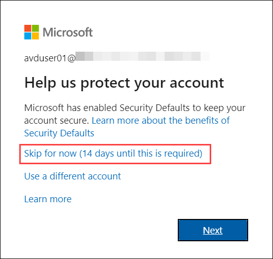
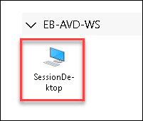
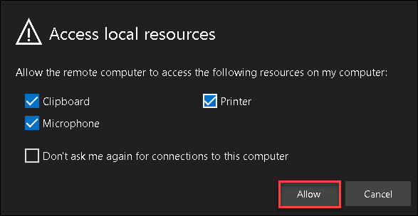

# Lab 13: App Masking (Optional)


### Overview

Application Masking is used to manage user access to installed components. Application Masking may be used in both physical and virtual environments. Application Masking is most often applied to manage non-persistent, virtual environments, such as Virtual Desktops.


##  Exercise-1: App Masking


1. In your JumpVM,  go to Start and search for **FSLogix Apps RuleEditor** and open the FSLogix Apps RuleEditor application.

    
    
2. On the FSLogix Apps RuleEditor application, click on **New**.

    
    
3. Provide a name for the Rule Set as **hidepowershell (1)** and click on **Enter file name (2)**.

    
    
4. On the **Rule Set : hidepowershell** dialog box, follow the below instructions:

    - Select ***Choose from installed programs (1)***
    -  Click on ***Browse (2)***
    -  Navigate to the mentioned path ***C:\ProgramData\Microsoft\Windows\Start Menu\Programs\Windows PowerShell (3)***
    -  Click on ***Scan (4)***
    
    
    
5. After Scan completes successfully, click on ***Ok***.

     
     
6. Now you have created the hiding rules to hide the PowerShell application. Click on **Apply Rules to System** to apply the created rule in your JumpVM.

     
     
7. Now in your JumpVM,  go to Start and search for **PowerShell (1)** and double click on **Windows Powershell ISE (2)** to open the application. Here you will not be able to open the app due to the hiding rule applied to your VM. 

     
     
    **Note:** In the same way, you can apply the hiding rule to the session desktop in the remote desktop from your JumpVM.
    
8. Navigate back to FSLogix App Rule Editor and click on **Manage Assignments**.

    
    
9. On the Assignments tab, click on **Add**.

    
    
10. Click on **User**.

    
    
11. On the **Select User** dialog box, follow the below instructions:

    - **User** : Paste the username  **<inject key="Avd User 01" /> (1)**
    - Click on **Ok (2)**

    
    
12. After adding the User, click on **Apply (1)** and **Ok (2)**.

    
    
13. Now you have added the User to the same hiding rules to hide the PowerShell application. Click on **Apply Rules to System** to apply the created rule in your Session host on the Remote desktop.

     
     
14. Paste the below-mentioned link in your browser in the **JumpVM** and enter your **credentials** to log in. 

     ```
     aka.ms/wvdarmweb
     ```

   - Username: *Paste the username*  **<inject key="Avd User 01" />** then click on **Next**.
   
     

   - Password: *Paste the password*  **<inject key="AVD User Password" />** *and click on* **Sign in**.

     

     >**Note:** If there's a dialog box saying ***Help us protect your account***, then select the **Skip for now** option.

      

15. Now in the AVD dashboard, click on the **Session Desktop** to access it. 

    

16. Select **Allow** on the prompt asking permission to *Access local resources*.

    

17. Enter your **credentials** to access the application and click on **Submit**.

   - Username: *Paste the username*  **<inject key="Avd User 01" />** then click on **Next**.
   
   - Password: *Paste the password*  **<inject key="AVD User Password" />** *and click on* **Sign in**.
   
     
     
18. Within the session desktop, go to Start and search for **PowerShell (1)** and double click on **Windows Powershell ISE (2)** to open the application. Here you will not be able to open the app due to the hiding rule applied to your session desktop through JumpVM. 

     

19. You have successfully added the hiding rule through App Masking for both the JumpVM and Session host.

20. Click on the **Next** button present in the bottom-right corner of this lab guide.  
