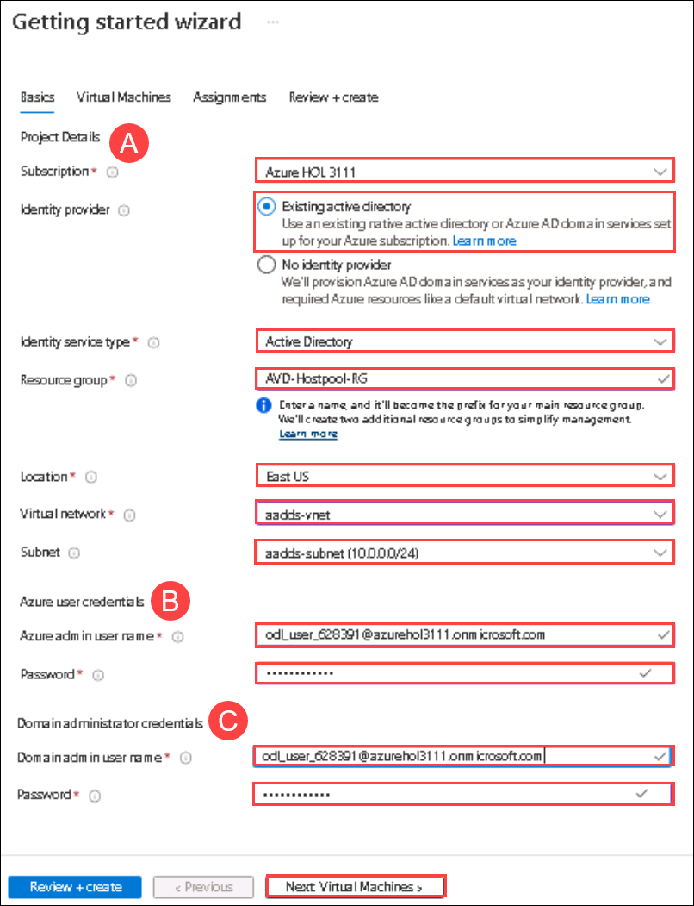

# Lab 15 : Azure Active Directory Domain Join (Read Only) 

## **Scenario**

 Contoso is planning to set up its infrastructure on Azure. As a first step, Contoso needs you to provision a host pool which is the main component of AVD. Creation of host pool also includes session hosts domain joined through Azure Active directory, default application group, and a workspace.

## **Overview**

 A Host Pool is a collection of Azure virtual machines that register to Azure Virtual Desktop as session hosts when you run the Azure Virtual Desktop agent. All session host virtual machines in a host pool should be sourced from the same image for a consistent user experience. To start with, we will login to the Azure portal.
 
## Exercise 1: Create Host Pool using Getting Started Wizard

In this exercise, We'll be creating the Host pool using **Getting Started Wizard** using minimum efforts and information.

1. On the **Azure portal** search for **Azure Virtual Desktop** in the **search bar** **(1)** and select **Azure Virtual Desktop** **(2)** from the suggestions.

   
   
    
2.	On the AVD **Overview page (1)**, click on Create a host pool **(2)**.

    

 
3.	On the **Basics** tab, provide the following information and click **Next: Virtual machines > (9)**

    A. **Project Details:**

       - Subscription: Select the **default (1)**
       - Resource group: Enter **AVD-HostPool-RG (2)**
       - Host pool name: **EB-AVD-AADJ-HP (3)**
       - Location: **East US (4)**
       - Validation environment: **Yes (5)**
        
    B. **Host pool type:**
    
       - Host pool type: **Pooled (6)**
       - Load balancing algorithm: **Breadth-first (7)**
       - Max session limit: **5** **(8)**

     
        
   
4.	On the **Virtual Machines** tab, provide the following information :

    A. **General:**
    
       - Add Azure virtual machines: **Yes (1)**
       - Resource group: **AVD-HostPool-RG (2)**
       - Name prefix: **AVD-AADJ-SH (3)**
       - Virtual machine location: **East US (4)**
       - Availability options: **No infrastructure redundancy required (5)**
       - Security type: **Standard (6)**
       - Image type: **Gallery (7)**
       - Image: Select **Windows 10 Enterprise multi-session, version 21H2 + Microsoft 365 Apps - Gen2 (8)** from dropdown
       - Virtual machine size: **Standard D4s v4 (9)**
       - Number of VMs: **2 (10)**
       - OS disk type: **Standard SSD (11)**

       
       
    B. **Network and security**
    
       - Virtual network: Select **aadds-vnet (1)** from drop-down
       - Network security group: **Basic (2)**
       - Public inbound ports: **No (3)**

      
       
    C. **Domain to join**
    
       - Select which directory you would like to join: **Azure Active Directory (1)**
       - Enroll VM with Intune: **No (2)**

       

    D. **Virtual Machine Administrator account**
    
       - Username: Username **(1)**
       - Password: Password **(2)**
       - Confirm password: Same as password **(3)**
       - Click on **Next : Workspace > (4)**

       

5.	On the Workspace tab, provide the following information and click **Review + create (3)**:

     - Register desktop app group: **Yes (1)**
     - To this workspace: **EB-AVD-WS (2)**

     

6.	Verify the information and click **Create**.

    

   > **NOTE:** Usually it takes 20 mins to get deployed successfully. Sometimes it might take up to 90 minutes.

7.	Once the deployment is successful, click on **Go to resource**.

    

8.	It will take you to the Host pool. The following resources were created:

     - Host Pool: 1 (EB-AVD-AADJ-HP)
     - Session Host: 2 (AVD-AADJ-SH-0, AVD-AADJ-SH-1)
     - Application Group: 1 (EB-AVD-AADJ-HP-DAG)
     - Application: 1 (SessionDesktop)
     - Workspace: 1 (EB-AVD-WS)
     
     

9.	Follow the instructions in Lab 3: Create Application Groups and assign them to users.

   
1. On the AVD page, **Click** on the **Getting Started** (1) from the side blade and click on **Start** (2).

   
   
1. On **Getting Started Wizard** page, **Provide** the information as mentioned below,

   **A**.Project Details:

   - Subscription: Select the ***default***
   - Identity provider: Select ***Existing active directory***
   - Identity Service Provider: Select ***Active Directory*** from the drop-down
   - Resource Group: Enter ***AVD-HostPool-RG***
   - Region: This should be same as the region of your *AVD-RG* resource group
   - Virtual Network: **aadds-vnet** *(choose from dropdown)*
   - Subnet: **sessionhosts-subnet(10.0.1.0/24)** *(choose from dropdown)*
   
   **B**. Azure user credentials:
   
   - Azure admin user name: *Paste your username* **<inject key="AzureAdUserEmail" />**
   - Password: *Paste the password* **<inject key="AzureAdUserPassword" />**

   **C**. Domain administrator credentials:
   
   - Domain admin user name: *Paste your username* **<inject key="AzureAdUserEmail" />**
   - Password: *Paste the password* **<inject key="AzureAdUserPassword" />**
   - **Click** on **Virtual Machines**.

   
   
1. In **Virtual Machines** tab, **Provide** the information as mentioned below,
   
   - Users per virtual machine: Select ***Multiple users***
   - Image type: ***Gallery***
   - Image: **Windows 10 Enterprise multi-session, version 20H2 + Microsoft 365 Apps (GEN2)** *(choose from dropdown)*
   - Virtual machine size: **Standard D4s v4**. *Click on **Change Size**, then select **D4s_v4** and click on **Select** as shown below*

     
   
   - Name prefix: **AVD-HP01-SH**
   - Number of VIrtual Machines: **2**
   - Link Azure template: **Unselect** the option

   
   
1. In **Assignments** page, **Provide** the information as mentioned below, 
   
   - Create test user account: **Unselect** the option
   - Assign existing users or groups: **Select** the option
   - click on **Review and Create**.

   
   
1. Verify the options and **click** on **Create**.

   
   
   >**NOTE**: Usually it takes 20 mins to get deployed successfully. Sometimes it might take upto 90 minutes.
   
1. Once the deployment is successful, **Click** on **Go to resource**.

   
   
1. It will take you to the **Host pool**. Reources created are as follows,

   - **Host Pool**: 1 (EB-AVD-HP)
   - **Session Host**: 2 (AVD-HP01-SH-0, AVD-HP01-SH-1)
   - **Aplication Group**: 1 (EB-AVD-HP-DAG)
   - **Application**: 1 (SessionDesktop)
   - **Workspace**: 1 (EB-AVD-WS)

   
   
1. Click on the **Next** button present in the bottom-right corner of this lab guide.  
   
