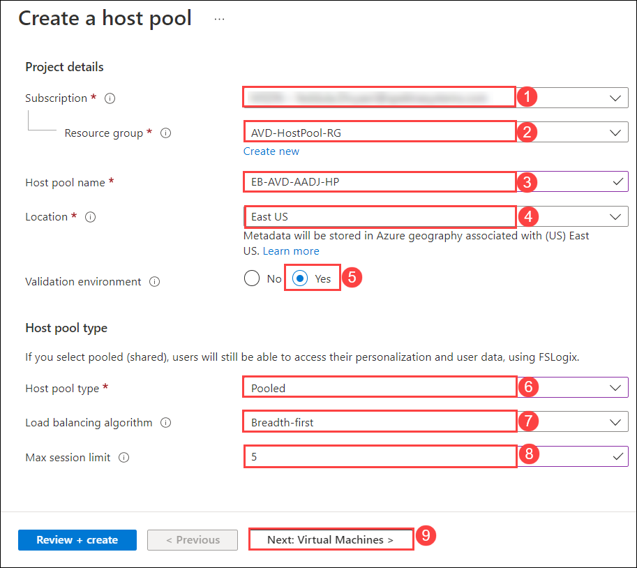
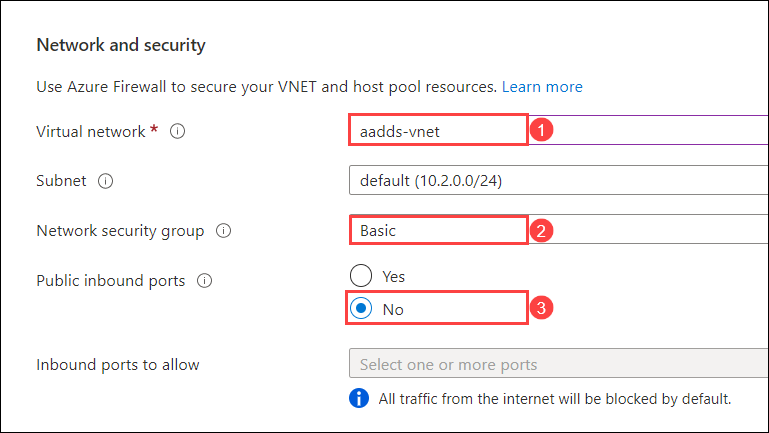
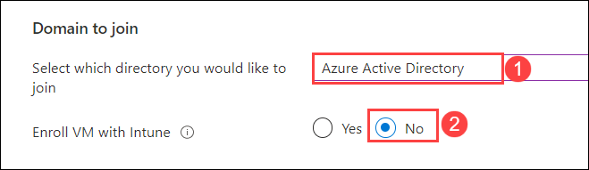
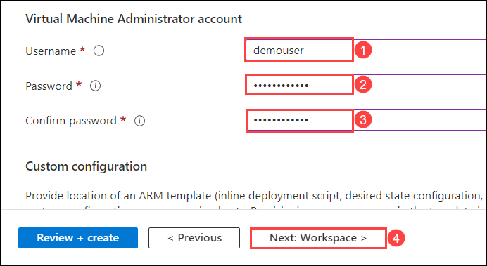
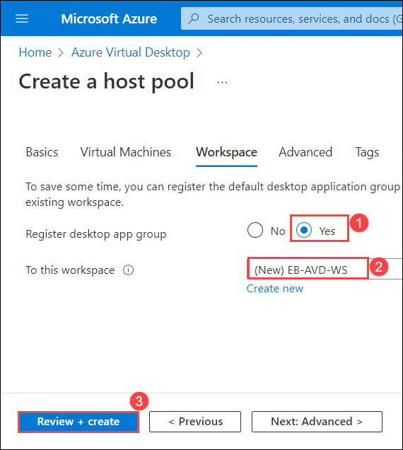
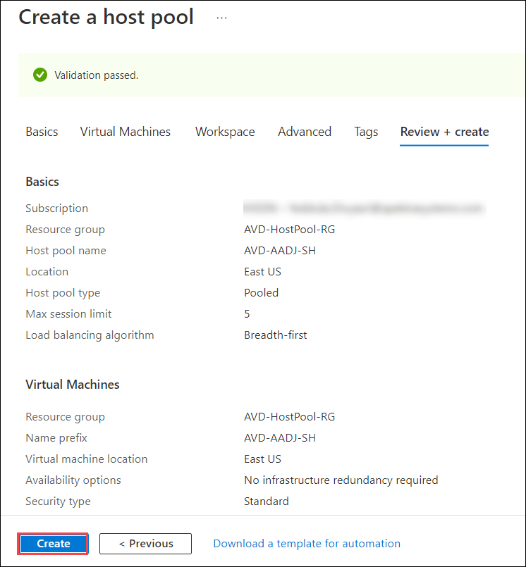

# Lab 15 : Azure Active Directory Domain Join (Read Only) 

## **Scenario**

 Contoso is planning to set up its infrastructure on Azure. As a first step, Contoso needs you to provision a host pool which is the main component of AVD. Creation of the host pool also includes session hosts domain joined through Azure Active directory, default application group, and a workspace.

## **Overview**

 A Host Pool is a collection of Azure virtual machines that register to Azure Virtual Desktop as session hosts when you run the Azure Virtual Desktop agent. All session host virtual machines in a host pool should be sourced from the same image for a consistent user experience. To start with, we will log in to the Azure portal.
 
## Exercise 1: Create Host Pool using Getting Started Wizard

In this exercise, We'll be creating the Host pool using **Getting Started Wizard** using minimum effort and information.

1. On the **Azure portal** search for **Azure Virtual Desktop** in the **search bar** **(1)** and select **Azure Virtual Desktop** **(2)** from the suggestions.

   
   
2.	On the AVD **Overview page (1)**, click on Create a host pool **(2)**.

   

3.	On the **Basics** tab, provide the following information and click **Next: Virtual machines >**

   - Load balancing algorithm: **Breadth-first (7)**
   - Max session limit: **5** **(8)**

   

4.	On the **Virtual Machines** tab, provide the following information :

   - Number of VMs: **2 (10)**
   - OS disk type: **Standard SSD (11)**

   

   B. **Network and security**

   - Virtual network: Select **aadds-vnet (1)** from drop-down
   - Network security group: **Basic (2)**
   - Public inbound ports: **No (3)**

   

   C. **Domain to join**

   - Select which directory you would like to join: **Azure Active Directory (1)**
   - Enroll VM with Intune: **No (2)**

   

   D. **Virtual Machine Administrator account**

   - Confirm password: **Password.1!!** **(3)**
   - Click on **Next : Workspace > (4)**

   

5.	On the Workspace tab, provide the following information and click **Review + create (3)**:

   - Register desktop app group: **Yes (1)**
   - To this workspace: **GS-AVD-WS (2)**

     

6.	Verify the information and click **Create**.

   

   > **NOTE:** Usually it takes 20 mins to get deployed successfully. Sometimes it might take up to 90 minutes.

7.	Once the deployment is successful, click on **Go to resource**.

   

8.	It will take you to the Host pool. The following resources were created:

   - Host Pool: 1 (EB-AVD-AADJ-HP)
   - Session Host: 2 (AVD-AADJ-SH-0, AVD-AADJ-SH-1)
   - Application Group: 1 (EB-AVD-AADJ-HP-DAG)
   - Application: 1 (SessionDesktop)
   - Workspace: 1 (EB-AVD-WS)
     
   
   
9. Click on the **Next** button present in the bottom-right corner of this lab guide.  
   
