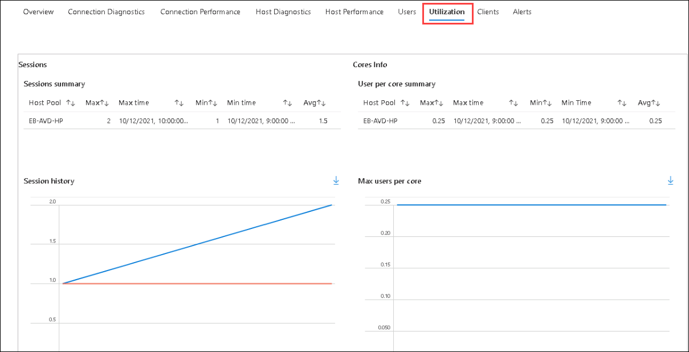

# Lab 2(B): Monitoring using Azure Monitor for AVD

## **Overview**

In this exercise, We'll be reviewing monitoring data of the AVD environment using Azure Insights which you had configured in part A of Exercise 2.

## Exercise 1: Exploring Insights for AVD

### Task 1: Access AVD using the browser and Remote client

   
1. Navigate to **Your Own PC/computer/workstation**, go to **Start** and search for **Remote desktop** and open the application with the exact icon as shown below.

   
   
1. Click on the *ellipses* and select **Unsubscribe**. Click on **Yes** for any warning.

   

   >**NOTE**: We need to unsubscribe from the feed because in Exercise 4 we subscribed to the AVD feed using a different user.

1. Click on the **Subscribe** button.

   

1. Enter the user credentials to access the workspace.

   - Username: *Paste the username*  **<inject key="Avd User 02" />** *then click on* **Next**.
   
   - Password: *Paste the password*  **<inject key="AVD User Password" />** *and click on* **Sign in**.

   

   >**NOTE**: If there's a dialog box saying ***Help us protect your account***, then select the **Skip for now** option.

   
    
1. Make sure to **uncheck** *Allow my organization to manage my device* and click on **No, sign in to this app only**.

   

1. In the AVD client, double click on the **Session Desktop** to access it. 

   

1. Enter your **credentials** to access the application and click on **Submit**.

   - Username: *Paste the username*  **<inject key="Avd User 02" />** then click on **Next**.*
   - Password: *Paste the* **<inject key="AVD User Password" />** *and click on* **OK**.* 
   
   
  
1. The virtual Desktop will launch as shown below. 

   
   
   >**NOTE**: **DO NOT** close the session or the AVD Remote client. Keep it running.

### Task 2: Exploring Insights data

>**NOTE**: While performing this exercise, you might see that data is not loaded as expected. In such a scenario, Please refresh the **Insights** page until the data is loaded.
   
1. Now, Navigate to Azure Virtual Desktop and select **Insights** under **Monitoring** blade in the Azure Portal.

   
   
1. In **Insights** page, **Click** on **Overview** tab *(1)*. Here **expand** *(2)* the **EB-AVD-HP** host pool. You'll be able to monitor the status and health of the session hosts (3).

   
   
1. **Click** on **Users** *(1)* tab, In **UPN to search for** blank paste **<inject key="Avd User 01" />** *(2)* and wait for the data to load. This tab gives an overview of the user's usage. Scroll down and explore different information loaded.

   
   
1. **Click** on **Utilization** tab, This tab gives information about sessions summary, cores info, and more information about the utilization of resources.

   
   
1. **Click** on **Clients** *(1)* tab, Here you'll be able to monitor the number of users connected to AVD using the browser and remote client application.

   
   
1. Spend some time on the page to explore different monitoring abilities offered by Azure Insights.

