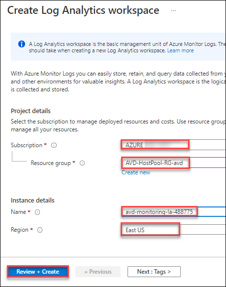
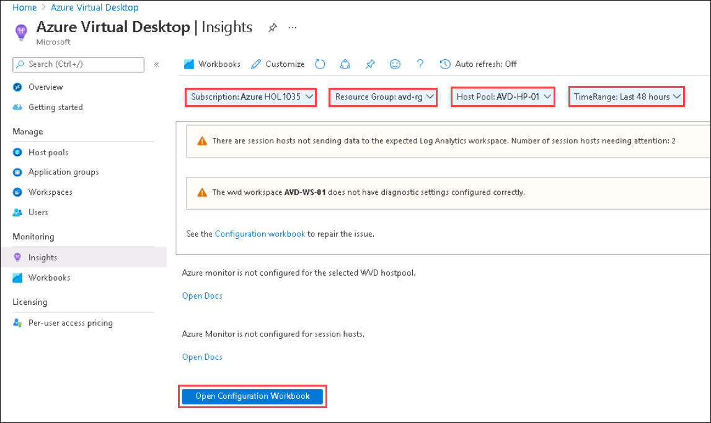
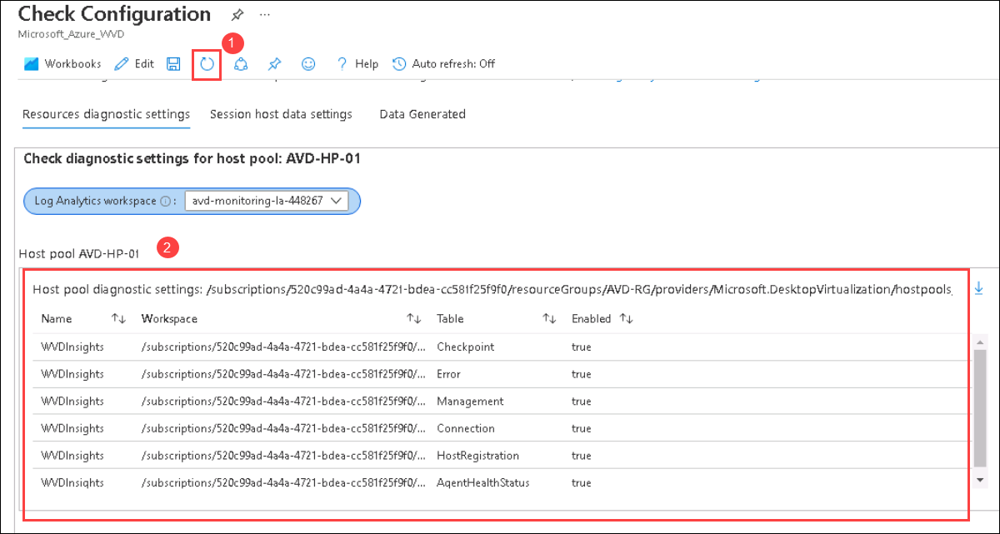
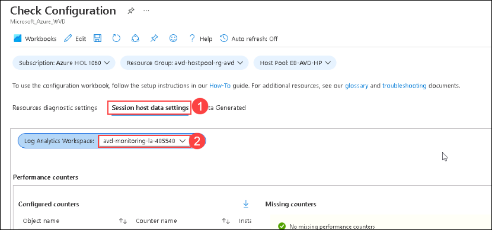
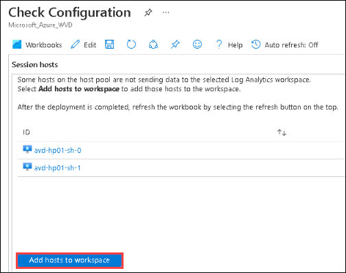
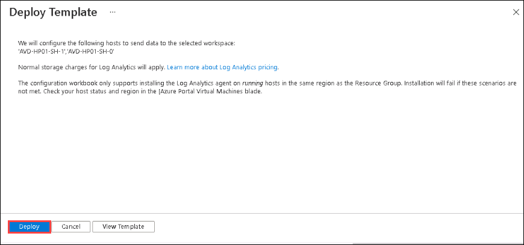
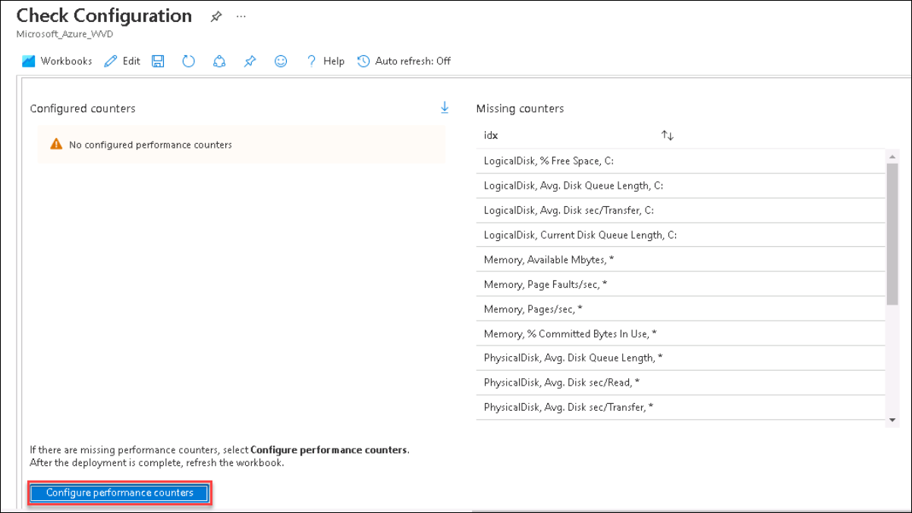
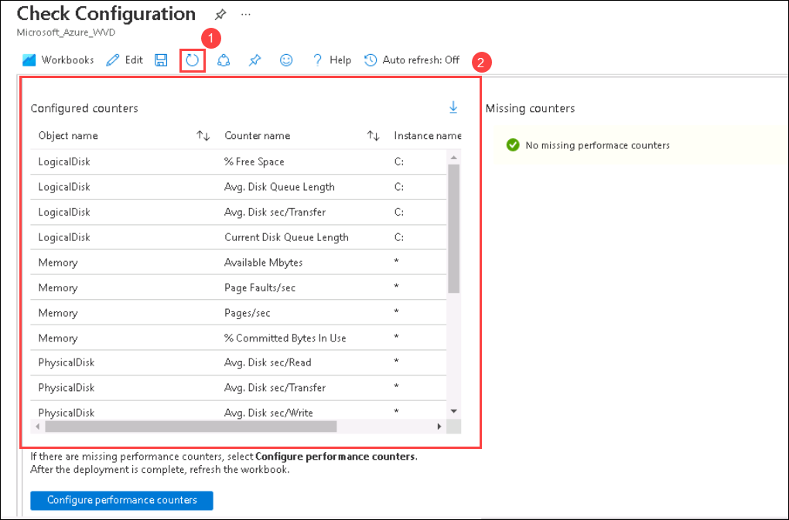

# Lab 2(A) : Monitoring using Log Analytics

## **Scenario**

Contoso is interested in setting up an operation center focused on monitoring the host pools, user access, and many more. You will help Contoso to set up a  monitoring solution with the help of features available in Azure virtual desktop and Azure monitoring resource. You will create a Log analytics workspace and map it to the AVD environment using Azure Insights.

## **Overview**

Azure Virtual Desktop uses Azure Monitor for monitoring and alerts like many other Azure services. This lets admins identify issues through a single interface. The service creates activity logs for both user and administrative actions.

## Exercise 1: Create Log Analytics

1. On the Azure portal, click on **Create a resource** given under *Azure services*.

   

1. Type *Log Analytics Workspace* in the search bar and click on **Log Analytics Workspace** from the suggestions.

   

1. On the Log Analytics Workspace page, click on **Create**.

   

1. Now add the following configurations:

   - Subscription: Leave it to ***default***
  
   - Resource group: *Select **AVD-Hostpool-RG-avd** from the drop down.*
  
   - Name: **<inject key="Log Analytics Workspace Name	" />**
  
   - Region: Select **<inject key="Region" />** from the drop-down list
  
   - Click on **Review + Create**

   

1. The last window helps us to verify if the parameters we filled are correct. Wait for validation to pass, then click on **Create** to initiate the deployment.

   

1. Once the deployment gets succeeded, it will look similar to the image shown below.

   
   

## Exercise 2: Enable diagnostics for Workspace
 
1. On **Azure portal** search for **Azure Virtual Desktop (1)** in the search bar and select **Azure Virtual Desktop** **(2)** from the suggestions.

    

1. You will get directed towards the Azure Virtual Desktop (hereafter referred to as AVD) management window. Select **Insights** under **Monitoring** blade.

   
   
1. On the **Insights** page, Select the following values and click on **Open Configuration Workbook**.
   
   - Subscription: **Choose the default subscription**.
   - Resource group: **avd-hotpool-rg-avd**.
   - Host Pool: **EB-AVD-HP**
   - Time range: **Leave it to default**.

   

1. In the **Check Configuration** page, Select the **<inject key="Log Analytics Workspace Name" enableCopy="false" /> (1)** workspace from the drop-down Under **Resource diagnostic settings** and Click on **Configure host pool (2)**.

   
   
1. On the **Deploy template** page, The diagnostic settings for the host pool are automated using a template. Look through the categories select and click on **deploy**.

   
   
1. Once the deployment is successful, **Refresh** the **Check Configuration** page. You'll be able to see the settings applied to the host pool.

   
   
1. Scroll down on the same page and click on **Configure workspace**.

   
   
1. On the **Deploy template** page, The diagnostic settings for the workspace are automated using a template. Look through the categories select and click on **deploy**.

    

1. Once the deployment is successful, **Refresh** the **Check Configuration** page. You'll be able to see the settings applied to the workspace.

   
   
1. On **Check Configuration** page, Select **Session host data settings (1)**. Select the **<inject key="Log Analytics Workspace Name	" /> (2)** analytics workspace.

   
   
1. On Check Configuration page click on **Add hosts to workspace** in **Session hosts** window.

   
   
1. On the **Deploy template** page, The required session hosts configuration will be added to the Log Analytics workspace. Click on **Deploy**.

   
   
1. On the **Check Configuration** page click on **configure performance counters** in the **performance counter** window.

   
   
1. On the **Deploy template** page, The required performance counters will be added to the Log Analytics workspace. Click on **Apply Config**

   
   
1. Once the deployment is successful, **Refresh** the **Check Configuration** page. You'll see that all the performance counters will be configured.

   
   
1. On the same **Check Configuration** page, scroll down and click on **Configure events** in **Windows event logs** window.

   
   
1. On the **Deploy template** page, The required events will be added to the Log Analytics workspace. Click on **Deploy**.

   
   
1. Once the deployment is completed, **Refresh** the **Check Configuration** page. You'll see that all the required events will be configured.
   
   
   
1. Click on the **Next** button present in the bottom-right corner of this lab guide.

 
