# Lab 2(A) : Monitoring using Log Analytics

## **Scenario**

Contoso is interested in setting up an operation center focused on monitoring the host pools, user access, and many more. You will help Contoso set up a monitoring solution with the help of features available in Azure virtual desktop and Azure monitoring resources. You will create a Log Analytics workspace and map it to the AVD environment using Azure Insights.

## **Overview**

Azure Virtual Desktop uses Azure Monitor for monitoring and alerts like many other Azure services. This lets admins identify issues through a single interface. The service creates activity logs for both user and administrative actions.

## Exercise 1: Create Log Analytics

1. On the Azure portal, click on **+ Create a resource** given under *Azure services*.

   

1. Type *Log Analytics Workspace* in the search bar and click on **log analytics workspace** from the suggestions.

   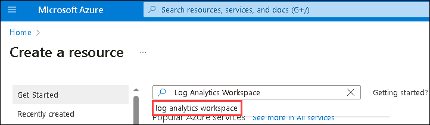

1. On the Marketplace page, Select the **drop down (1)**  and click on **Log Analytics Workspace (2)**.

   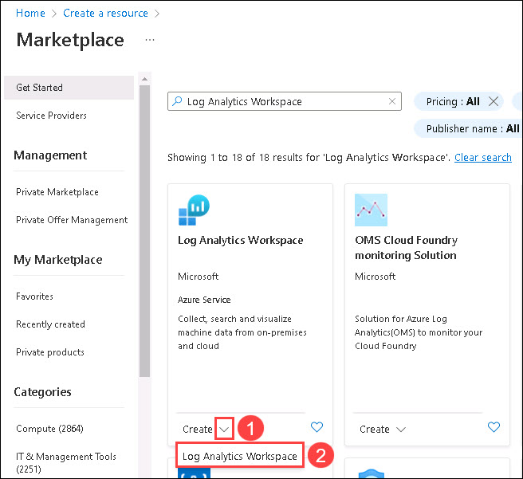

1. Now add the following configurations:

   - Subscription: Leave it to ***default***
  
   - Resource group: *Select **AVD-Hostpool-RG-avd** from the drop-down.*
  
   - Name: **<inject key="Log Analytics Workspace Name	" />**
  
   - Region: Select **<inject key="Region" enableCopy="false"/>** from the drop-down list
  
   - Click on **Review + Create**

   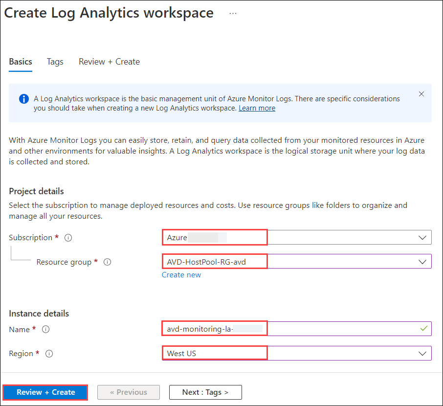

1. The last window helps us to verify if the parameters we filled are correct. Wait for validation to pass, then click on **Create** to initiate the deployment.

   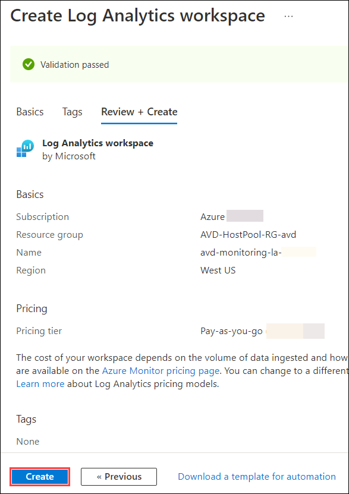

1. Once the deployment succeeds, it will look like the image shown below:

   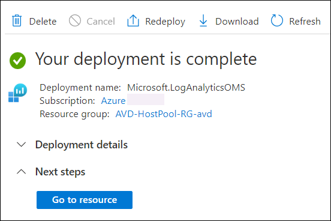
   

## Exercise 2: Enable diagnostics for Workspace
 
1. On the **Azure portal** search for **Azure Virtual Desktop (1)** in the search bar and select **Azure Virtual Desktop** **(2)** from the search results.

   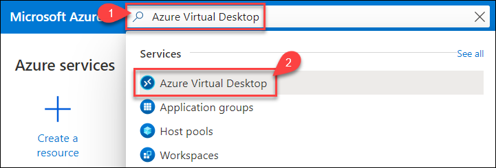 

1. You will be directed towards the Azure Virtual Desktop (hereafter referred to as AVD) management window. Select **Insights** under **Monitoring** blade.

   -ex2-step2.png)
   
1. On the **Insights** page, select the following values and click on **GS-AVD-HP** under overview.
   
   - Subscription: **Choose the default subscription**
   - Resource group: **avd-hostpool-rg-avd**
   - Host Pool: **GS-AVD-HP**
   - Time range: **Leave it to default**

   -ex2-step3.png)
   
1. On the **GS-AVD-HP | Insights** hostpool page, click on **Open Configuration Workbook**. 

   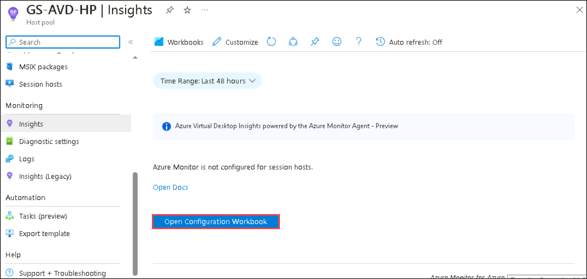

1. On the **CheckAMAConfiguration** page, re-select the resource group and host pool name as mentioned below. After that select the **<inject key="Log Analytics Workspace Name" enableCopy="false" />** workspace from the drop-down menu under the **Resource diagnostic settings** section of the page. 

   - Resource group: **avd-hostpool-rg-avd**
   - Host Pool: **GS-AVD-HP**

   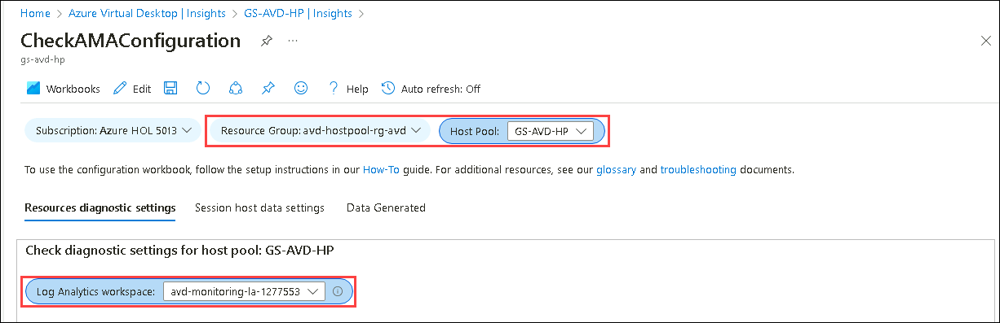
   
1. Scroll down on the same page and click on **Configure host pool**.

   >**Note**: Sometimes, monitoring for the host pool gets configured automatically. Please **re-configure** monitoring for the host pool as a few components might not be configured.

    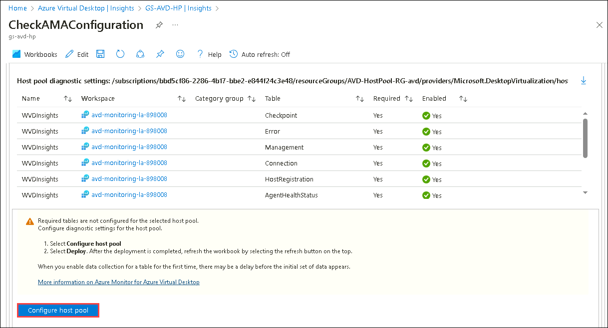
   
1. On the **Deploy template** page, the diagnostic settings for the host pool are automated using a template. Look through the categories select and click on **deploy**.

   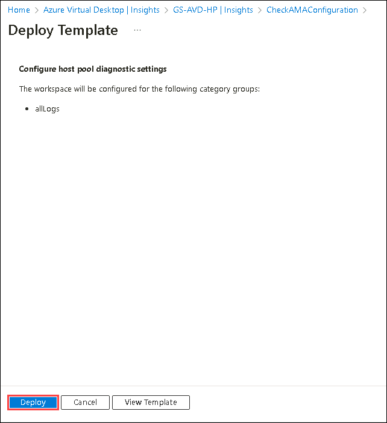
   
1. Once the deployment is successful, **Refresh** the **Check Configuration** page. You'll be able to see the settings applied to the host pool.

   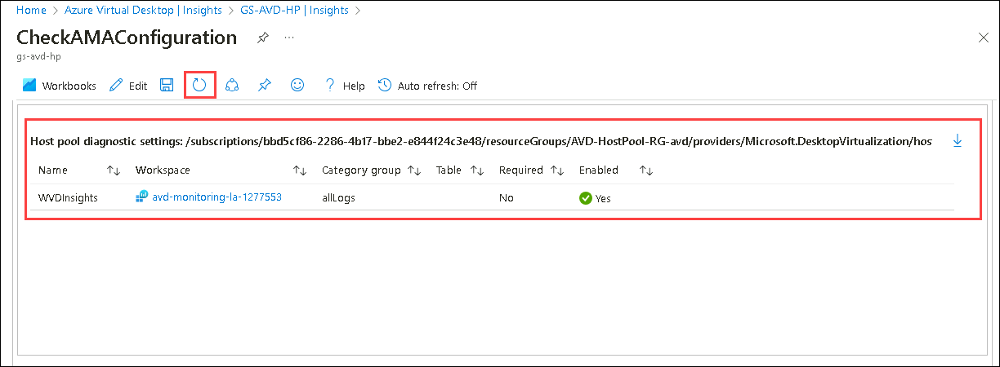
   
1. Scroll down on the same page and click on **Configure workspace**.

   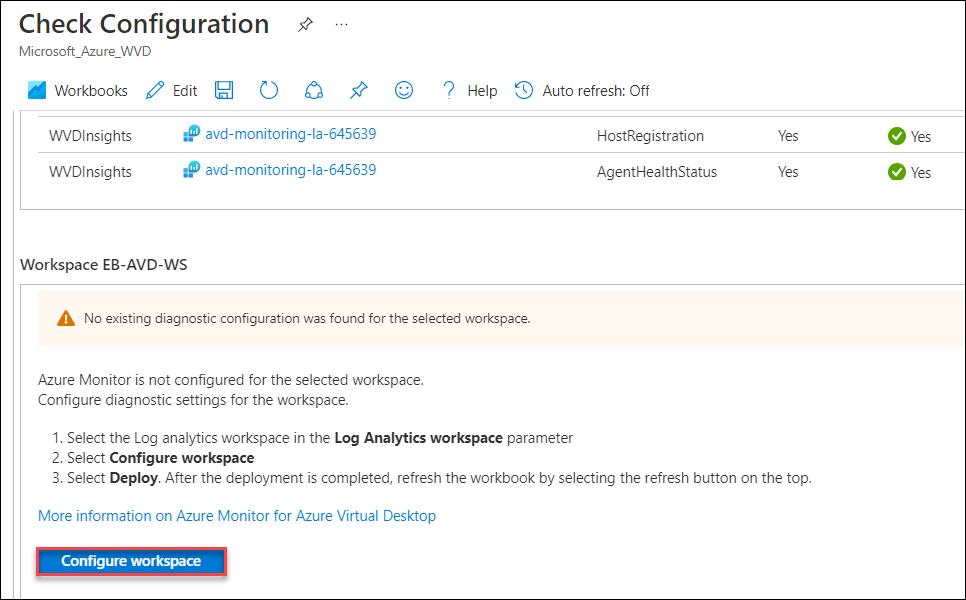
   
1. On the **Deploy template** page, click on **deploy**. (Note: The diagnostic settings for the host pool are automated using a template).

   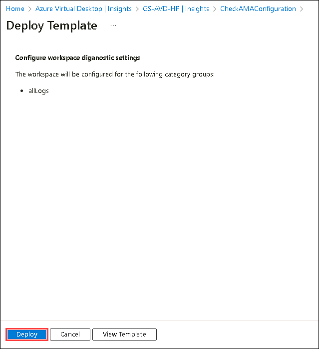 

1. Once the deployment is successful, **Refresh** the **Check Configuration** page 2-3 times as it takes some time to load the details. You'll be able to see the settings applied to the workspace.

   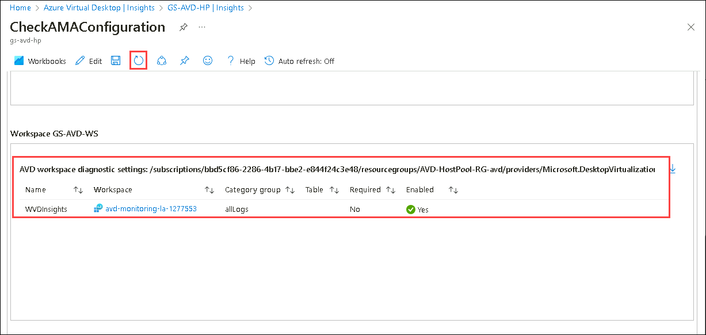
   
1. On **CheckAMAConfiguration** page, Select **Session host data settings (1)**. Then, select the **<inject key="Log Analytics Workspace Name	" /> (2)** analytics workspace.

   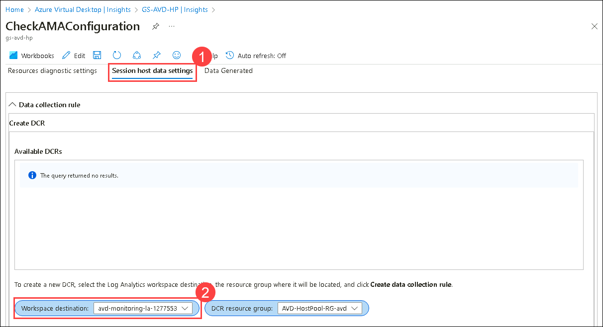
   
1. On CheckAMAConfiguration page click on **Add extension** in **Session hosts missing Azure Monitor extension** window.

   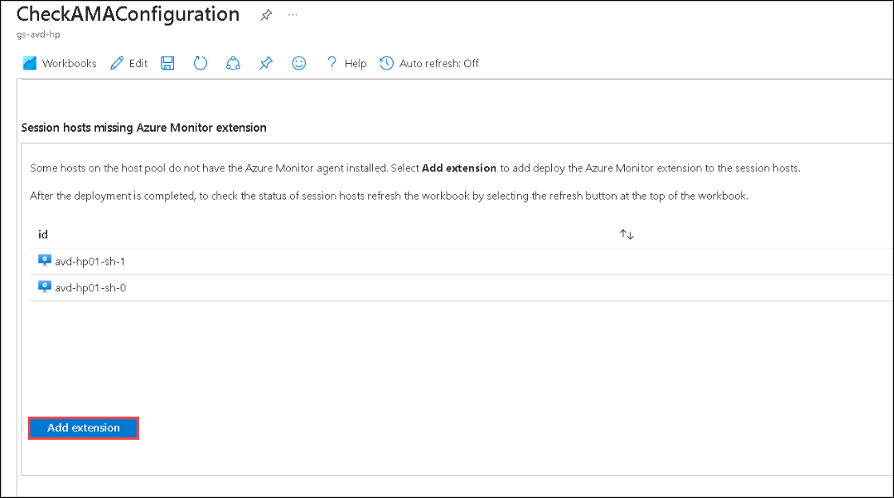
   
1. On the **Deploy template** page, click on **Deploy**. (Note: the diagnostic settings for the workspace are automated using a template).

   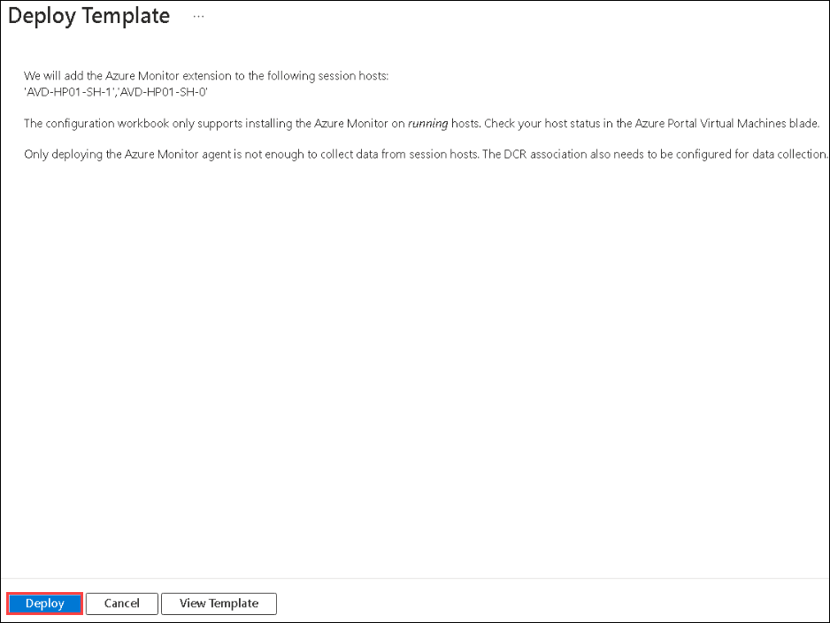
   
1. Once the deployment is successful, **Refresh** the **Check Configuration** page. You'll see a message as **No session hosts missing AMA extension.**.

   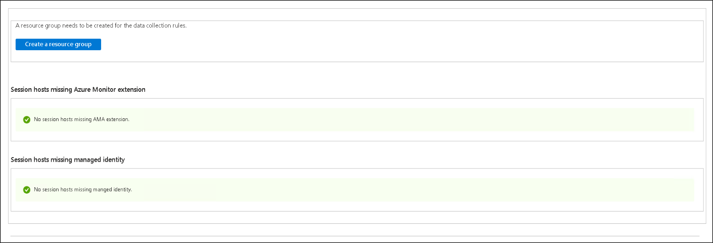
   
1. Click on the **Next** button present in the bottom-right corner of this lab guide.

 
