# Lab 2 Monitoring using Log Analytics(PART 1)

Azure Virtual Desktop uses Azure Monitor for monitoring and alerts like many other Azure services. This lets admins identify issues through a single interface. The service creates activity logs for both user and administrative actions.

### **Exercise 1: Create Log Analytics**

1. On the Azure portal, click on **Create a resource** given under *Azure services*.

   

1. Type *Log Analytics Workspace* in the search bar and click on **Log Analytics Workspace** from the suggestions.

   

1. On the Log Analytics Workspace page, click on **Create**.

   

1. Now add the following configurations:

   - Subscription: *Choose the default subscription.*
  
   - Resource group: *Select **AVD-RG** from the drop down.*
  
   - Name: **<inject key="Log Analytics Workspace Name	" />**
  
   - Region: **East US**, *basically this should be same as the region of your resource group.*
  
   - Click on **Review + Create**

   

1. The last window helps us to verify if the parameters we filled are correct. Wait for validation to pass, then click on **Create** to initiate the deployment.

   

1. Once the deployment gets succeeded, it will look similar to the image shown below.

   
   
   ### **Exercise 2: Enable diagnostics for Workspace**
 
1. On **Azure portal** search for *Azure Virtual Desktop* in the search bar (1) and select **Azure Virtual Desktop** (2) from the suggestions.

    

1. You will get directed towards the Azure Virtual Desktop (here after referred to as AVD) management window. Select **Insights** under **Monitoring** blade.

   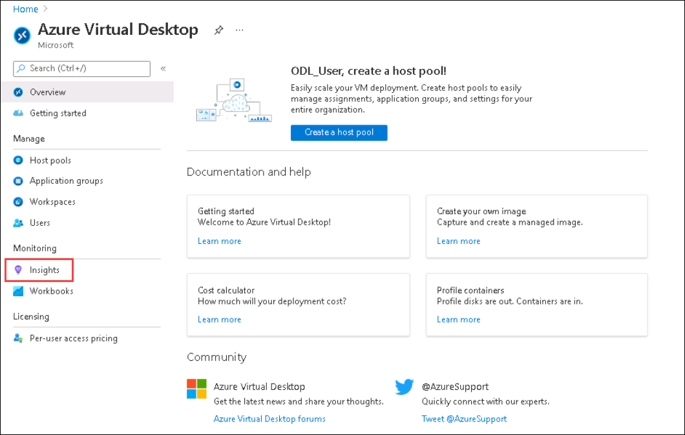
   
1. In **Insights** page, Select the following values and click on **open configuration Workbook**.
   
   - Subscription: **Choose the default subscription**.
   - Resource group: **AVD-RG**.
   - Host Pool: **AVD-HP-01**
   - Time range: **Leave it to default**.

   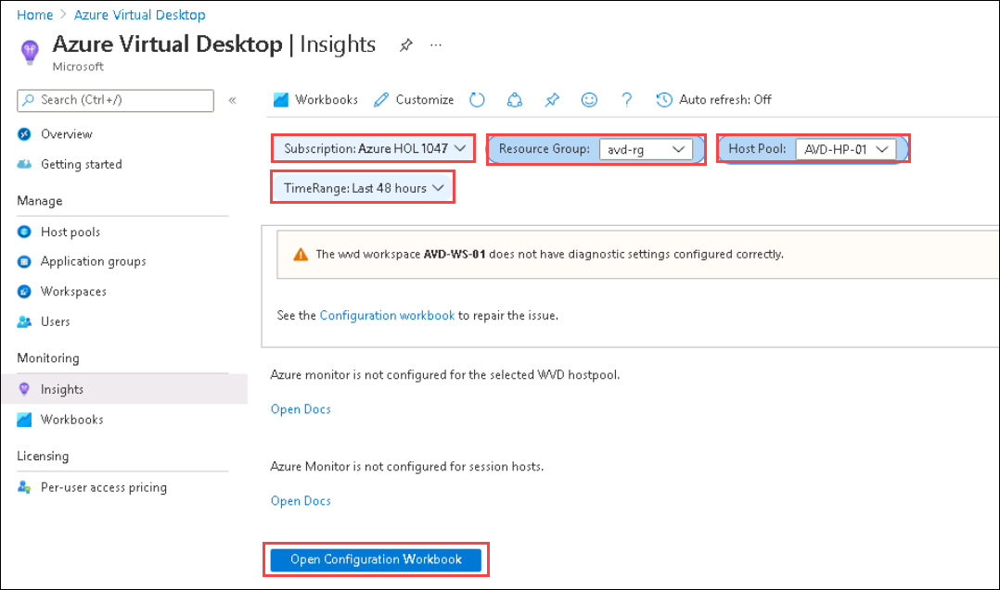

1. In **Check Configuration** page, Select the **<inject key="Log Analytics Workspace Name	" />** workspace from the drop-down Under **Resource diagnostic settings** and Click on **Configure host pool**.

   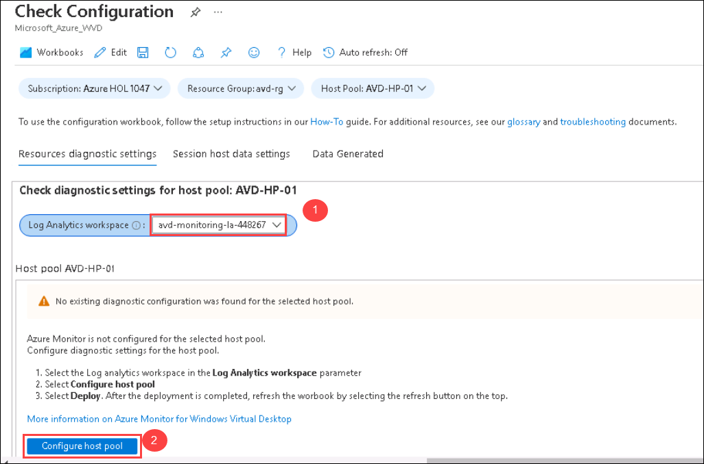
   
1. In **Deploy template** page, The diagnostic settings for the host pool are automated using a template. Look through the categories select and click on **deploy**.

   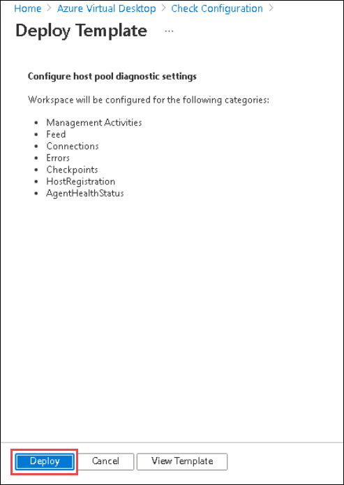
   
1. Once the deployment is successfull, **Refresh** the **Check Configuration** page. You'll be able to see the settings applied to the host pool.

   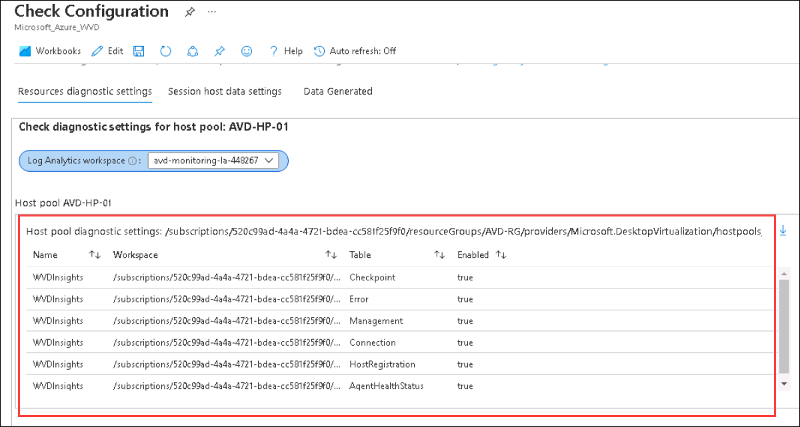
   
1. Scroll down on the same page and click on **Configure workspace**.

   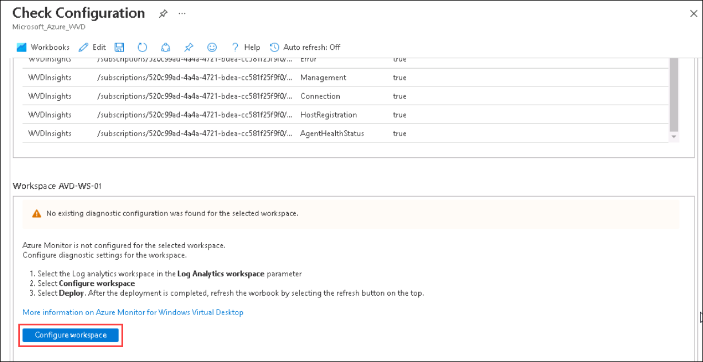
   
1. In **Deploy template** page, The diagnostic settings for the workspace are automated using a template. Look through the categories select and click on **deploy**.

   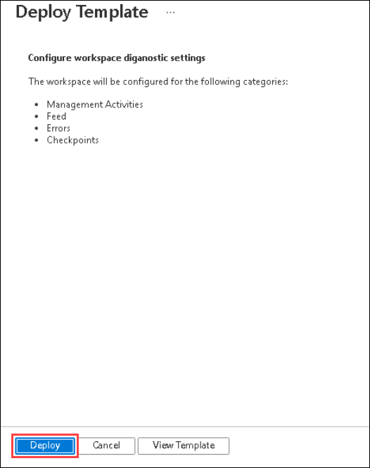 

1. Once the deployment is successfull, **Refresh** the **Check Configuration** page. You'll be able to see the settings applied to the workspace.

   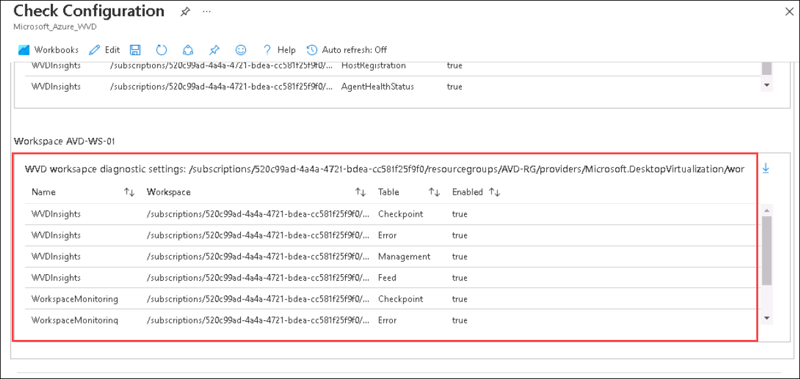
   
1. On **Check Configuration** page, Select **Session host data settings**. Select the **<inject key="Log Analytics Workspace Name	" />** analytics workspace and click on **Add host to workspace**.

   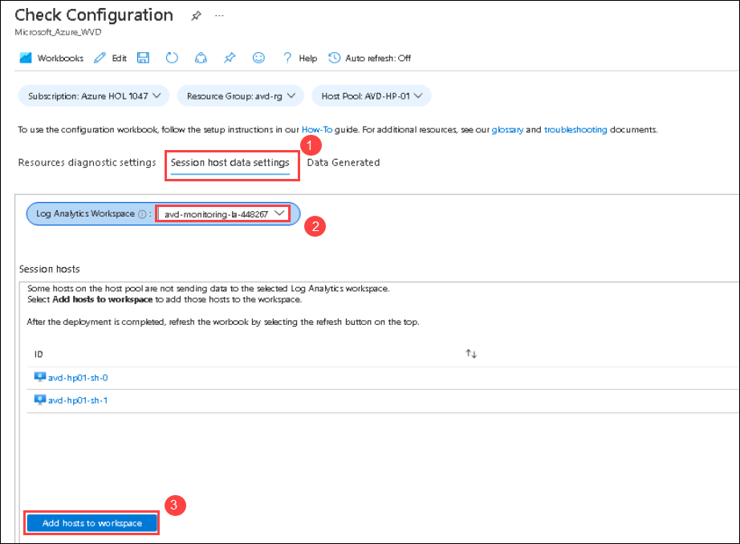
   
1. In **Deploy template** page, Both the session host will be configured to send data to the selected workspace. Click on **Deploy**.

   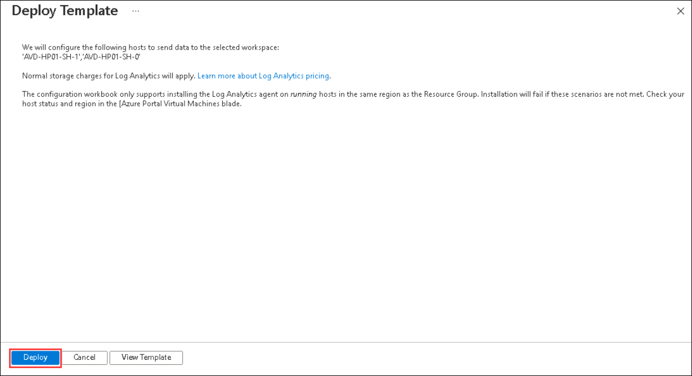
   
1. Once the deployment is successful, On **Check Configuration** page click on **configure performance counters** in **performance counter** window.

   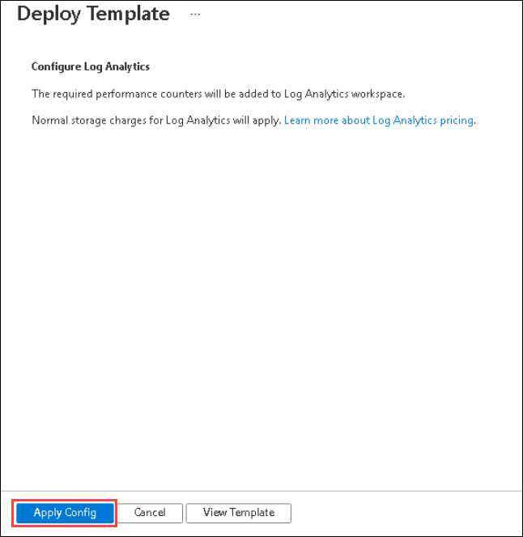
   
1. In **Deploy template** page, The required performance counters will be added to Log Analytics workspace. Click on **Deploy**

   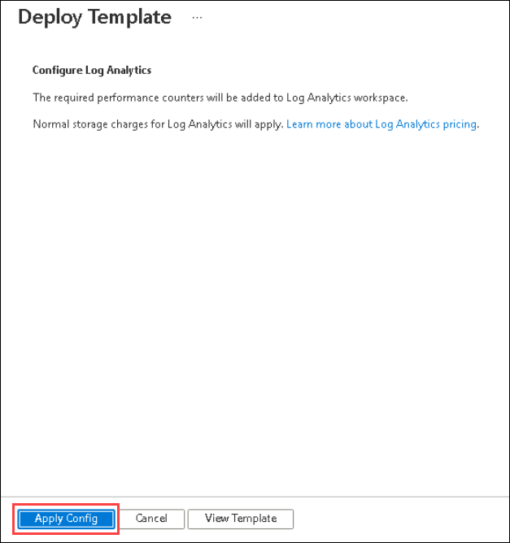
   
1. Once the deployment is successfull, **Refresh** the **Check Configuration** page. You'll see that all the performance counters will be configured.

   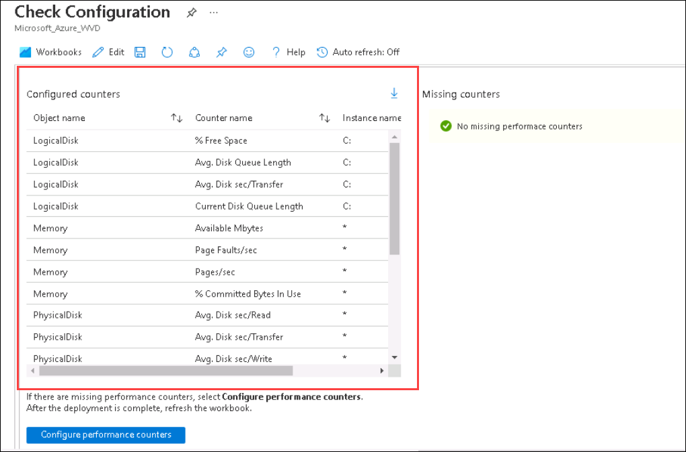
   
1. On the same **Check Configuration** page, scroll down and click on **Configure events** in **Windows event logs** window.

   
   
1. In **Deploy template** page, The required events will be added to Log Analytics workspace. Click on **Deploy**.

   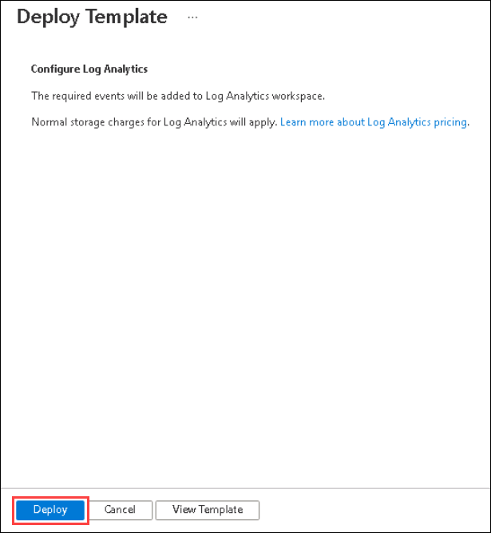
   
1. Once the deployment is completed, **Refresh** the **Check Configuration** page. You'll see that all the required events will be configured.
   
   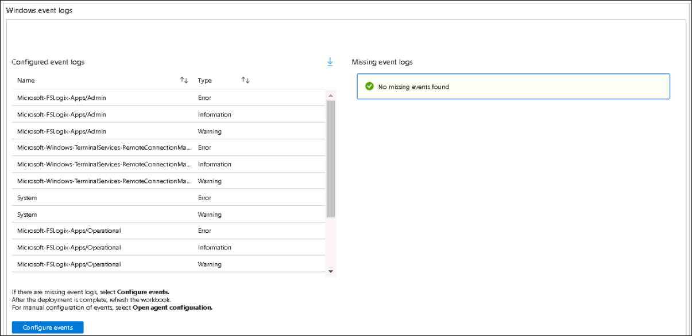

   >**NOTE**: Now that all the configuration has be done successfully. you'll be checking the implementation later in Lab 2(part 2).

   

   
