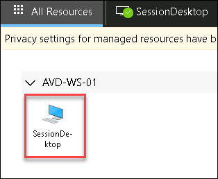
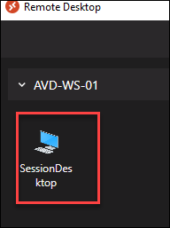
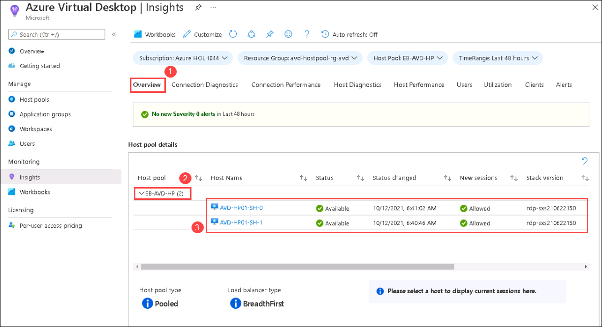
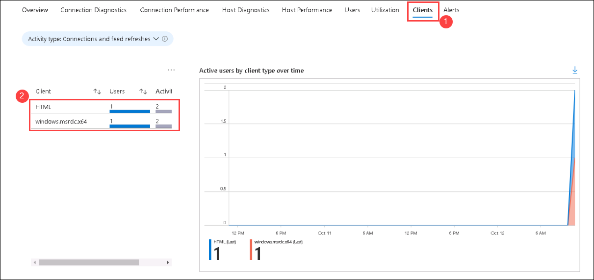

# Lab 2: Monitoring using Azure Monitor for AVD (Part 2)

## Exercise 1: Access AVD using browser and Remote client

1. Paste the below mentioned link in your browser in the **JumpVM** and enter your **credentials** to login. 

   ```
   aka.ms/wvdarmweb
   ```

   - Username: *Paste the username*  **<inject key="Avd User 01" />** then click on **Next**.*
   
   

   - Password: *Paste the password*  **<inject key="AVD User Password" />** *and click on* **Sign in**.

   

   >**Note:** If there's a dialog box saying ***Help us protect your account***, then select **Skip for now** option.

   

1. Now in the AVD dashboard, click on the **Session Desktop** to access it. 

   

1. Select **Allow** on the prompt asking permission to *Access local resources*.

   

1. Enter your **credentials** to access the application and click on **Submit**.

   - Username: *Paste the username*  **<inject key="Avd User 01" />** then click on **Next**.*
   
   - Password: *Paste the password*  **<inject key="AVD User Password" />** *and click on* **Sign in**.
   
   

1. The virtual Desktop will launch as shown below. 

   
   
   >**NOTE**: **DO NOT** close the session or the AVD web client. Keep it running.
   
1. Navigate to **Your Own PC/computer/workstation**, go to **Start** and search for **Remote desktop** and open the application with the exact icon as shown below.

   
   
1. Click on the *ellipses* and select **Unsubscribe**. Click on **Yes** for any warning.

   

   >**Note:** We need to unsubscribe from the feed, because in Exercise 4 we subscribed to AVD feed using a different user.

1. Click on **Subscribe** button.

   

1. Enter the user credentials to access the workspace.

   - Username: *Paste the username*  **<inject key="Avd User 02" />** *then click on* **Next**.
   
   - Password: *Paste the password*  **<inject key="AVD User Password" />** *and click on* **Sign in**.

   

   >**Note:** If there's a dialog box saying ***Help us protect your account***, then select **Skip for now** option.

   
    
1. Make sure to **uncheck** *Allow my organization to manage my device* and click on **No, sign in to this app only**.

   

1. In AVD client, double click on the **Session Desktop** to access it. 

   

1. Enter your **credentials** to access the application and click on **Submit**.

   - Username: *Paste the username*  **<inject key="Avd User 02" />** then click on **Next**.*
   - Password: *Paste the* **<inject key="AVD User Password" />** *and click on* **OK**.* 
   
   
  
1. The virtual Desktop will launch as shown below. 

   

1. The virtual Desktop will launch as shown below. 

   
   
   >**NOTE**: **DO NOT** close the session or the AVD Remote client. Keep it running.


## Exercise 2: Exploring Insights for AVD

>**NOTE**: While performing this exercise, you might see that data is not loaded as expected. In such scenario, Please refresh the **Insights** page untill the data is loaded.
   
1. Now, Navigate to Azure Virtusl Desktop and select **Insights** under **Monitoring** blade in the Azure Portal.

   
   
1. In **Insights** page, **Click** on **Overview** tab (1). Here **expand** (2) the **EB-AVD-HP** host pool. You'll be able to monitor the status and health of the session hosts (3).

   
   
1. **Click** on **Clients** (1) tab, Here you'll be able monitor the number of users connected to AVD using browser and remote client application.

   
   
1. Spend some time on the page to explore different monitoring abilities offeres by Azure Insights.

1. Click on the Next button present in the bottom-right corner of this lab guide.
   
