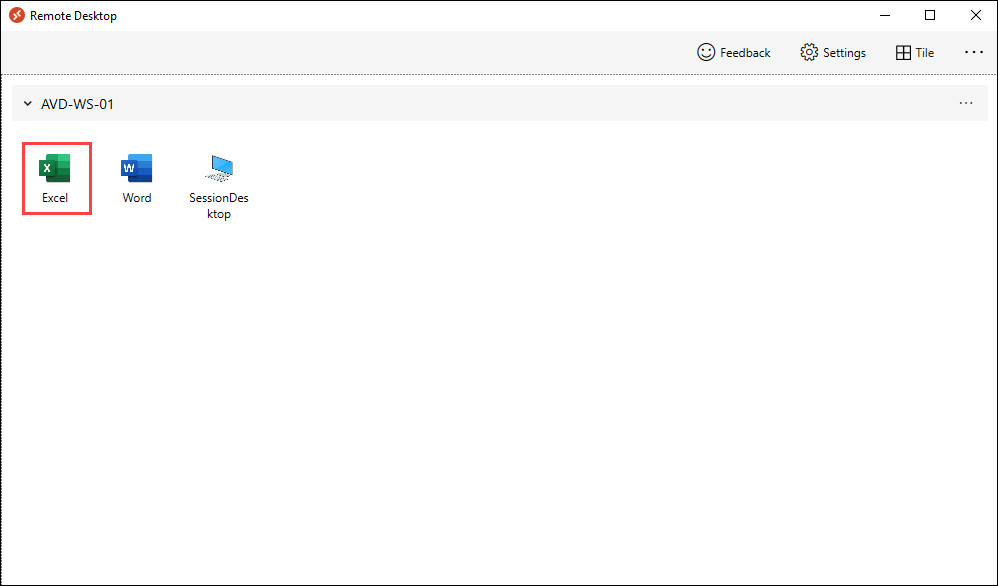
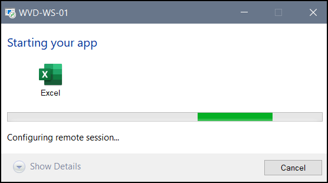
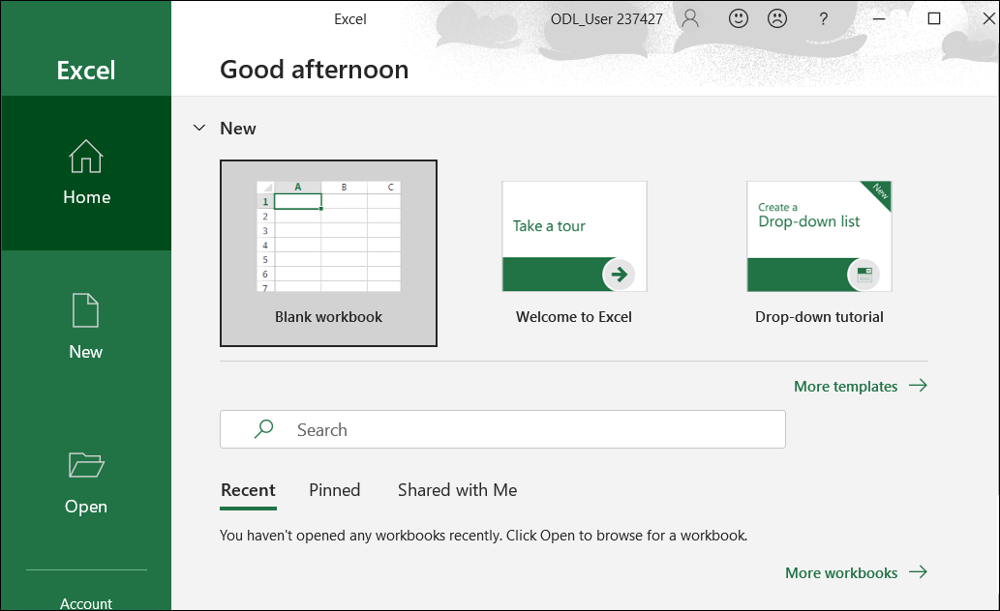

# Lab 2: Monitoring using Azure Monitor for AVD(Part 2)

1. In your PC go to **Start** and search for **Remote desktop** and open the remote desktop application with exact icon as shown below.

   
   
1. Once the application opens, click on **Subscribe**.

   
  
1. Enter your **credentials** to access the workspace.

   - Username: *Paste your username* **<inject key="AzureAdUserEmail" />** *and then click on **Next**.*
   
   

   - Password: *Paste the password* **<inject key="AzureAdUserPassword" />** *and click on **Sign in**.*

   
   
   >**Note:** If there's a popup entitled **Help us protect your account** click **Skip for now (14 days intil this is required)**

   

1. Make sure to **uncheck** *Allow my organization to manage my device* and click on **No, sign in to this app only**.

   
      
1. The WVD dashboard will launch, then double click on **Excel** application to access it.

    
   
1. A window saying *Starting your app*, will appear. Wait for few seconds, then enter your password to access the Application.

    - Password: **<inject key="AzureAdUserPassword" />**
   
    

1. Wait for the Application to connect.

    
   
1. The Excel application will launch and look similar to the screenshot below.

     
    
   >**NOTE**: Keep the application open and do not close the Remote Desktop client.
   
1. Paste the below mentioned link in your browser in the **JumpVM** and enter your **credentials** to login. 

   ```
   aka.ms/wvdarmweb
   ```

   - Username: *Copy* **AVDUser01** *username from the **Environment Details tab** and paste it then click on **Next**.*
   
   

   - Password: *Paste the password* **Azure1234567** *and click on* **Sign in**.

   

   >**Note:** If there's a dialog box saying ***Help us protect your account***, then select **Skip for now** option.

   

1. Now in the AVD dashboard, click on the **Session Desktop** to access it. 

   

1. Select **Allow** on the prompt asking permission to *Access local resources*.

   

1. Enter your **credentials** to access the application and click on **Submit**.

   - Username: *Paste the username*  **<inject key="Avd User 01" />**
   
   - Password: *Paste the password*  **<inject key="AVD User Password" />**
   
   

1. The virtual Desktop will launch as shown below. 

   
   
1. Now, Navigate to Azure Virtusl Desktop and select **Insights** under **Monitoring** blade in the Azure Portal.

   
