# Lab 3: Create Application Groups and assign them to users

## **Scenario**

Contoso wants to restrict access to the applications used by different teams in the organization. With Azure Virtual Desktop, admins can create unique application groups for users that require access to a specific set of applications. In this lab, you’ll help Contoso to configure and create an application group and add applications to it.

## **Overview**

As explained in the General Hierarchy section, an Application Group is a logical grouping of applications installed on session hosts in the host pool. There are two types of application groups: 

1. RemoteApp 
2. Desktop 

### Exercise 1: Create an Application Group

An application group of type ‘Desktop’, was created automatically while creating the Session Host in the previous exercise. In this task, we will create a new application group of type ‘*RemoteApp*’ and publish two applications in it. Also, we will assign users to both application groups.

1. Navigate to the Azure portal, Search for Azure Virtual Desktop in the search bar and select **Azure Virtual Desktop** from the search results.

   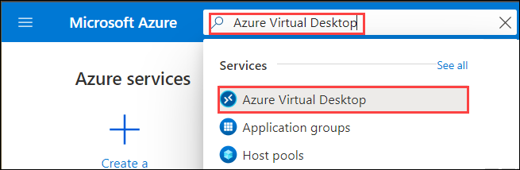

1. You will be directed towards the **Azure Virtual Desktop** management window.  

   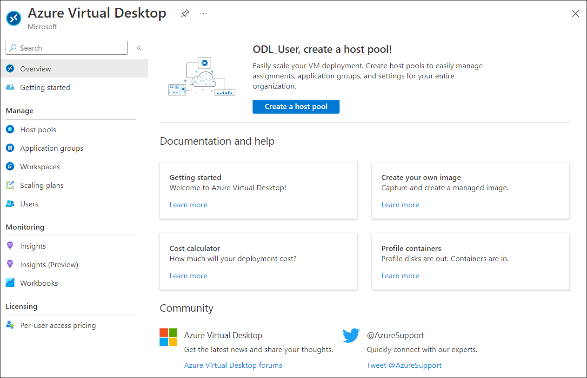

1. Click on the **Application Groups** tab and you will see the default Application Group there. 

   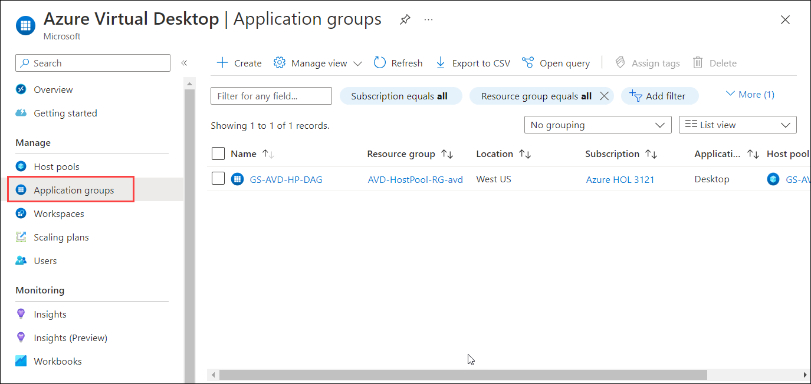
   
1. Click on the **GS-AVD-HP-DAG** application group.

   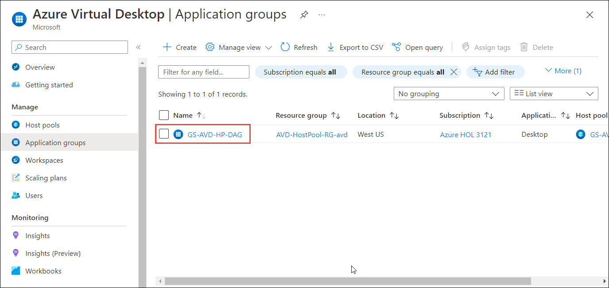
      
1. Under **Manage** blade, open **Assignments (1)** and then click on **+ Add (2)**. 

   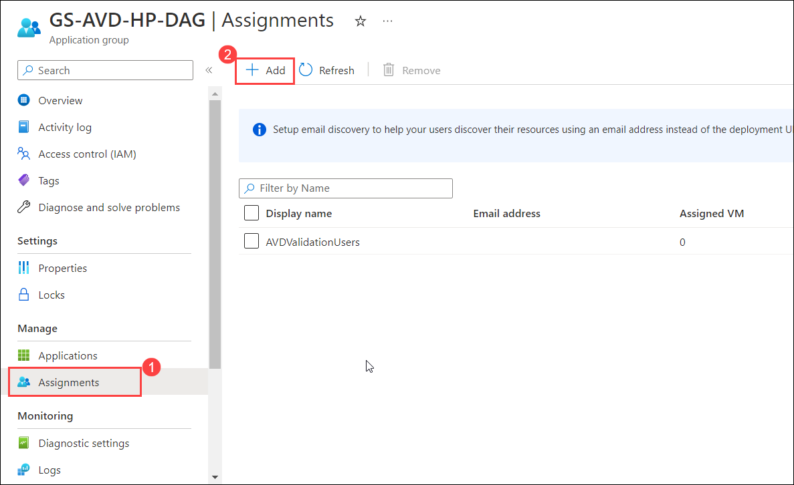   
 
1. Now in the search bar, copy and paste your **username: <inject key="AzureAdUserEmail" /> (1)**. Then under the search bar, click on your **username: <inject key="AzureAdUserEmail" />(2)** to select it then click on the **Select(3)** button.

   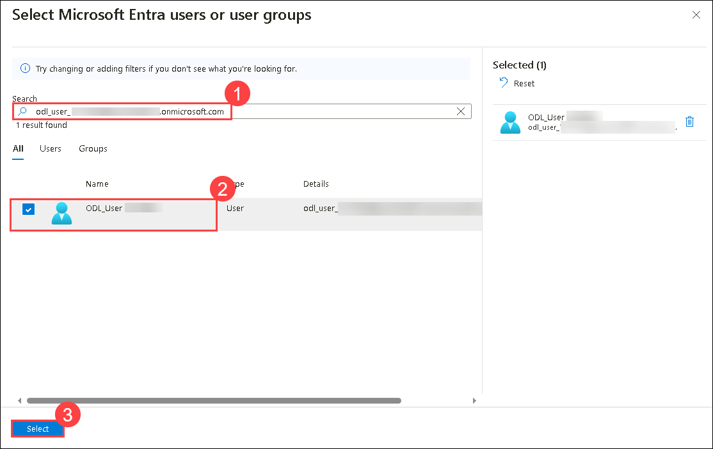
   
1. We will now create a new Application Group of type ‘RemoteApp’. To do this, navigate back to the **Azure Virtual Desktop** and click on the **Host Pools (1)** button, then click on the **GS-AVD-HP (2)** pool.

1. In the **GS-AVD-HP** host pool select **Application Groups** under **Applications**. Then select **+ Add** in the **GS-AVD-HP - Application groups**
  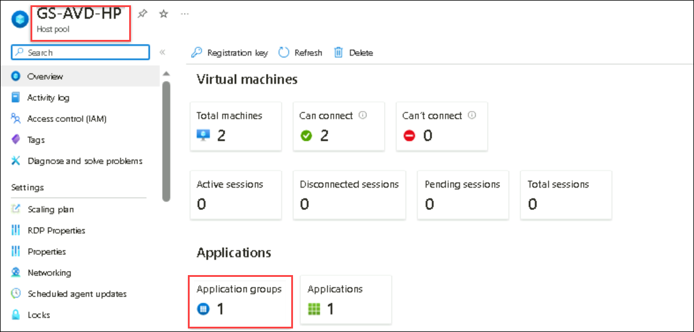

1. In the *Basics* tab, do the following configuration: 

   i. Leave the following parameters to default:
   
      - *Subscription*
      - *Location*
         
   ii. Fill in the remaining parameters below:  
   
      - Resource Group: *Select* **AVD-Hostpool-RG-avd** *from the dropdown*.
      - Host Pool: *Select* **GS-AVD-HP** *Host pool from the dropdown*.
      - Application Group Type: **RemoteApp** 
      - Application Group Name: **AVD-AG-01**
      - Click on **Next: Applications >**

      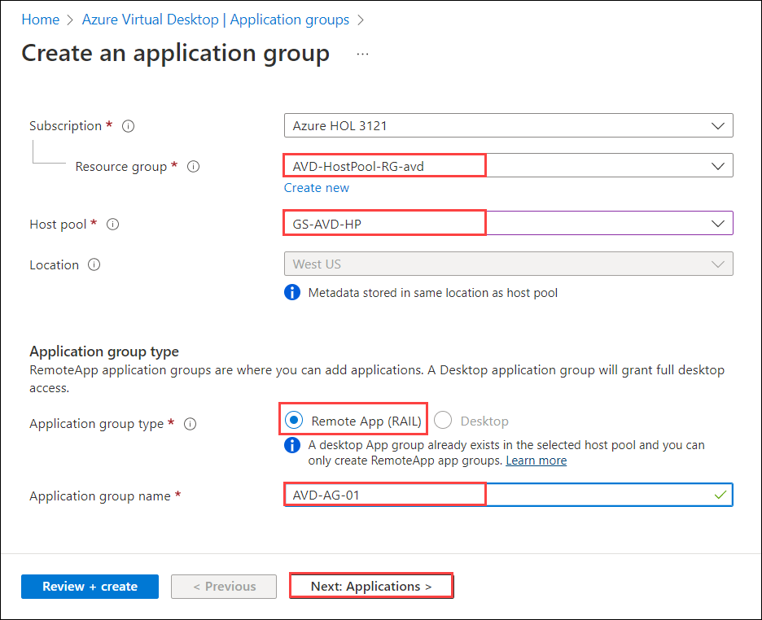

1. On the *Applications* tab, click on **+ Add Applications** to add applications to this application group.

   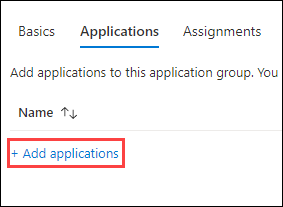

1. In this window, choose the parameters mentioned below: 

    - Application Source: **Start Menu** *(choose from the dropdown)*  
    - Application: **Excel** *(choose from the dropdown)* 
    - Display Name: **Excel**
    - Leave the rest of the parameters as default and click on **Review + Add** and then **Add**.
   
    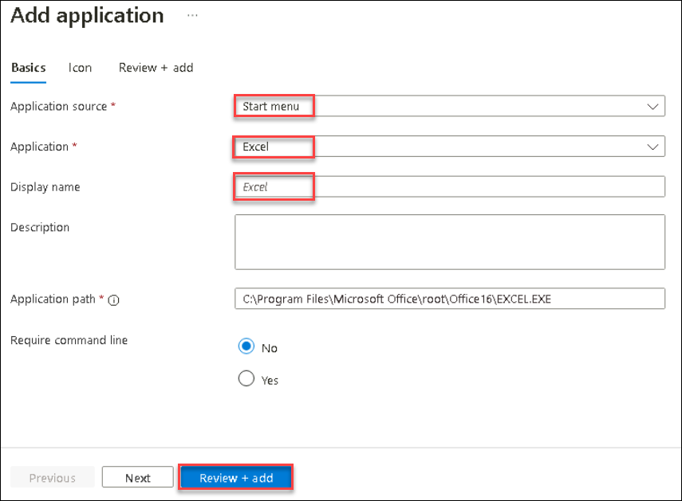
 
1. Click on **+ Add Applications** again. 

   

1. Choose the parameters as mentioned below: 

    - Application Source: **Start Menu** *(choose from the dropdown)*   
    - Application: **Word** *(choose from the dropdown)*
    - Display Name: **Word**    
    - Leave the rest of the parameters to default and click on **Review + Add** and then **Add**. 
   
   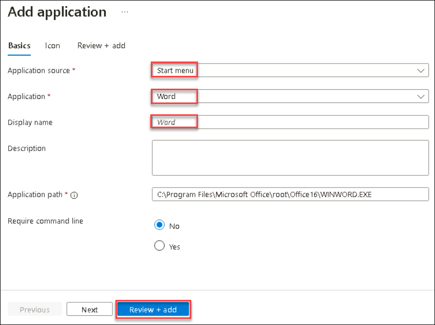

1. Click on **Next: Assignments >**.

   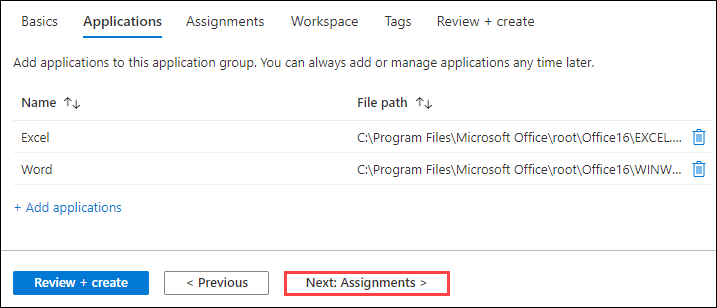

1. Click on the **+Add Microsoft Entra users or user groups (1)**, then copy and paste your username **<inject key="AzureAdUserEmail" />** **(2)** in the search bar. When your username appears under the search bar, select it, and then click on the **Select (3)** button. This will give you access to the application group.
 
   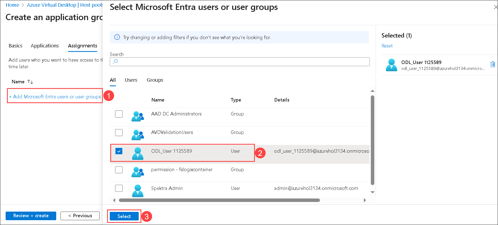

1. Click on **Next: Workspace >**.

   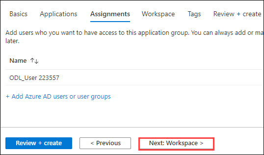

1. On the *Workspace* tab, choose the parameters as mentioned below:  

    - Register application Group: **Yes**
    - Register application Group: Leave the value to default
    - Click on **Review + Create**.

   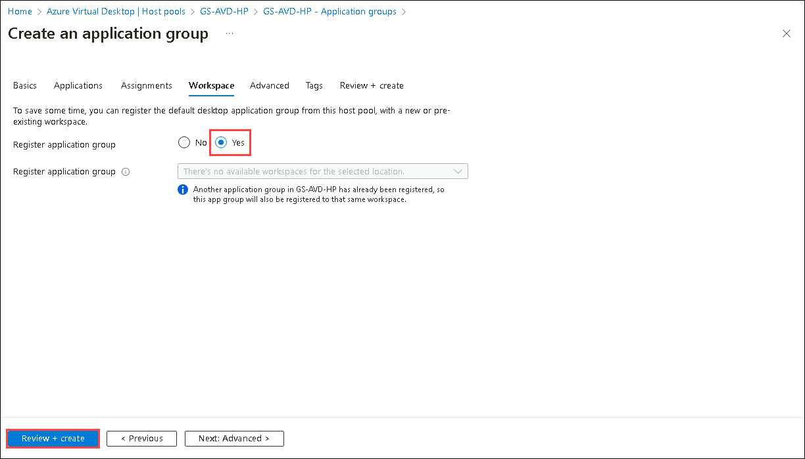

1. The last window helps us to verify if the parameters we filled in are correct. Wait for validation to pass, then click on **Create** to initiate the deployment. 

   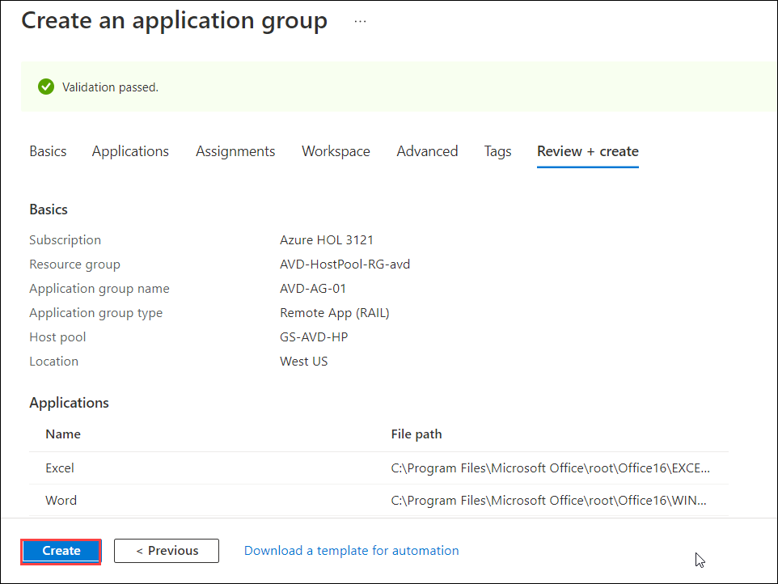

    >**Note:** The deployment will take about a minute to succeed.

1. Once the deployment is complete, open notifications and click on **Go to Resource**. 

   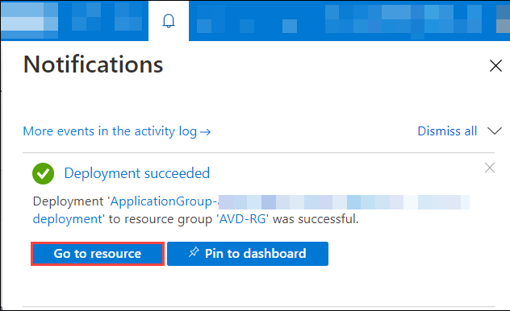

1. In the Application Group Window, click on **Applications** under the **Manage** section of settings and you will see that the applications are published in the new application Group. 

   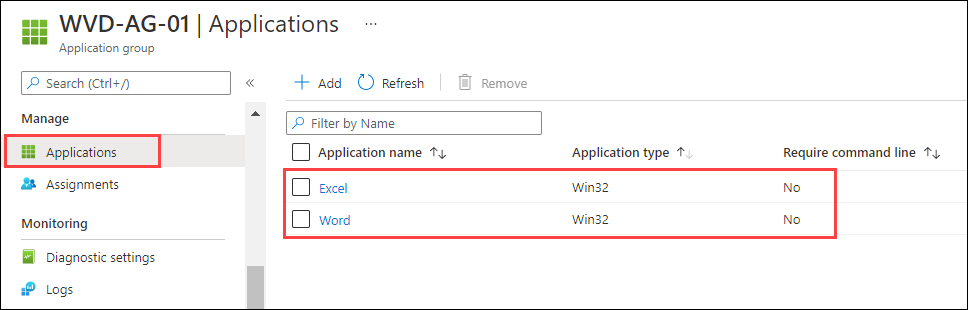

1. Click on the **Next** button present in the bottom-right corner of this lab guide. 
