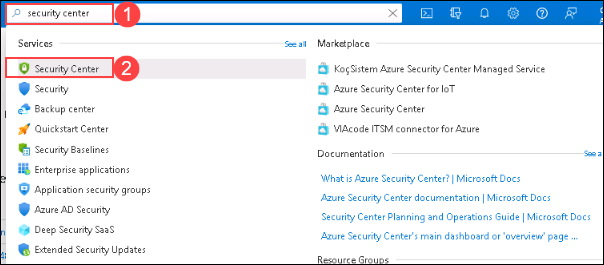
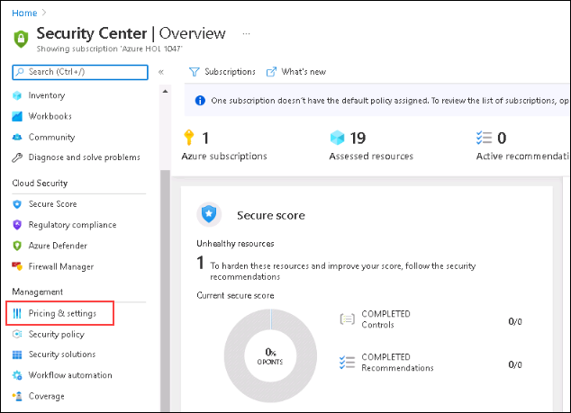
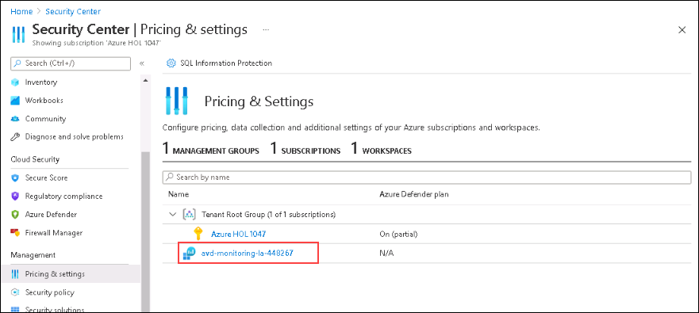
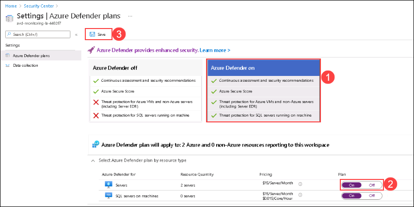

# Lab 3: Onboard AVD to Azure Security Center(Part-1)

## Exercise 1: Enabling Azure Security Center for Azure Virtual Desktop environment

### Task 1: Enabling Azure Security Center

1. In Azure Portal search for **Security Center** and click on it from the search results.

  
  
2. In the Security center page click on **Pricing & settings** under Management from the left hand blade.

  

3. Now in Security center | Pricing and settings page, click on your Log Analytics workspace i.e. **avd-monitoring-la-[Suffix]**.

  
  
4. In Settings | Azure Defender plans page, click on **Azure Defender on** *(1)* and make sure that the toggle switch for **Server** is set to **On** then click on **Save**.

  
  
  
**Note:** The security Center takes time to collect the data, hence we will continue the lab at the end in **Lab 3 (Part 2): Explore Azure Security Center**.

