# Lab 9: Cost Optimizations

## **Overview**

In this lab, We'll be enabling the Start Virtual Machine (VM) on Connect feature which lets you save costs by allowing users to turn on their VMs only when they need them.

## Exercise 1: Enable Start Virtual Machine on Connect

### Task 1: Create a custom role for Start VM on Connect

In this task, you will through the process to understand the creation of custom role.

> **Note :** If you observe the custom role is already exists, you can skip Task 1 and navigate to Task 2.

1. In your JumpVM launch browser and go to Aure Portal (https://portal.azure.com).

1. Now in the Azure portal search for **Subscription** and click on the search result.

   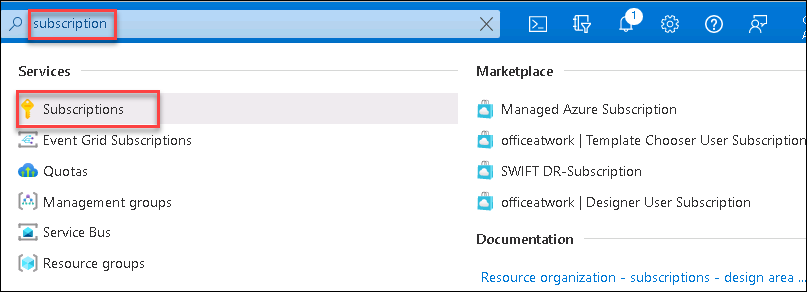

1. On the Subscription page, click on the name of your subscription.

   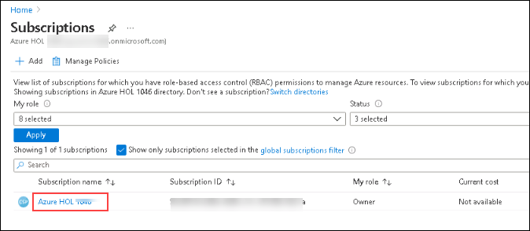
  
1. Now from the left-hand side blade, Click on **Access Control (IAM) (1)** and then click on **+ Add (2)** and select **Add custom role (3)**.

   

1. On the create a custom role page, Provide **Custom role name** as **start VM on connect** **(1)** and click on **Next** **(2)**.

   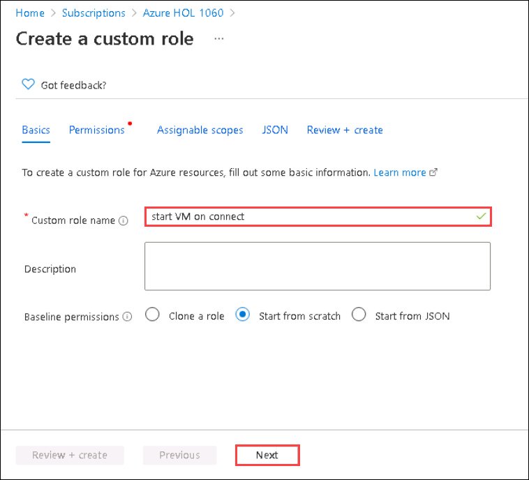

1. Under the Permissions tab, click on **+ Add Permissions**.

   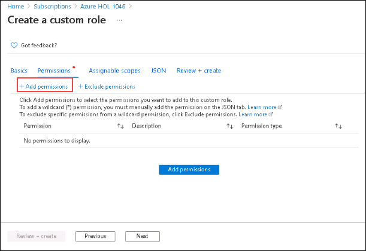

1. In Add Permissions search for **Virtual Machines** **(1)** and select **Microsoft Compute (2)** from the search results.

   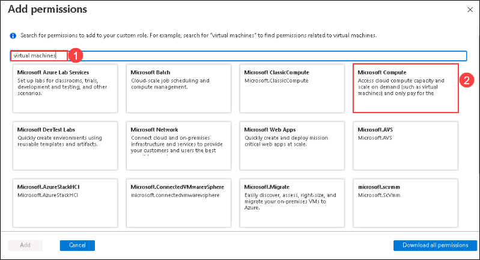

1. From the list of permissions, search for **Microsoft.Compute/virtualMachines** then select **Read : Get Virtual Machine** **(1)** and **Other : Start Virtual Machine** **(2)** and click on **Add** **(3)**.

   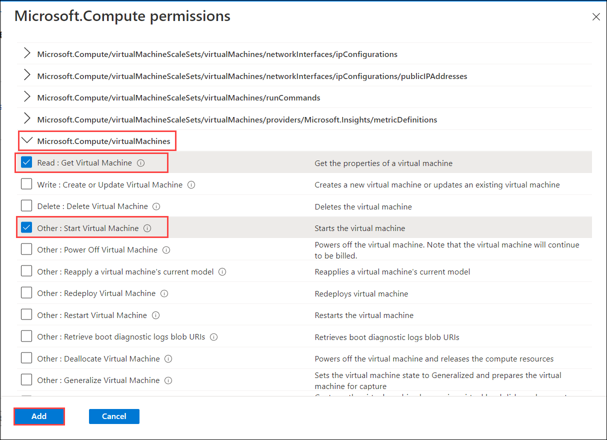
  
1. Now click on **Review + Create** to publish the roles and followed by **Ok**. 

   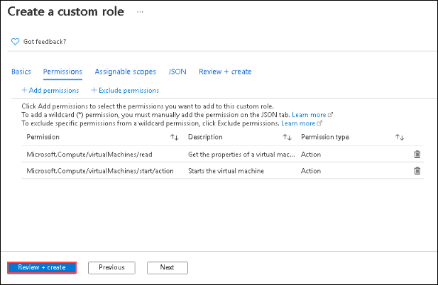
  
1. Review the configuration and click on **Create**.

   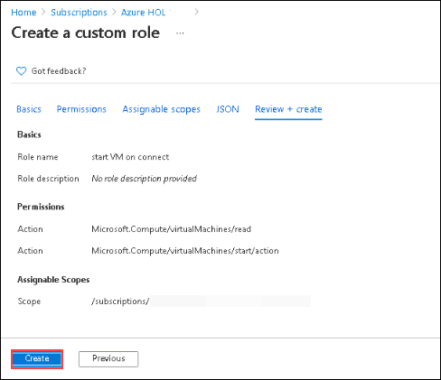

1. In **Access Control (IAM)** click on **+ Add**  and select **Add role assignment** .
  
   - Under Role, search and select **start VM on connect**, then click on **Next**.

     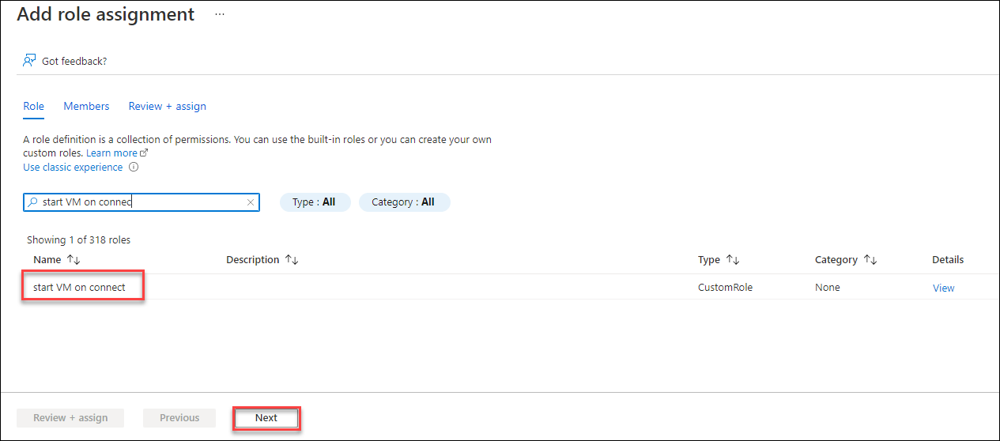
     
   - Under **Members** tab,enter the below mentioned details:

      - Assign access to: 	**User, group, or service principal (1)**
  
      - Click on **+ Select members (2)**
     
      - Under Select, search for **Windows Virtual desktop** and select it **(3)**
      
      - Click on **Select (4)**.

    > **Note :** In certain situations **Windows Virtual Desktop** might not be visible in the search results, in certain situations please search for **Azure virtual desktop** and select it from the search result.
    
    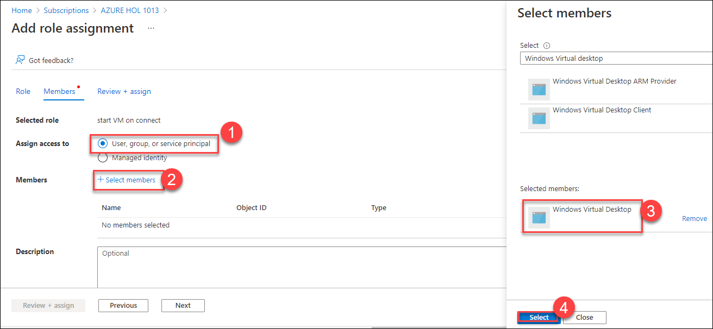
    
  - Click on **Review + assign**

## Exercise 2: Configure the Start VM on Connect feature

### Task 1: Configuring Host pool Properties

1. In the Azure portal, search for **Azure Virtual Desktop** and select it from search result.

   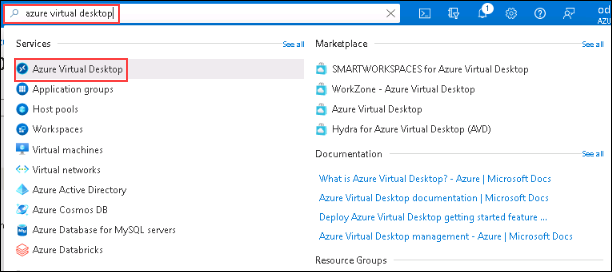
  
1. On the left-hand side blade, click on **Host pools** **(1)** and select the **host pool** **(2)** we want to configure.

   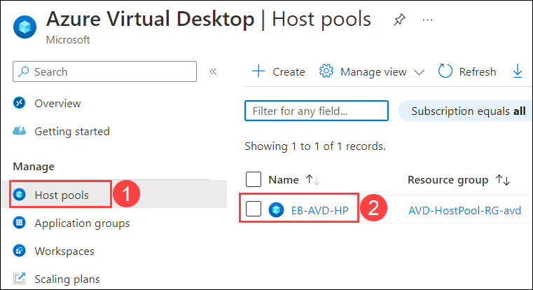
  
1. On the left-hand side blade of the Host pool page. Click on **Properties** **(1)**
  
   - Toggle **Start VM on connect** to **Yes** **(2)**.
   - Click on **Save** **(3)**.

   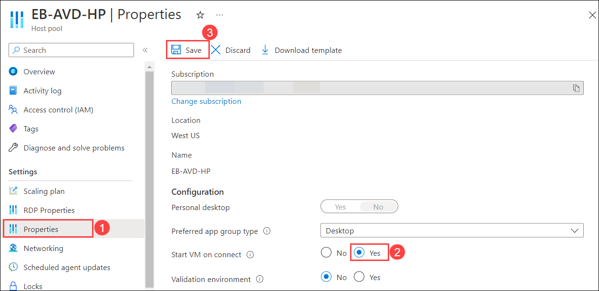

## Exercise 3: Experience VM start on connect

### Task 1: Stop the Session host VMs

1. In Azure Portal search for **Virtual Machines** and click on it.

   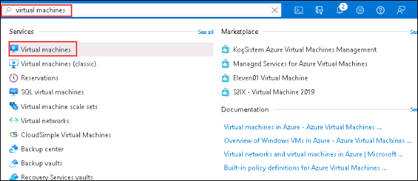

1. Select the **session host VMs** **(1)** and click on **Stop** **(2)**.

   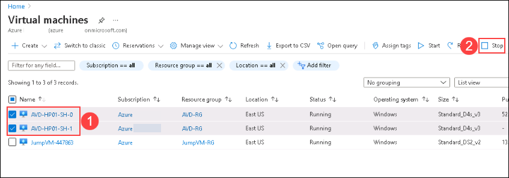
  
1. On a prompt saying "Do you want to stop the selected Virtual Machines" click on **Yes**.

   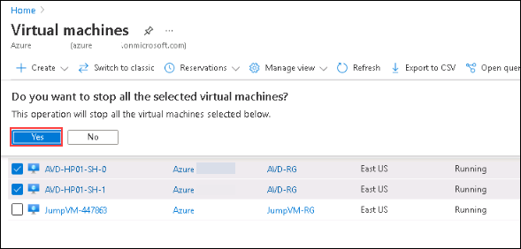
  
### Task 2: Access the Session host desktop

1. Navigate to **Your Own PC/computer/workstation**, go to **Start** and search for **Remote desktop** and open the application with the exact icon as shown below.

   
   
1. Click on the *ellipses* and select **Unsubscribe**. Click on **Yes** for any warning.

   

   >**Note:** We need to unsubscribe from the feed because in Exercise 4 we subscribed to the AVD feed using a different user.

1. Click on the **Subscribe** button.

   

1. Enter the user credentials to access the workspace.

   - Username: *Paste the username*  **<inject key="AzureAdUserEmail" />** *then click on* **Next**.

     
   
   - Password: *Paste the password*  **<inject key="AzureAdUserPassword" />** *and click on* **Sign in**.

      )

1. Return to AVD client application. On the AVD dashboard, click on the tile named **Session Desktop** to launch the desktop.

   
   
1. A window saying *Connecting to: Session Desktop* will appear. Wait for a few seconds, then enter your password to access the Desktop.

   - Password: **<inject key="AzureAdUserPassword" />**
   
   
   
   >**Note:** If there's a dialog box saying ***Help us protect your account***, then select the **Skip for now** option.
   
   

1. While the Session Desktop is connecting, we can see a message saying **Starting remote PC**.

   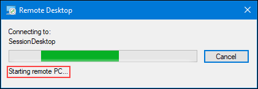

1. Your virtual desktop will launch and look similar to the screenshot below. You can exit from the window by clicking on **X *i.e., the close button***. 
        
      
     
1. Return to the Azure portal and click on **refresh** **(1)** to get the updated status of Virtual Machines. Here, we can see the session hosts VM in the **Running** state and has started automatically when the session desktop was launched.

   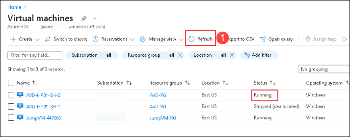
   

1. Click on the **Next** button present in the bottom-right corner of this lab guide.
