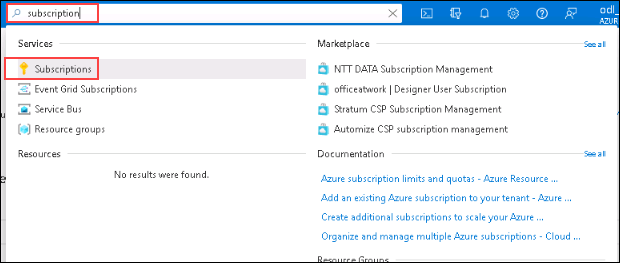
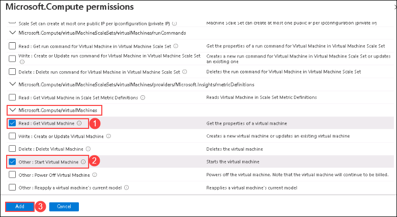
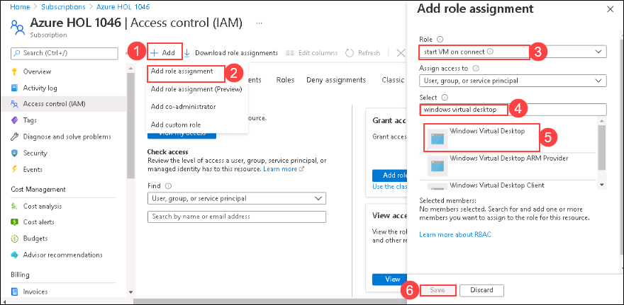
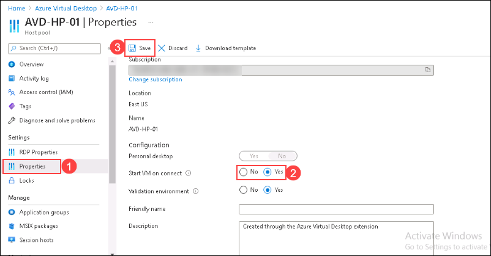
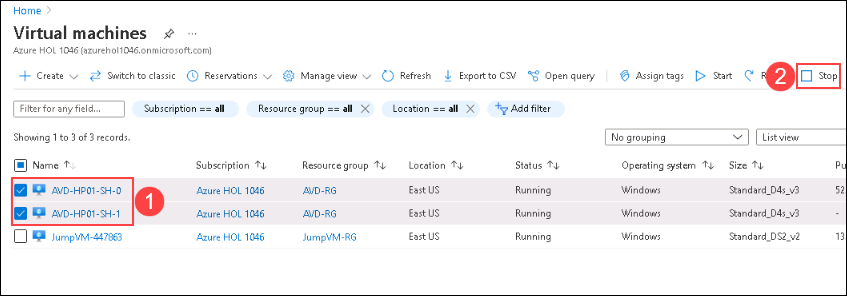
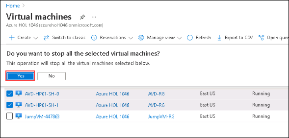
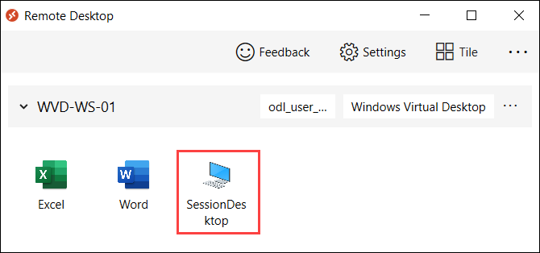
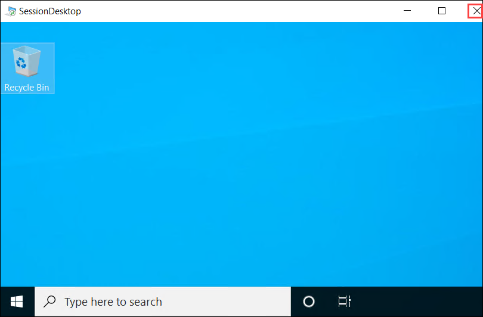
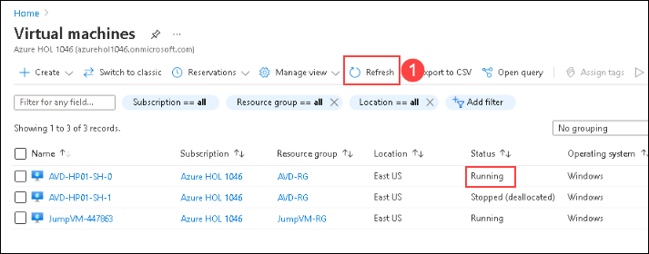

# **Lab 9: Cost Optimizations**

## **Exercise 1: Enable Start Virtual Machine on Connect**

### **Task 1: Create a custom role for Start VM on Connect**

1. In your JumpVM launch browser and go to Aure Portal (https://portal.azure.com).

2. Now in the Azure portal search for **Subscription* and click on the search result.

   

3. On the Subscription page, click on the name of your subscription.

   
  
4. Now from the left-hand side blade, Click on **Access Control (IAM)** and then click on **+ Add** and select **Add custom role**.

   

5. On the create a custom role page, Provide **Custom role name** as **start VM on connect** *(1)* and click on **Next** *(2)*.

   

6. Under the Permissions tab, click on **+ Add Permissions**.

   

7. In Add Permissions search for **Virtual Machines** *(1)* and select **Microsoft Compute** from the search results *(2)*.

   

8. From the list of permissions search for **Microsoft.Compute/virtualMachines** then select **Read : Get Virtual MAchine** *(1)* and **Other : Start Virtual Machine** *(2)* and click on **Add** *(3)*.

   
  
9. Now click on **Review + Create** to publish the roles.

   
  
6. Review the configuration and click on **Create**.

   

1. In **Access Control (IAM)** click on **+ Add** *(1)* and select **Add role assignment** *(2)*.

   
  
   - Under Role, search and select **start VM on connect** *(3)*.
   - Under Select, search for **Windows Virtual desktop** **(4)** and select it *(5)*
   - Click on **Save** *(6)*.

## Exercise 2: Configure the Start VM on Connect feature

### **Task 1: Configuring Host pool Properties**

1. In the Azure portal search for **Azure Virtual Desktop** and click on it.

   
  
2. On the left-hand side blade click on **Host pools** *(1)* and select the **host pool** *(2)* we want to configure.

   
  
3. On the left-hand side blade of the Host pool page. Click on **Properties** *(1)*

   
  
   - Toggle Start VM on connect to **Yes** *(2)*.
   - Click on **Save** *(3)*.

## **Exercise 2: Experience VM start on connect**

### **Task 1: Stop the Session host VMs**

1. In Azure Portal search for **Virtual Machines** and click on it.

   

2. Select the **session host VMs** *(1)* and click on **Stop** *(2)*.

   
  
3. On a prompt saying "Do you want to stop the selected Virtual Machines" click on **Yes**.

   
  
### Task 2: Access the Session host desktop

1. Return to WVD client application. On the AVD dashboard, click on the tile named **Session Desktop** to launch the desktop.

   
   
2. A window saying *Connecting to: Session Desktop* will appear. Wait for few seconds, then enter your password to access the Desktop.

   - Password: **<inject key="AzureAdUserPassword" />**
   
   
   
   >**Note:** If there's a dialog box saying ***Help us protect your account***, then select **Skip for now** option.
   
   

3. While the Session Desktop is connecting, we can see a message saying **Starting remote PC**.

   

4. Your virtual desktop will launch and look similar to the screenshot below. You can exit from the window by clicking on **X *i.e., the close button***. 
        
      
     
5. Return to the Azure portal and click on **refresh** *(1)* to get the updated status of Virtual Machines. Here we can see the session hosts VM in the **Running** state and has started automatically when the session desktop was launched.

   
  
  
  
