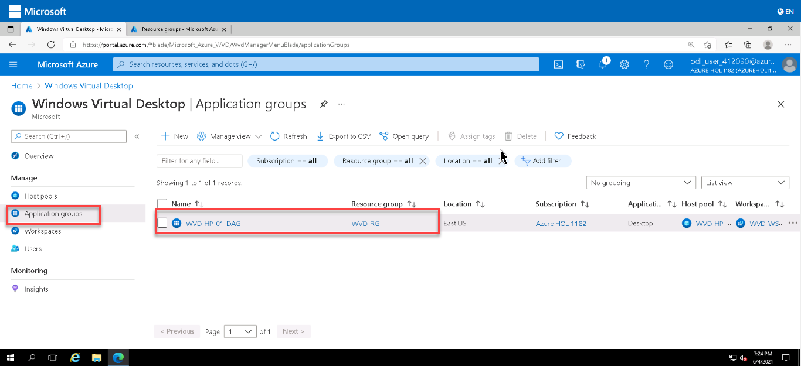

# **Getting Started with Your AIW-Azure-Virtual-Desktop Workshop**
 
Welcome to your AIW-Azure-Virtual-Desktop workshop! We've prepared a seamless environment for you to explore and learn about Azure services. Let's begin by making the most of this experience:
 
## **Accessing Your Lab Environment**
 
Once you're ready to dive in, your virtual machine and lab guide will be right at your fingertips within your web browser.

   .png)	

### **Virtual Machine & Lab Guide**
 
Your virtual machine is your workhorse throughout the workshop. The lab guide is your roadmap to success.
 
## **Exploring Your Lab Resources**
 
To get a better understanding of your lab resources and credentials, navigate to the **Environment** tab.
 
   .png)	
 
## **Utilizing the Split Window Feature**
 
For convenience, you can open the lab guide in a separate window by selecting the **Split Window** button from the Top right corner.
 
   .png)	
 
## **Managing Your Virtual Machine**
 
Feel free to start, stop, or restart your virtual machine as needed from the **Resources** tab. Your experience is in your hands!
 
   .png)	
 
## **Let's Get Started with Azure Portal**
 
1. On your virtual machine, click on the **Azure Portal** icon as shown below:
 
    .png)	
 
1. When you click on Azure portal, the edge browser welcome screen will come up, select **Start without your data**.

   
   
1. On the next window, click on **Continue without this data**.

   
   
1. Click on **Confirm and start browsing**.

   
   
1. Now, you will see two tabs in the Edge browser, close the first tab named **Microsoft Edge**.

1. Login to Azure with the username **<inject key="AzureAdUserEmail" />** and click on **Next**.

   

1. Enter password **<inject key="AzureAdUserPassword" />** and click on **Sign in**.

   

   >**Note:** If there's a popup entitled **Stay signed in?** with buttons for **No** and **Yes** - Choose **No**.
   
   
     
   >**Note:** If there's another popup entitled **Welcome to Microsoft Azure** with buttons for **Start Tour** and **Maybe Later** - Choose **Maybe Later**.
   
    
   
   >**Note:** If there's another popup entitled **Help us protect your account** click **Skip for now (14 days until this is required)**
   
   
    
1. **Close** the recommendation page by clicking on the X mark.

   

1. Now in the Azure portal, click on **Resource Groups** present under *Navigate*.

   

1. You will see a list of resource groups as shown in the image below. Click on **AVD-RG** to open it.

   
   
1. Click on the **Next** button present in the bottom-right corner of this lab guide.   

Now you're all set to explore the powerful world of technology. Feel free to reach out if you have any questions along the way. Enjoy your workshop!
