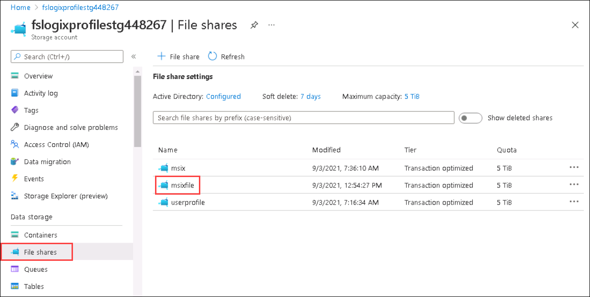
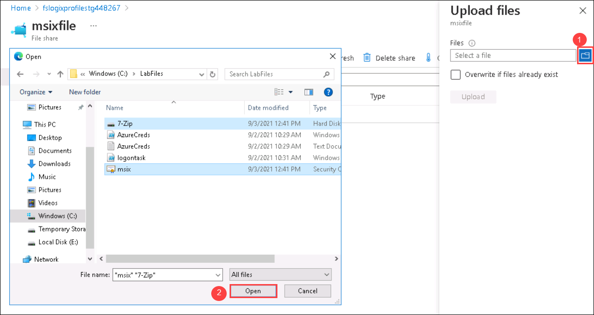
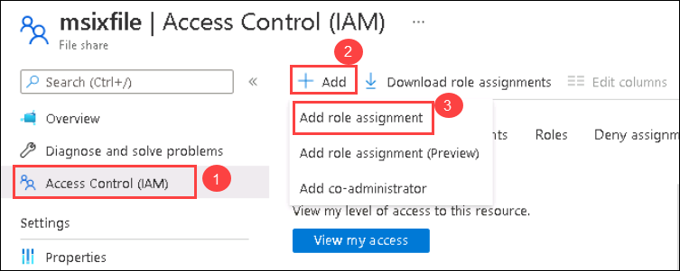
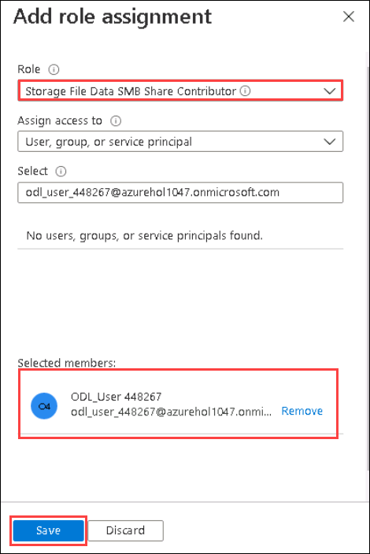
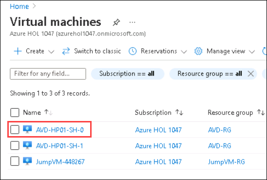
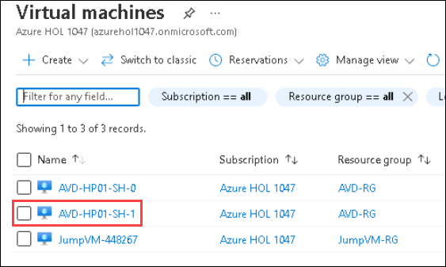
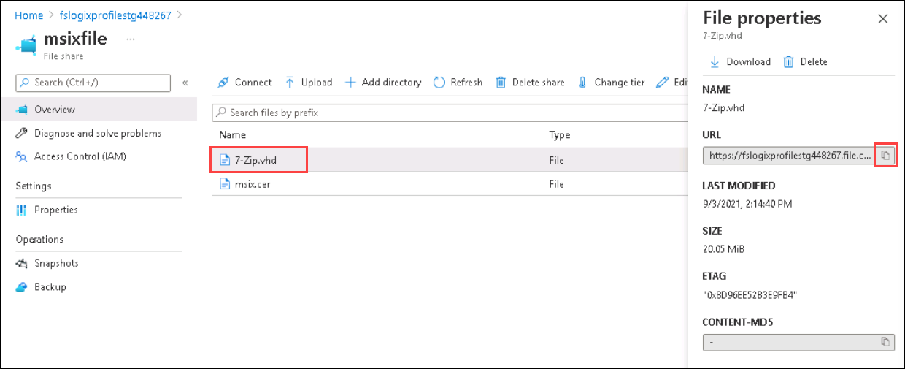
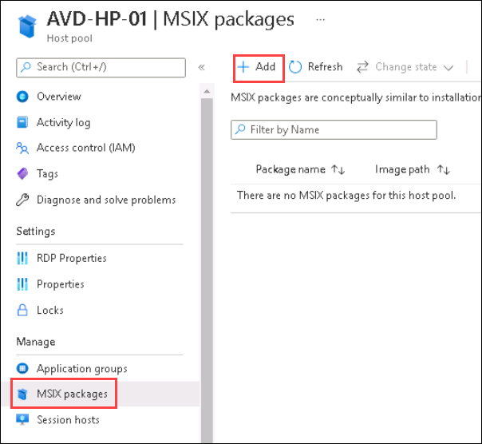
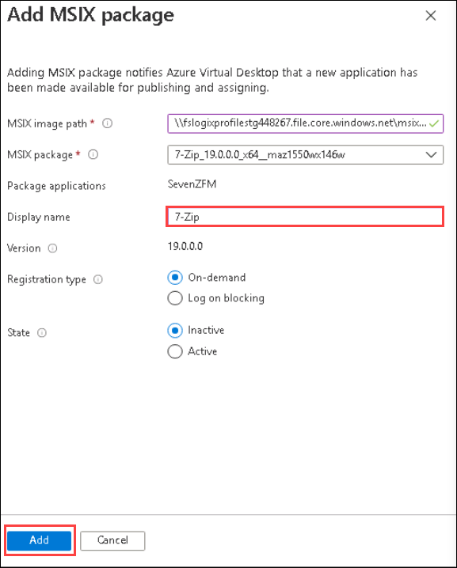

# MSIX App Attach(Optional)

1. Search for **Stoarage accounts** in the search bar and select the **<inject key="Storage Account Name" />** account which was created in **Exercise 5: Setup FSLogix**.
1. 11. In the right pane, click on **File shares** present under *Data Storage* blade.

    
 
1. Enter the following name for your file share.
    
    - Name: **msixfile**   
    - Tier: **Transaction Optimized**
    - Click on **Create**, this will create the file share.
    
    
    
1. Go to **msixfile** file share and select **upload**.

   
   
   
   
1. Browse the files go to ``C:\LabFiles``. Select **7-Zip.vhd**, **msix.cer** files and Click on **Open**.

   
   
1. Select **Access Control(IAM)** from the side blade. Click on **Add** and select **Add Role Assignment**.

   
   
1. Select the following options and click **Save**

   -Role: Search and select **Storage File Data SMB share Contributor** role.
   -Assign access to: **User, groups, or service principal**.
   -Select: Search and select **<inject key="AzureAdUserEmail" />** user.
   
   
   
1. Search for **Stoarage accounts** in the search bar and select the **<inject key="Storage Account Name" />** account.

   
 
1. Go to **msixfile** file share and click on **Connect**.

   
   
1. Under **Windows** tab. Select **Storage account key** and **copy** the code from the window.

   
   
1. Go to home page, Search for **virtual machine** in the search bar. Select **AVD-HP01-SH-0**.

   
   
1. Under **Operations** blade, Select Run Command. Select **RunPowerShellScript**.
    
   
  
1. **Paste** the **code** which you copied earlier into the window and select **Run**. Once the execution is completed, Output will be displayed as mentioned in the screenshot below.

   
   
   >**NOTE**: **This step is only required for this lab only. In the production environment, this is not required. You will use Azure active directory and Acess control(IAM) to control access to MSIX VHD file. For more information refer to ***Link yet to be Searched***.
   
1. Go to home page, Search for **virtual machine** in the search bar. Select **AVD-HP01-SH-1** VM.

   
   
1. Under **Operations** blade, Select Run Command. Select **RunPowerShellScript**.
    
   
  
1. **Paste** the **code** which you copied earlier into the window and select **Run**. Once the execution is completed, Output will be displayed as mentioned in the screenshot below.

   
   
# ADD STEPS TO INSTALL CERTIFICATE INTO THE SESSION VM.

1. Go to **msixfile** file share and select the **7-Zip** file. **Copy** the **URL**.

   

1. Navigate to Azure portal, then search for *Azure Virtual Desktop* in search bar and select **Azure Virtual Desktop** from the suggestions.

   

1. You will be directed towards the Azure Virtual Desktop management window.  

   

1. Under **Manage** blade, Select the **MSIX** tab and click on **Add**.

   
   
1. Paste the **URL** and follow the below mentioned steps to create **UNC** path.

   - **Remove** ``https://`` from the URL. Add ``\\`` to the starting of the link.
   - **Replace** all the ``/`` (front slash) with ``\`` (back slash0. 
   - The final UNC path should look like this ``\\fslogixprofilestg448267.file.core.windows.net\msixfile\7-Zip.vhd``.

   

   Click on **Add*.
   
1. For **Display name**, provide **7-Zip** as the value and click on **Add**.

   
   
1. Under **Manage** blade, Select the **Application groups** tab and click on **AVD-AG-01**.

   
