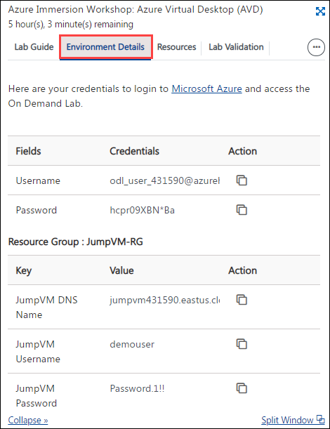
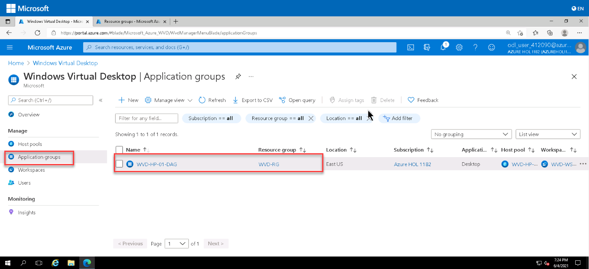

# Lab 1: Create Host Pool from Azure Portal:

A Host Pool is a collection of Azure virtual machines that register to Azure Virtual Desktop as session hosts when you run the Azure Virtual Desktop agent. All session host virtual machines in a host pool should be sourced from the same image for a consistent user experience. To start with, we will login to the Azure portal. 
 
## Getting Started with Lab	

1. Once you launch the lab, a virtual machine (JumpVM) on the left and lab guide on the right will get loaded in your browser. Use this virtual machine throughout the workshop to perform the lab.	

   	

2. To get lab environment details, click on the **Environment Details** tab located next to the *Lab Guide* tab. 	

   	

## Exercise 1: Log in to Azure Portal

1. In the JumpVM, double click on the **Azure portal shortcut** on the desktop.

     

2. Login to Azure with the username **<inject key="AzureAdUserEmail" />** and click on **Next**.

   

3. Enter password **<inject key="AzureAdUserPassword" />** and click on **Sign in**.

   

   >**Note:** If there's a popup entitled **Stay signed in?** with buttons for **No** and **Yes** - Choose **No**.
   
   
     
   >**Note:** If there's another popup entitled **Welcome to Microsoft Azure** with buttons for **Start Tour** and **Maybe Later** - Choose **Maybe Later**.
   
    
   
   >**Note:** If there's another popup entitled **Help us protect your account** click **Skip for now (14 days intil this is required)**
   
   
    
4. **Close** the recomendation page by clicking on the X mark.

   

4. Now in the Azure portal, click on **Resource Groups** present under *Navigate*.

   

5. You will see a list of resource groups as show in the image below. Click on **AVD-RG** to open it.

   
   
   >**Note:** You will be using ***AVD-RG*** throughout the lab. Other two resource groups listed in the portal are not to be used in the lab.

## Exercise 2: Create Host Pool using Getting Started Wizard

In this exercise, We'll be creating the Host pool using **Getting Started Wizard** using minimum efforts and information.

1. On the **Azure portal** search for **Azure Virtual Desktop** in the search bar (1) and select **Azure Virtual Desktop** (2) from the suggestions.

   
   
1. On the AVD page, **Click** on the **Getting Started**(1) from the side blade and click on **Start**(2).

   
   
1. On **Getting Started Wizard** page, **Provide** the information as mentioned below,

   **A**.Project Details:

   - Subscription: Select the ***default***
   - Identity provider: Select ***Existing active directory***
   - Identity Service Provider: Select ***Azure AD Doamin Services*** from the drop-down
   - Resource Group: ***AVD-HostPool-RG***
   - Region: **East US**, *basically this should be same as the region of your resource group*
   - Virtual Network: **aadds-vnet** *(choose from dropdown)*
   - Subnet: **sessionhosts-subnet(10.0.1.0/24)** *(choose from dropdown)*
   
   **B**. Domain administrator credentials:
   
   - Azure admin user name: *Paste your username* **<inject key="AzureAdUserEmail" />**
   - Password: *Paste the password* **<inject key="AzureAdUserPassword" />**

   **C**. Domain administrator credentials:
   
   - Domain admin user name: *Paste your username* **<inject key="AzureAdUserEmail" />**
   - Password: *Paste the password* **<inject key="AzureAdUserPassword" />**
   - **Click** on **Virtual Machines**.

   
   
1. In **Virtual Machines** tab, **Provide** the information as mentioned below,
   
   - Users per virtual machine: Select ***Multiple users***
   - Image type: ***Gallery***
   - Image: **Windows 10 Enterprise multi-session, version 20H2 + Microsoft 365 Apps (GEN2)** *(choose from dropdown)*
   - Virtual machine size: **Standard D4s v4**. *Click on **Change Size**, then select **D4s_v4** and click on **Select** as shown below*
   - **Click** on **Assignments**.

     
   
   - Name prefix: **AVD-HP01-SH**
   - Number of VIrtual Machines: **2**
   - Link Azure template: **Unselect** the option

   
   
1. In **Assignments** page, **Provide** the information as mentioned below, 
   
   
   
   - Create test user account: **Unselect** the option
   - Assign existing users or groups: **Select** the option
   - click on **Review and Create**.
   
1. Verify the options and **click** on **Create**.

   
   
   >**NOTE**: It takes 20 mins to get deployed successfully.
   
1. Once the deployment is successful, **Click** on **Go to resource**.

   
   
1. It will take you to the **Host pool**. Reources created are as follows,

   - **Host Pool**: 1 (EB-AVD-HP)
   - **Session Host**: 2 (AVD-HP01-SH-0, AVD-HP01-SH-1)
   - **Aplication Group**: 1 (EB-AVD-HP-DAG)
   - **Application**: 1 (SessionDesktop)
   - **Workspace**: 1 (EB-AVD-WS)

   
   
1. Click on the **Next** button present in the bottom-right corner of this lab guide.  
   
